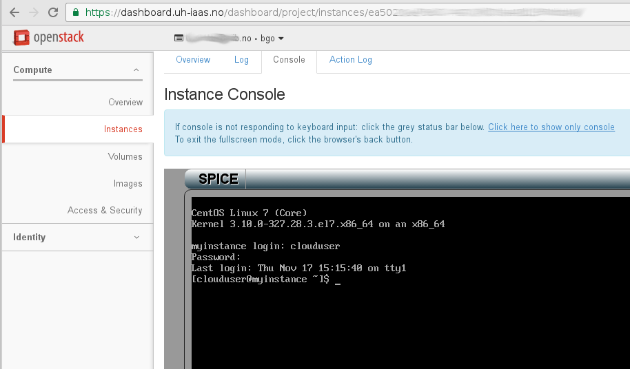

.. |date| date::

.. _Lightweight Linux remote desktop environment: usecase-toturials.html#lightweight-linux-remote-desktop-environment

Instance console
================

Last changed: |date|

.. contents::

Accessing the console
---------------------

You can access a graphical console for your instances from the Console tab
in the Instances panel. For this to be meaningful, you must configure a user
and a password in your instance, as most images come with unconfigured passwords,
relying on ssh keys for authentication.

Console limitations
-------------------

The web-based console offered in the dashboard is the last resort to be considered
and is not suited for any productional use. Instead, we recommend that you use
standard remote protocols for accessing the instances depending on the operating
system running on your instance.

Example remote protocols
------------------------

.. _ssh: https://en.wikipedia.org/wiki/Secure_Shell
.. _vnc: https://en.wikipedia.org/wiki/Virtual_Network_Computing
.. _x2go: https://en.wikipedia.org/wiki/X2Go
.. _rdp: https://en.wikipedia.org/wiki/Remote_Desktop_Protocol
.. _teamviewer: https://en.wikipedia.org/wiki/TeamViewer

Depending on use case and operating systems used, here are some suggestions you
may consider for accessing your instances:

+---------------------------------+-------------------------------------------------+
| Protocol                        | Description                                     |
+=================================+=================================================+
|Secure shell (ssh_)              |Secure shell is always available by default in   |
|                                 |linux based instances. It's command based, and   |
|                                 |does not offer a graphical console.              |
|                                 |Authenication is key based.                      |
+---------------------------------+-------------------------------------------------+
|Virtual Network Computer (vnc_)  |VNC is a platform independent method to access   |
|                                 |a remote machine with graphical console. Clients |
|                                 |and servers are available on most operating      |
|                                 |systems. This protocol is used by ubuntu's       |
|                                 |remote desktop function.                         |
+---------------------------------+-------------------------------------------------+
|x2go (x2go_)                     |X2Go gives remote access to the Linux graphical  |
|                                 |user interface. It's very easy to configure, as  |
|                                 |it runs over the SSH protocol. In fact, it works |
|                                 |out of the box after installation. It's session  |
|                                 |based, so you can resume your work after a       |
|                                 |disconnect. Clients are available on all         |
|                                 |operating systems.                               |
+---------------------------------+-------------------------------------------------+
|Team Viewer (teamviewer_)        |Team Viewer is proprietary protocol offering     |
|                                 |remote control of a remote machine. Clients and  |
|                                 |servers are available for many operating systems |
+---------------------------------+-------------------------------------------------+
|Remote Desktop Protocol (rdp_)   |RDP is a proprietary protocol from Microsoft,    |
|                                 |however, clients are available for most systems. |
|                                 |For Linux, xrdp is a well-known RDP server       |
+---------------------------------+-------------------------------------------------+

Please note that all the above-mentioned protocols require you to modify or create
security groups. In addition, Linux-based cloud images will not have a graphical
console installed by default. If you want to use a graphical console, you need to
install the appropriate packages. For a full example, see `Lightweight Linux remote desktop environment`_.
