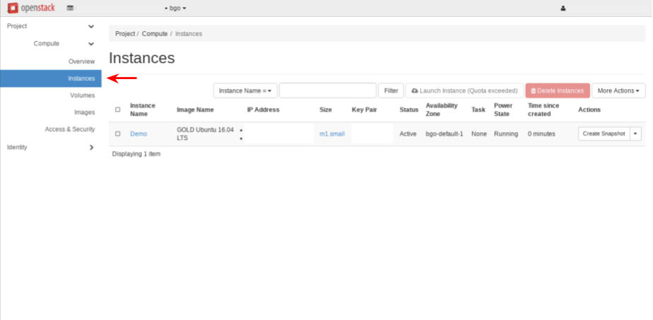
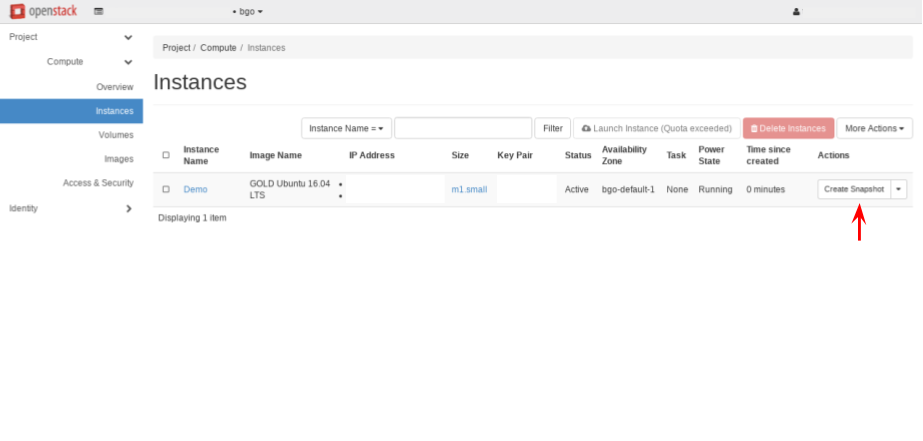
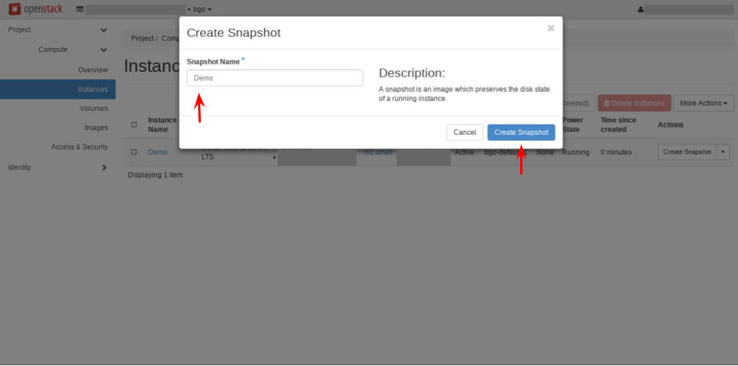
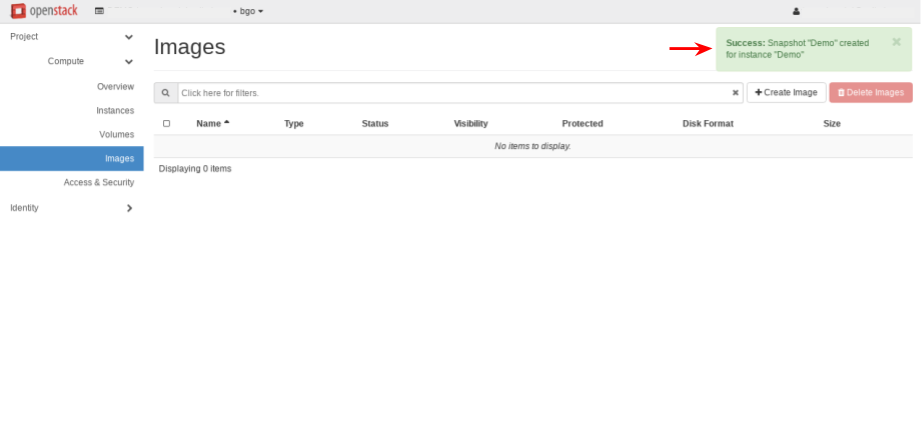

.. |date| date::

Create and manage snapshots
===========================

Last changed: |date|

.. contents::

You can create a snapshot and use it as the base for your new instances.

Create a snapshot
-----------------
*NB!* Make sure that the instance is turned off, before creating a snapshot.

In the dashboard, select *Instances* in the *Compute* tab:

Click on ``Create Snapshot``, and the following window appears:

   
   

Fill in the **Snapshot Name** and click on ``Create Snapshot``. The snapshot
will be created and located under *Images* in the *Compute* tab:

   
   

Once the snapshot is created, you can start up a new instance using this image.

   
   

Launch a snapshot
-----------------
Select *Images* in the *Compute* tab:

.. image:: images/create-snapshot-05.png
   :align: center
   :alt: Dashboard - Launch Snapshot

Choose the snapshot, and click on ``Launch``, and further steps are described under :ref:`create virtual machine`.

The new instance contains now the expected customizations made earlier in your previous instance. 

Doing the same with CLI
-----------------------

Listing any existing servers:

.. code-block:: console
     
    $ openstack server list
    +--------------------------------------+--------------+--------+---------------------------------------+-----------------------+
    | ID                                   | Name         | Status | Networks                              | Image Name            |
    +--------------------------------------+--------------+--------+---------------------------------------+-----------------------+
    | d281daef-e6b2-4dc5-979b-9c4fcec19b82 | DemoInstance | ACTIVE | IPv6=2000:200:2:2000::200a, 10.2.0.02 | GOLD Ubuntu 16.04 LTS |
    +--------------------------------------+--------------+--------+---------------------------------------+-----------------------+

Creating snapshot of an existing server:

.. code-block:: console
     
    $ openstack server image create --name DemoInstanceSnapshot DemoInstance  
    +------------------+-----------------------------------------------------------------------------------------------------------------------+
    | Field            | Value                                                                                                                 |
    +------------------+-----------------------------------------------------------------------------------------------------------------------+
    | checksum         | None                                                                                                                  |
    | container_format | None                                                                                                                  |
    | created_at       | 2017-12-20T10:00:23Z                                                                                                  |
    | disk_format      | None                                                                                                                  |
    | file             | /v2/images/f7495bf2-23c3-4b07-b0c4-6da26a0e6b81/file                                                                  |
    | id               | f7495bf2-23c3-4b07-b0c4-6da26a0e6b81                                                                                  |
    | min_disk         | 10                                                                                                                    |
    | min_ram          | 768                                                                                                                   |
    | name             | DemoInstanceSnapshot                                                                                                  |
    | owner            | 1b123d89493123e7937123d91e912304                                                                                      |
    | properties       | base_image_ref='de540652-bb5f-4827-8abc-6a17cfc37790', hw_disk_bus='scsi', hw_scsi_model='virtio-scsi',               |
    |                  | image_type='snapshot', instance_uuid='d281daef-e6b2-4dc5-979b-9c4fcec19b82', locations='[]',                          |
    |                  | user_id='57c5e7b739614845811d123227a6d596'                                                                            |
    | protected        | False                                                                                                                 |
    | schema           | /v2/schemas/image                                                                                                     |
    | size             | None                                                                                                                  |
    | status           | queued                                                                                                                |
    | tags             |                                                                                                                       |
    | updated_at       | 2017-12-20T10:00:23Z                                                                                                  |
    | virtual_size     | None                                                                                                                  |
    | visibility       | private                                                                                                               |
    +------------------+-----------------------------------------------------------------------------------------------------------------------+

Listing available images:
  
.. code-block:: console
     
    $ openstack image list
    +--------------------------------------+-----------------------------------+-------------+
    | ID                                   | Name                              | Status      |
    +--------------------------------------+-----------------------------------+-------------+
    | 20cc80f4-1567-4082-ac6f-68c9ae2040ff | myInstanceSnapshot                | active      |
    +--------------------------------------+-----------------------------------+-------------+
   
