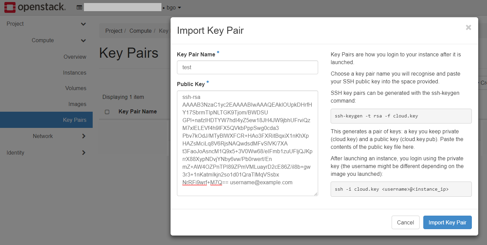
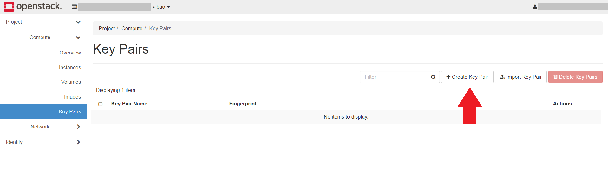
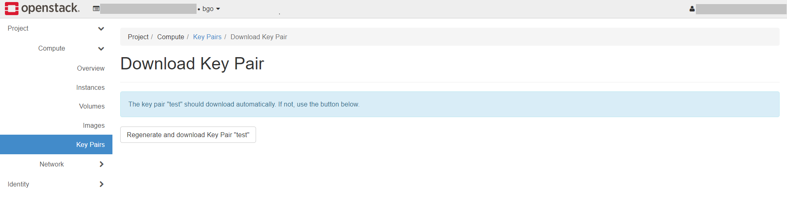
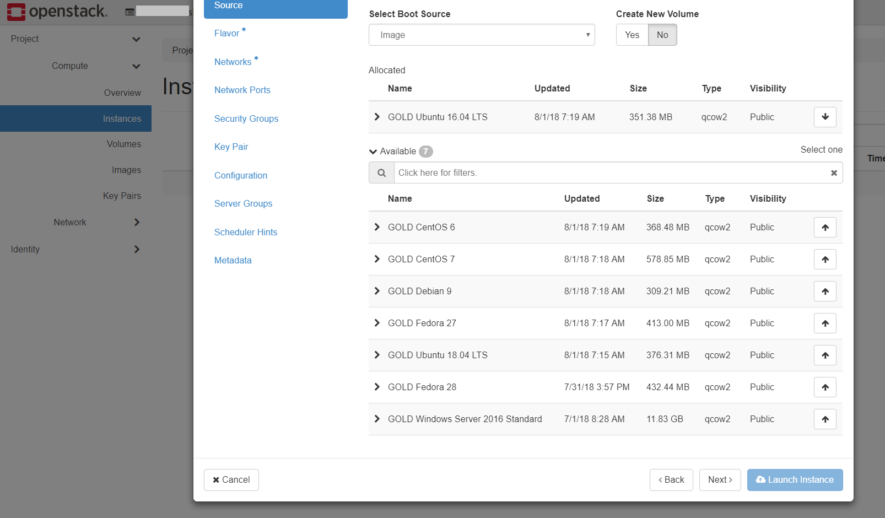
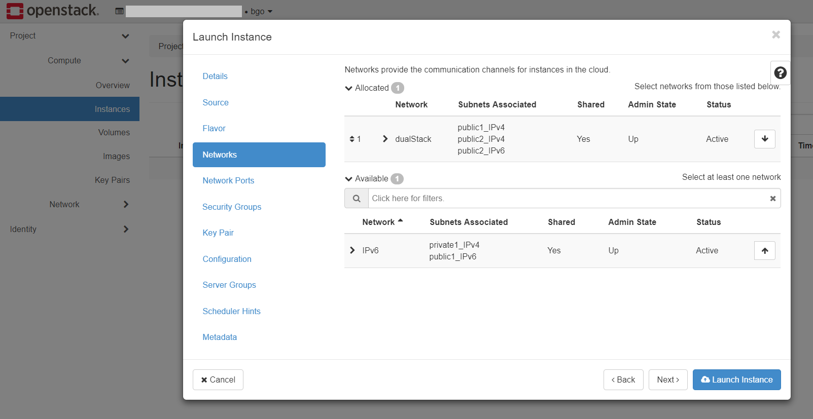
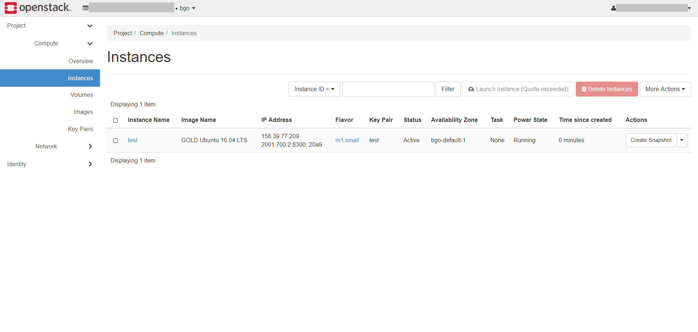
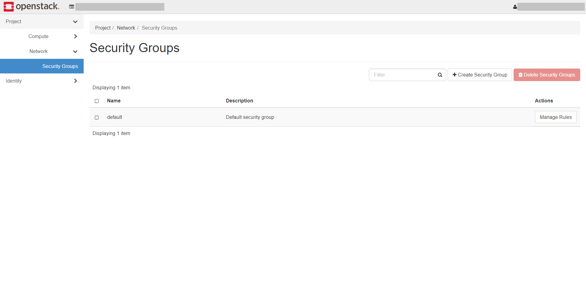
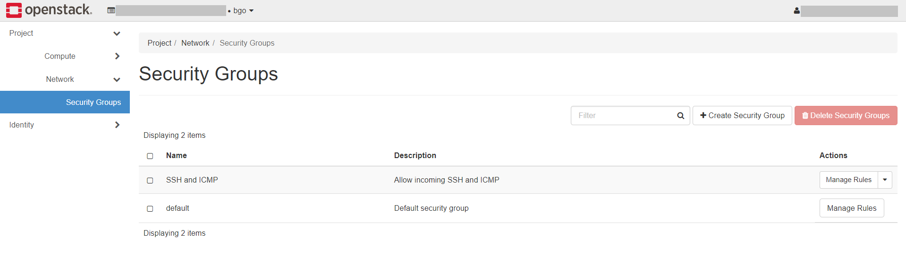

.. |date| date::

Create a Linux virtual machine
==============================

Last changed: |date|

.. contents::

.. _setting-up-keypair:
Setting up a keypair
--------------------

Virtual machines in NREC are accessed using SSH keypairs. There are
numerous ways to achieve this, depending on the OS on your local
computer.

Importing an existing key
~~~~~~~~~~~~~~~~~~~~~~~~~

If the local computer is Linux, any BSD variant such as
FreeBSD, or MacOSX, the easiest way is to create a keypair locally if
you don't already have one:

.. code-block:: console

  $ ssh-keygen
  Generating public/private rsa key pair.
  Enter file in which to save the key (/home/username/.ssh/id_rsa):
  Enter passphrase (empty for no passphrase):
  Enter same passphrase again:
  Your identification has been saved in /home/username/.ssh/id_rsa.
  Your public key has been saved in /home/username/.ssh/id_rsa.pub.
  The key fingerprint is:
  SHA256:UrFhPtth14+S9f8BzMHsy+KbAZJMoC1s+8nHh9UDIc4 username@example.org
  The key's randomart image is:
  +---[RSA 2048]----+
  |     . .+.       |
  |  . o +o.+. o.   |
  |   = . E=.o .+o  |
  |  . o o..=oo+o.+ |
  |   .  .+So.oo=. o|
  |    o o.+ . o.o .|
  |     + + . o o ..|
  |      . . . +   o|
  |           +.   .|
  +----[SHA256]-----+

Another option is to let OpenStack create a keypair for you, more
about that later. To import your existing keypair into OpenStack, go
to the **Key Pairs** tab under **Project** and select "Key
Pairs":

.. image:: images/dashboard-access-and-security-01.png
   :align: center
   :alt: Dashboard - Access & Security

Click the button labeled "Import Key Pair". Give the keypair a name,
and enter the contents of the **id_rsa.pub** file in the "Public Key"
field:

Click "Import Key Pair" and the key is saved:

.. image:: images/dashboard-keypairs-01.png
   :align: center
   :alt: Dashboard - View keypairs

Letting OpenStack create a keypair
~~~~~~~~~~~~~~~~~~~~~~~~~~~~~~~~~~

You can let OpenStack create a keypair for you, if you don't wish to
use an existing one. Go to the **Key Pairs** tab
under **Project** and select "Key Pairs":

Click on "Create Key Pair":

.. image:: images/dashboard-create-keypair-01.png
   :align: center
   :alt: Dashboard - Create an SSH keypair

Choose a name for you keypair and click "Create Key Pair". The newly
created private key will be downloaded by the browser automatically:

The name of the downloaded file is based on the name you provided
earlier. In this example the file is called "test.pem" as "test" was
provided as the keypair name. Remember to restrict the access to the
private key, as SSH will refuse to use unless it's properly
protected:

.. code-block:: console

  $ chmod 0600 test.pem

In order to use the downloaded private key, use the **-i** option to
ssh, like this (example for "test.pem" above):

.. code-block:: console

  $ ssh -i test.pem -l <username> <virtual-machine>

Replace "<virtual-machine>" with the name or IP of the virtual machine
that this keypair is assigned to, and "<username>" with the username
for which the SSH key is added to authorized_keys. For more info, see
`Accessing the virtual machine`_.

Create a virtual machine
------------------------

Once you have an SSH keypair defined, you can proceed with creating a
virtual machine (instance). In the **Project** tab,
select **Instances**:

.. image:: images/dashboard-create-instance-01.png
   :align: center
   :alt: Dashboard - Instances

Click "Launch Instance". The following window will appear:

.. image:: images/dashboard-create-instance-02.png
   :align: center
   :alt: Dashboard - Launch instance

In this window, enter the following values:

**Instance Name**: Select a name for your new virtual machine

**Availability Zone**:
You can choose between `<region>-default-1` and `<region>-legacy-1`. `default` uses a centralized storage, which means that instances will not need to be rebooted while doing maintenance work. On the other hand, `legacy` uses a local storage, which will then require reboot in the case of maintenance work.

**Instance Count**: How many virtual machines to create (usually only 1)

When finished with this tab, select the next, "Source":

**Select Boot Source** should be left at "Image", which is the
default. In this case, the virtual machine will boot from a standard
cloud image. When selecting this option, you can choose from a list of
images. In our example, we have selected "Fedora 24".

When finished with this tab, select the next, "Flavor":

This is where you select the flavor for the virtual machine, i.e. a
pre-defined set of compute resources. In our example, we've selected
the "Small" flavor, which is just enough to run our Fedora instance.

When finished with this tab, select the next, "Networks":

In NREC, there are two networks to choose from, "dualStack"
and "IPv6". Both networks provide a public IPv6 address, so the difference
lays in IPv4. "IPv6" provides a "private" IPv4 address (RFC 1918), which gives
the instance outbound IPv4 connectivity through NAT, while "dualStack" provides
a public IPv4 address as well.

IPv6 is the future of internet IP addressing, but unfortunately, not all devices
support IPv6 yet. Please check your IPv6 connectivity before choosing "IPv6".

You should also note that you only can choose either "dualStack" or "IPv6", choosing
both networks at the same time will result in networking issues.

When finished with this tab, select the "Security Groups" tab:

.. image:: images/dashboard-create-instance-10.png
   :align: center
   :alt: Dashboard - Launch instance - Security Groups

Here, select any "Security Groups" you want to add to the virtual
machine. In our example, we haven't created any security groups yet,
and select only the "Default" security group. For more info, see
the section `Allowing SSH and ICMP access`_ below.

When finished with this tab, select the "Key Pairs" tab:

.. image:: images/dashboard-create-instance-09.png
   :align: center
   :alt: Dashboard - Launch instance - Key Pairs

Here, choose which SSH keypair you want to assign to this virtual
machine.

When satisfied, clik "Launch" to create your virtual machine.

After a few moments, the virtual machine is up and running. If you
chose a public IPv4 address the virtual machine is accessible from the
Internet, but you need to manage security groups in order to reach
it. By default, all network access is denied.

Allowing SSH and ICMP access
----------------------------

In order to allow traffic to the virtual machine, you need to create a
new security group which allows it, and attach that security group to
the virtual machine. Alternatively, you can modify an existing rule
such as "default". To create a new security group, go to the **Network**
tab under **Project** and select "Security Groups":

Click on "Create Security Group":

.. image:: images/dashboard-create-secgroup-01.png
   :align: center
   :alt: Dashboard - Create Security Group

Fill in a name for the new security group, and optionally a
description. Then click "Create Security Group":

Next, click "Manage Rules" for the "SSH and ICMP" security group:

.. image:: images/dashboard-create-secgroup-03.png
   :align: center
   :alt: Dashboard - Create Security Group

You want to add a couple of rules. Click "Add Rule":

Select "ALL ICMP" from the drop-down menu under "Rule". Leave the rest
at its default and click "Add". Repeat the process and select "SSH"
from the "Rule" drop-down menu, and the result should be:

.. image:: images/dashboard-create-secgroup-05.png
   :align: center
   :alt: Dashboard - Create Security Group

Go back to the **Instances** tab under Compute, and use the drop-down
menu to the right of your newly created virtual machine. Select "Edit
Security Groups":

.. image:: images/dashboard-instance-edit-secgroup-01.png
   :align: center
   :alt: Dashboard - Edit Security Group

The following will appear:

.. image:: images/dashboard-instance-edit-secgroup-02.png
   :align: center
   :alt: Dashboard - Edit Security Group

Add the "SSH and ICMP" security group and click "Save".

Accessing the virtual machine
-----------------------------

With a proper security group in place, the virtual machine is now
reachable from the Internet:

.. code-block:: console

  $ ping 158.39.77.101
  PING 158.39.77.101 (158.39.77.101) 56(84) bytes of data.
  64 bytes from 158.39.77.101: icmp_seq=1 ttl=55 time=6.15 ms
  64 bytes from 158.39.77.101: icmp_seq=2 ttl=55 time=6.05 ms
  64 bytes from 158.39.77.101: icmp_seq=3 ttl=55 time=6.01 ms

You can log in to the virtual machine using the SSH key assigned to
the virtual machine. In case you let OpenStack create the keypair for
you (example with "test.pem" above):

.. code-block:: console

  $ ssh -i test.pem fedora@158.39.77.101
  [fedora@test ~]$ uname -sr
  Linux 4.5.5-300.fc24.x86_64
  [fedora@test ~]$ sudo -i
  [fedora@test ~]# whoami
  root

SSH username
~~~~~~~~~~~~
  
Each image has its own default user, for which the SSH public key is
added to its SSH authorized_keys file. This varies with each image,
at the discretion of the image vendor. The most common are:

============== ===========
Image          User
============== ===========
CentOS         centos
Fedora         fedora
Ubuntu         ubuntu
Debian         debian
RHEL           cloud-user
CirrOS         cirros
============== ===========

This is a non-exhaustive list. For images not listed here, consult the
image vendor's documentation.

Doing the same with CLI
-----------------------

.. _Installing the CLI tools: http://docs.nrec.no/api.html#openstack-command-line-interface-cli

For information on how to install the *command line tools*, check the section
`Installing the CLI tools`_.

#. Listing any existing servers, keypairs and security groups:

   .. code-block:: console

     $ openstack server list

     $ openstack keypair list

     $ openstack security group list
     +--------------------------------------+---------+------------------------+----------------------------------+
     | ID                                   | Name    | Description            | Project                          |
     +--------------------------------------+---------+------------------------+----------------------------------+
     | 5c87d72e-2186-4878-94cd-27a784019988 | default | Default security group | dd21945e2e094a4dad277ed7846b3cf0 |
     +--------------------------------------+---------+------------------------+----------------------------------+

   In this example, we have no servers and keypairs, and our copy of
   the default security group.

#. Uploading an SSH key:

   .. code-block:: console

     $ openstack keypair create --public-key ~/.ssh/id_rsa.pub mykey
     +-------------+-------------------------------------------------+
     | Field       | Value                                           |
     +-------------+-------------------------------------------------+
     | fingerprint | e2:2e:26:7f:5d:98:9e:8f:5e:fd:c7:d5:d0:6b:44:e7 |
     | name        | mykey                                           |
     | user_id     | 6bb8dbcdc9b94fff89258094bc56a49f                |
     +-------------+-------------------------------------------------+

#. Creating a security group:

   .. code-block:: console

     $ openstack security group create --description "Allow incoming SSH and ICMP" SSH_and_ICMP
     +-------------+---------------------------------------------------------------------------------+
     | Field       | Value                                                                           |
     +-------------+---------------------------------------------------------------------------------+
     | description | Allow incoming SSH and ICMP                                                     |
     | headers     |                                                                                 |
     | id          | 0da85d7a-bd96-4d4d-a77b-e7e2d78c8d0a                                            |
     | name        | SSH_and_ICMP                                                                    |
     | project_id  | dd21945e2e094a4dad277ed7846b3cf0                                                |
     | rules       | direction='egress', ethertype='IPv4', id='b04b0cfc-1f2e-44b5-acc2-7102d57fe941' |
     |             | direction='egress', ethertype='IPv6', id='2d72e9f9-70c1-4c33-816c-83b5e3c649df' |
     +-------------+---------------------------------------------------------------------------------+

#. Adding rules to the security group:

   .. code-block:: console

     $ openstack security group rule create --remote-ip 0.0.0.0/0 (for IPv4) or ::/0 (for IPv6) --dst-port 22 --protocol tcp --ingress SSH_and_ICMP
     +-------------------+--------------------------------------+
     | Field             | Value                                |
     +-------------------+--------------------------------------+
     | description       |                                      |
     | direction         | ingress                              |
     | ethertype         | IPv4                                 |
     | headers           |                                      |
     | id                | 8c10f0a3-c284-4b92-a234-7ceda998d356 |
     | port_range_max    | 22                                   |
     | port_range_min    | 22                                   |
     | project_id        | dd21945e2e094a4dad277ed7846b3cf0     |
     | protocol          | tcp                                  |
     | remote_group_id   | None                                 |
     | remote_ip_prefix  | 0.0.0.0/0                            |
     | security_group_id | 0da85d7a-bd96-4d4d-a77b-e7e2d78c8d0a |
     +-------------------+--------------------------------------+

     $ openstack security group rule create --remote-ip 0.0.0.0/0 (for IPv4) or ::/0 (for IPv6) --protocol icmp --ingress SSH_and_ICMP
     +-------------------+--------------------------------------+
     | Field             | Value                                |
     +-------------------+--------------------------------------+
     | description       |                                      |
     | direction         | ingress                              |
     | ethertype         | IPv4                                 |
     | headers           |                                      |
     | id                | d741564d-886d-4019-915d-b1eecb936100 |
     | port_range_max    | None                                 |
     | port_range_min    | None                                 |
     | project_id        | dd21945e2e094a4dad277ed7846b3cf0     |
     | protocol          | icmp                                 |
     | remote_group_id   | None                                 |
     | remote_ip_prefix  | 0.0.0.0/0                            |
     | security_group_id | 0da85d7a-bd96-4d4d-a77b-e7e2d78c8d0a |
     +-------------------+--------------------------------------+

#. Listing available images:

   .. code-block:: console

     $ openstack image list
     +--------------------------------------+---------------------+-------------+
     | ID                                   | Name                | Status      |
     +--------------------------------------+---------------------+-------------+
     | 2120eb31-09b6-4945-a904-7579ac579aed | Ubuntu server 16.04 | active      |
     | cbd76177-c79b-490f-9a7f-59f9eed3412e | Debian Jessie 8     | active      |
     | d175564a-156e-41c7-b2a3-fd8b018e9e11 | Outdated (Ubuntu)   | deactivated |
     | 484e5754-f4f7-409c-8ba1-454e422816b4 | Outdated (Ubuntu)   | deactivated |
     | fecf1f4d-e36d-44fe-94de-4eae707b40aa | Outdated (Ubuntu)   | deactivated |
     | 6f24613b-4f98-4caa-9bc6-0294f4c67fac | Outdated (Ubuntu)   | deactivated |
     | 1ae6303e-5d08-454e-94e6-083d05559998 | Fedora 24           | active      |
     | ceb6ff80-24de-460a-9ecc-85f3283aa98e | Outdated (Debian)   | deactivated |
     | d241a2b5-cd1d-4812-8d59-2ccfb1acbf88 | CentOS 7            | active      |
     +--------------------------------------+---------------------+-------------+

#. Listing available flavors:

   .. code-block:: console

     $ openstack flavor list
     +--------------------------------------+------------+-------+------+-----------+-------+-----------+
     | ID                                   | Name       |   RAM | Disk | Ephemeral | VCPUs | Is Public |
     +--------------------------------------+------------+-------+------+-----------+-------+-----------+
     | 1                                    | m1.tiny    |   512 |    1 |         0 |     1 | True      |
     | 34532829-2bb7-42f6-aae1-9654908a521e | m1.large   |  8192 |   20 |         0 |     4 | True      |
     | 47d7f445-db26-4f1d-bf58-e79de7394f97 | m1.medium  |  4096 |   20 |         0 |     2 | True      |
     | 922bfed4-42e5-4baa-8ea4-9e164839ca41 | m1.windows |  8192 |   50 |         0 |     4 | True      |
     | b128b802-3d12-401d-bf51-878122c0e908 | m1.small   |  2048 |   10 |         0 |     1 | True      |
     | ff6e88a4-3da9-4cbe-9c5d-a47d51f9c37a | m1.xlarge  | 16384 |   20 |         0 |     8 | True      |
     +--------------------------------------+------------+-------+------+-----------+-------+-----------+

#. Listing available networks:

   .. code-block:: console

     $ openstack network list
     +--------------------------------------+------------+--------------------------------------+
     | ID                                   | Name       | Subnets                              |
     +--------------------------------------+------------+--------------------------------------+
     | c97fa886-592e-4ad1-a995-6d55651bed78 | osl-public | c4f1c0aa-6b02-4870-a743-3403d0740082 |
     +--------------------------------------+------------+--------------------------------------+

#. Creating a server (instance):

   .. code-block:: console

     $ openstack server create --image "Fedora 24" --flavor m1.small \
           --security-group SSH_and_ICMP --security-group default \
           --key-name mykey --nic net-id=osl-public myserver
     +--------------------------------------+-----------------------------------------------------+
     | Field                                | Value                                               |
     +--------------------------------------+-----------------------------------------------------+
     | OS-DCF:diskConfig                    | MANUAL                                              |
     | OS-EXT-AZ:availability_zone          |                                                     |
     | OS-EXT-STS:power_state               | NOSTATE                                             |
     | OS-EXT-STS:task_state                | scheduling                                          |
     | OS-EXT-STS:vm_state                  | building                                            |
     | OS-SRV-USG:launched_at               | None                                                |
     | OS-SRV-USG:terminated_at             | None                                                |
     | accessIPv4                           |                                                     |
     | accessIPv6                           |                                                     |
     | addresses                            |                                                     |
     | adminPass                            | P7QpJ7gQzdva                                        |
     | config_drive                         |                                                     |
     | created                              | 2016-11-14T12:12:07Z                                |
     | flavor                               | m1.small (b128b802-3d12-401d-bf51-878122c0e908)     |
     | hostId                               |                                                     |
     | id                                   | 132c186a-03a2-4449-b8d0-04b85a37e21a                |
     | image                                | Fedora 24 (1ae6303e-5d08-454e-94e6-083d05559998)    |
     | key_name                             | mykey                                               |
     | name                                 | myserver                                            |
     | os-extended-volumes:volumes_attached | []                                                  |
     | progress                             | 0                                                   |
     | project_id                           | dd21945e2e094a4dad277ed7846b3cf0                    |
     | properties                           |                                                     |
     | security_groups                      | [{u'name': u'SSH_and_ICMP'}, {u'name': u'default'}] |
     | status                               | BUILD                                               |
     | updated                              | 2016-11-14T12:12:07Z                                |
     | user_id                              | 6bb8dbcdc9b94fff89258094bc56a49f                    |
     +--------------------------------------+-----------------------------------------------------+

#. Listing servers:

   .. code-block:: console

     $ openstack server list
     +--------------------------------------+----------+--------+-------------------------+------------+
     | ID                                   | Name     | Status | Networks                | Image Name |
     +--------------------------------------+----------+--------+-------------------------+------------+
     | 132c186a-03a2-4449-b8d0-04b85a37e21a | myserver | ACTIVE | osl-public=158.37.63.62 | Fedora 24  |
     +--------------------------------------+----------+--------+-------------------------+------------+

