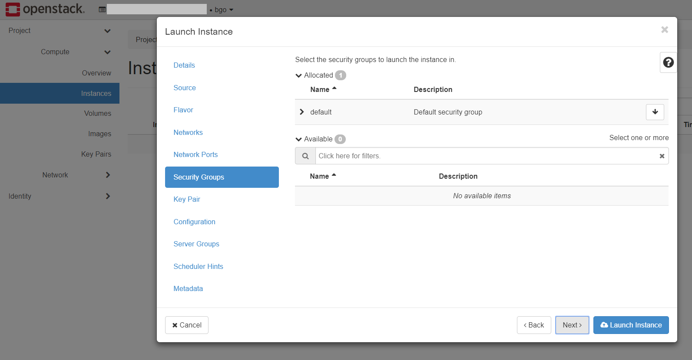
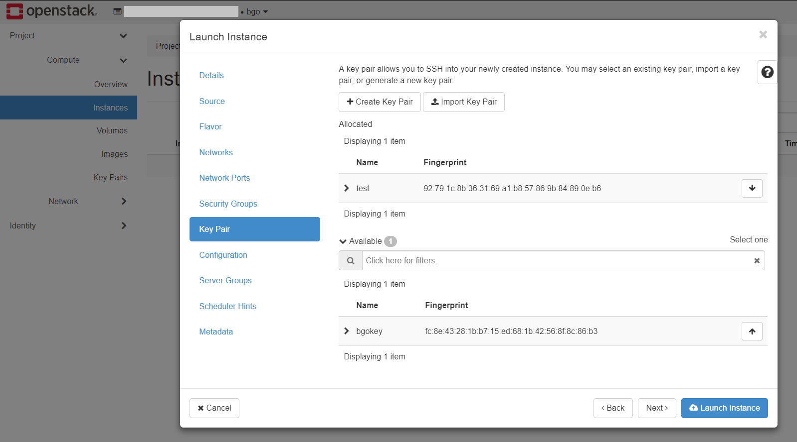
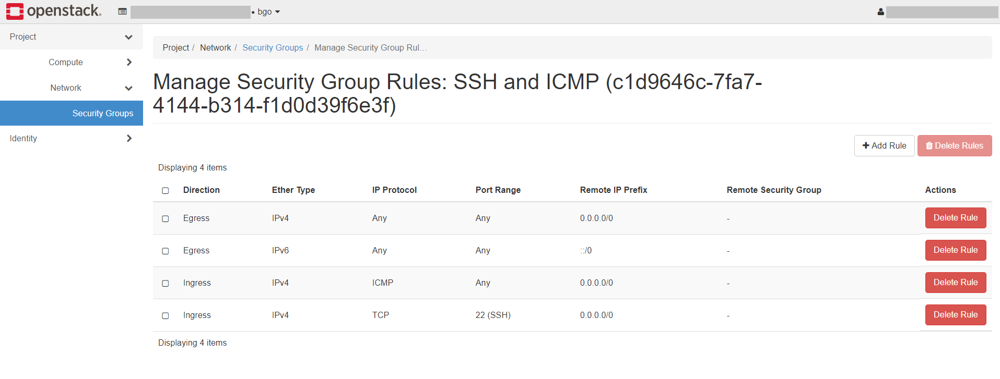

.. |date| date::

Create a Linux virtual machine
==============================

Last changed: |date|

.. contents::

.. _Security Groups: security-groups.html
.. _the default security group: security-groups.html#the-default-security-group
.. _Using SSH: ssh.html
.. _Creating a key pair: ssh.html#creating-a-key-pair
.. _Connecting to the instance: ssh.html#connecting-to-the-instance

SSH key pair
------------

Virtual machines in NREC are accessed using SSH key pairs. If you
don't already have an SSH key pair, visit `Creating a key pair`_ in
the document `Using SSH`_. You need to have an SSH key pair in order
to proceed.

Create a virtual machine
------------------------

Once you have an SSH keypair defined, you can proceed with creating a
virtual machine (instance). Navigate to **Project** -> **Compute**
-> **Instances**:

.. figure:: images/dashboard-create-instance-01.png
   :align: center
   :alt: Dashboard - Instances

Click **Launch Instance**. The following window will appear:

.. figure:: images/dashboard-create-instance-02.png
   :align: center
   :alt: Dashboard - Launch instance

In this window, enter the following values:

* **Instance Name**: Select a name for your new virtual machine

* **Description**: Optionally set a description
  
* **Availability Zone**: Leave this at its default value

* **Instance Count**: How many virtual machines to create (usually only 1)

When finished with this tab, select the next, **Source**:

.. figure:: images/dashboard-create-instance-06.png
   :align: center
   :alt: Dashboard - Launch instance - Source

**Select Boot Source** should be left at "Image", which is the
default. In this case, the virtual machine will boot from a standard
cloud image. When selecting this option, you can choose from a list of
images. In our example, we have selected "GOLD CentOS 8".

When finished with this tab, select the next, **Flavor**:

.. figure:: images/dashboard-create-instance-07.png
   :align: center
   :alt: Dashboard - Launch instance - Flavor

This is where you select the flavor for the virtual machine, i.e. a
pre-defined set of compute resources. In our example, we've selected
the "Small" flavor, which is just enough to run our CentOS instance.

When finished with this tab, select the next, "Networks":

.. figure:: images/dashboard-create-instance-08.png
   :align: center
   :alt: Dashboard - Launch instance - Networks

In NREC, there are two networks to choose from, "dualStack" and
"IPv6". Both networks provide a public IPv6 address, so the difference
lays in IPv4.

* **IPv6** provides a "private" IPv4 address (RFC 1918), which gives
  the instance outbound IPv4 connectivity through NAT

* **dualStack** provides a public IPv4 address and a public IPv6
  address.

IPv6 is the future of internet IP addressing, but unfortunately, not
all devices support IPv6 yet. Please check your IPv6 connectivity
before choosing "IPv6".

You should also note that you only can choose either "dualStack" or
"IPv6", choosing both networks at the same time will result in
networking issues.

When finished with this tab, select the "Security Groups" tab:

Here, select any `Security Groups`_ (i.e. IP filters) you want to add
to the virtual machine. `The default security group`_ is already
selected, and in our example we have another that we have created
before. Choose which security groups should be applied to the
instance. This can be also be edited at a later time. For more info,
see the section `Allowing SSH and ICMP access`_ below.

When finished with this tab, select the **Key Pairs** tab:

Here, choose which SSH keypair you want to assign to this virtual
machine. Adding SSH public key to the instance is only done during
instance creation and cannot be changed later.

When satisfied, clik "Launch" to create your virtual machine.

.. figure:: images/dashboard-create-instance-11.png
   :align: center
   :alt: Dashboard - Launch instance - finished

After a few moments, the virtual machine is up and running.

Allowing SSH and ICMP access
----------------------------

.. _Working with Security Groups: security-groups.html

For more information about allowing access via security groups, visit
`Working with Security Groups`_.

In order to allow traffic to the virtual machine, you need to create a
new security group which allows it, and attach that security group to
the virtual machine. To create a new security group, navigate to
the **Project** -> **Network** -> **Security Groups**:

.. figure:: images/dashboard-access-and-security-02.png
   :align: center
   :alt: Dashboard - Access & Security

Click on **Create Security Group**:

Fill in a name for the new security group, and optionally a
description. Then click **Create Security Group**. The dashboard will
automatically navigate into where you are expected to manage the
security group rules:

You want to add a couple of rules. Click "Add Rule":

.. figure:: images/dashboard-create-secgroup-04.png
   :align: center
   :alt: Dashboard - Create Security Group

Select "ALL ICMP" from the drop-down menu under "Rule". Leave the rest
at its default and click **Add**. Repeat the process and select "SSH"
from the "Rule" drop-down menu, and the result should be:

.. NOTE::
   In this case we are adding ICMP and SSH from a single machine
   (login.uio.no) via IPv6. You will have to repeat the process for
   the IPv4 address if you want to open for IPv4 as well.

Navigate to **Compute** -> **Instances**, and use the drop-down menu
to the right of your newly created virtual machine. Select **Edit
Security Groups**:

.. figure:: images/dashboard-instance-edit-secgroup-01.png
   :align: center
   :alt: Dashboard - Edit Security Group

The following will appear:

.. figure:: images/dashboard-instance-edit-secgroup-02.png
   :align: center
   :alt: Dashboard - Edit Security Group

Add the "SSH and ICMP" security group and click **Save**.

Accessing the virtual machine
-----------------------------

With a proper security group in place, the virtual machine is now
reachable from the Internet:

.. code-block:: console

  $ ping6 2001:700:2:8301::1366
  PING 2001:700:2:8301::1366(2001:700:2:8301::1366) 56 data bytes
  64 bytes from 2001:700:2:8301::1366: icmp_seq=1 ttl=55 time=6.12 ms
  64 bytes from 2001:700:2:8301::1366: icmp_seq=2 ttl=55 time=5.96 ms
  64 bytes from 2001:700:2:8301::1366: icmp_seq=3 ttl=55 time=6.57 ms
  64 bytes from 2001:700:2:8301::1366: icmp_seq=4 ttl=55 time=6.01 ms
  ^C
  --- 2001:700:2:8301::1366 ping statistics ---
  4 packets transmitted, 4 received, 0% packet loss, time 3002ms
  rtt min/avg/max/mdev = 5.965/6.170/6.570/0.244 ms

You can log in to the virtual machine using the SSH key assigned to
the virtual machine. For more information, visit `Connecting to the
instance`_ in the document `Using SSH`_.

Doing the same with CLI
-----------------------

.. _Installing the CLI tools: http://docs.nrec.no/api.html#openstack-command-line-interface-cli

For information on how to install the *command line tools*, check the section
`Installing the CLI tools`_.

#. Listing any existing servers, keypairs and security groups:

   .. code-block:: console

     $ openstack server list
     (...no output...)
     
     $ openstack keypair list
     (...no output...)
     
     $ openstack security group list
     +--------------------------------------+---------+------------------------+----------------------------------+------+
     | ID                                   | Name    | Description            | Project                          | Tags |
     +--------------------------------------+---------+------------------------+----------------------------------+------+
     | 6743c744-1a06-462e-82e6-85c9d0b2399f | default | Default security group | 24823ac5a6dd4d27966310600abce54d | []   |
     +--------------------------------------+---------+------------------------+----------------------------------+------+

   In this example, we have no servers and keypairs, and our copy of
   the default security group.

#. Uploading an SSH key:

   .. code-block:: console

     $ openstack keypair create --public-key ~/.ssh/id_rsa.pub mykey
     +-------------+-------------------------------------------------+
     | Field       | Value                                           |
     +-------------+-------------------------------------------------+
     | fingerprint | e2:2e:26:7f:5d:98:9e:8f:5e:fd:c7:d5:d0:6b:44:e7 |
     | name        | mykey                                           |
     | user_id     | 6bb8dbcdc9b94fff89258094bc56a49f                |
     +-------------+-------------------------------------------------+

#. Creating a security group:

   .. code-block:: console

     $ openstack security group create --description "Allow incoming SSH and ICMP" SSH_and_ICMP
     (...output omitted...)

#. Adding rules to the security group:

   .. code-block:: console

     $ openstack security group rule create --ethertype IPv6 --protocol ipv6-icmp --remote-ip 2001:700:100:12::7 SSH_and_ICMP
     (...output omitted...)
     
     $ openstack security group rule create --ethertype IPv6 --protocol tcp --dst-port 22 --remote-ip 2001:700:100:12::7 SSH_and_ICMP
     (...output omitted...)

#. Listing available images:

   .. code-block:: console

     $ openstack image list --status active
     +--------------------------------------+-----------------------------------+--------+
     | ID                                   | Name                              | Status |
     +--------------------------------------+-----------------------------------+--------+
     | c1becb87-ab4f-4988-862e-f5be219755be | GOLD CentOS 7                     | active |
     | cc8bee9f-b8e5-48c3-bc76-ba173a75b503 | GOLD CentOS 8                     | active |
     | 86a0859e-1746-460f-abf7-2f53fe572163 | GOLD Debian 10                    | active |
     | 7ecf8f33-9686-4207-86dc-89cf1946128c | GOLD Debian 9                     | active |
     | a7ab8139-638a-464a-8fad-e2796a87729e | GOLD Fedora 32                    | active |
     | ac68185f-de0f-47fa-b260-c60cb1d31e68 | GOLD Ubuntu 18.04 LTS             | active |
     | 10f180ac-fb3f-47ff-9b3a-00115de56848 | GOLD Ubuntu 20.04 LTS             | active |
     | b2d189c0-a5b4-4660-8007-555f34dcd4c4 | GOLD Windows Server 2016 Standard | active |
     | b7047043-8d00-4ab5-8db5-8b2688d0d74b | GOLD Windows Server 2019 Core     | active |
     | 72568f04-d909-4809-8b0a-279679c054de | GOLD Windows Server 2019 Standard | active |
     +--------------------------------------+-----------------------------------+--------+

#. Listing available flavors:

   .. code-block:: console

     $ openstack flavor list
     +--------------------------------------+-----------+-------+------+-----------+-------+-----------+
     | ID                                   | Name      |   RAM | Disk | Ephemeral | VCPUs | Is Public |
     +--------------------------------------+-----------+-------+------+-----------+-------+-----------+
     | 348dfae3-bf34-4286-8dd8-b700b25fc109 | m1.large  |  8192 |   20 |         0 |     2 | True      |
     | 39351b5b-86db-4a12-bd68-dd5530de802d | m1.xlarge | 16384 |   20 |         0 |     4 | True      |
     | 6877962f-41df-42b3-b955-f3a846bef179 | m1.tiny   |   512 |    2 |         0 |     1 | True      |
     | b128b802-3d12-401d-bf51-878122c0e908 | m1.small  |  2048 |   10 |         0 |     1 | True      |
     | c76cbbc9-df2d-4b8c-9587-b9b9bc232685 | m1.medium |  4096 |   20 |         0 |     1 | True      |
     +--------------------------------------+-----------+-------+------+-----------+-------+-----------+

#. Listing available networks:

   .. code-block:: console

     $ openstack network list -c ID -c Name
     +--------------------------------------+-----------+
     | ID                                   | Name      |
     +--------------------------------------+-----------+
     | 62421b56-346d-4794-99b0-fc27fe4e700f | IPv6      |
     | c97fa886-592e-4ad1-a995-6d55651bed78 | dualStack |
     +--------------------------------------+-----------+

#. Creating a server (instance):

   .. code-block:: console

     $ openstack server create --image "GOLD CentOS 8" --flavor m1.small \
           --security-group SSH_and_ICMP --security-group default \
           --key-name mykey --nic net-id=IPv6 myserver
     +-----------------------------+------------------------------------------------------+
     | Field                       | Value                                                |
     +-----------------------------+------------------------------------------------------+
     | OS-DCF:diskConfig           | MANUAL                                               |
     | OS-EXT-AZ:availability_zone | osl-default-1                                        |
     | OS-EXT-STS:power_state      | NOSTATE                                              |
     | OS-EXT-STS:task_state       | scheduling                                           |
     | OS-EXT-STS:vm_state         | building                                             |
     | OS-SRV-USG:launched_at      | None                                                 |
     | OS-SRV-USG:terminated_at    | None                                                 |
     | accessIPv4                  |                                                      |
     | accessIPv6                  |                                                      |
     | addresses                   |                                                      |
     | adminPass                   | BHb84gEEks3F                                         |
     | config_drive                |                                                      |
     | created                     | 2021-03-15T13:28:06Z                                 |
     | flavor                      | m1.small (b128b802-3d12-401d-bf51-878122c0e908)      |
     | hostId                      |                                                      |
     | id                          | 9fb1f289-81ae-4b6d-be52-995434ab9978                 |
     | image                       | GOLD CentOS 8 (cc8bee9f-b8e5-48c3-bc76-ba173a75b503) |
     | key_name                    | mykey                                                |
     | name                        | myserver                                             |
     | progress                    | 0                                                    |
     | project_id                  | 24823ac5a6dd4d27966310600abce54d                     |
     | properties                  |                                                      |
     | security_groups             | name='00b69714-0378-46dc-bd3e-718a93b5188d'          |
     |                             | name='6743c744-1a06-462e-82e6-85c9d0b2399f'          |
     | status                      | BUILD                                                |
     | updated                     | 2021-03-15T13:28:06Z                                 |
     | user_id                     | 6bb8dbcdc9b94fff89258094bc56a49f                     |
     | volumes_attached            |                                                      |
     +-----------------------------+------------------------------------------------------+

#. Listing servers:

   .. code-block:: console

     $ openstack server list
     +--------------------------------------+----------+--------+----------------------------------------+---------------+----------+
     | ID                                   | Name     | Status | Networks                               | Image         | Flavor   |
     +--------------------------------------+----------+--------+----------------------------------------+---------------+----------+
     | 9fb1f289-81ae-4b6d-be52-995434ab9978 | myserver | ACTIVE | IPv6=2001:700:2:8201::13f2, 10.2.2.104 | GOLD CentOS 8 | m1.small |
     +--------------------------------------+----------+--------+----------------------------------------+---------------+----------+

