.. |date| date::

Create a Windows virtual machine
================================

Last changed: |date|

.. contents::

.. IMPORTANT::
   Because of Windows' rather steep resource demands, a demo
   project will have insufficient disk quota to launch windows
   instances. In other words, you will need another project with
   higher quotas in order to run Windows. Ask for access to the "win" flavor.

.. TIP::
   Starting with Windows Server 2019, a SSH server is automatically configured
   and started in your Windows Instance. It takes some time from the instance
   appears configured until it is actually finished. Be patient if you want
   to start a SSH session to your Windows instance.

.. NOTE::
   When launching Windows instances in the BGO region, these will automatically
   be activated. However, for licensing reasons, this will not as yet happen
   in the OSL region, and the Windows instances there will run unactivated.

Setting up a keypair
--------------------

For Windows instances SSH keys may be used to retreive a random generated
password, or, for Windows Server 2019 or newer, to create a SSH session
to the instance. Either way you will need a SSH keypair to go with your
Windows instance. Refer to :doc:`create-virtual-machine` for more information
on how to create a SSH keypair.

Create a virtual machine
------------------------

Once you have an SSH keypair defined, you can proceed with creating a
virtual machine (instance). In the **Project** tab,
select **Instances**:

.. image:: images/dashboard-create-instance-01.png
   :align: center
   :alt: Dashboard - Instances

Click "Launch Instance". The following window will appear:

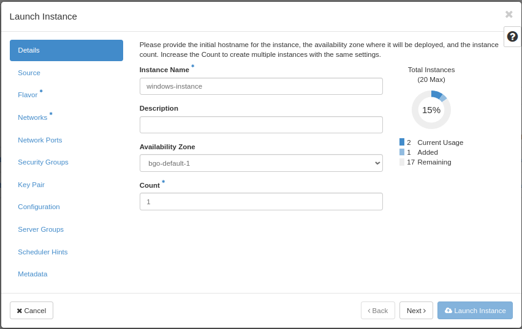

In this window, enter the following values:

* **Instance Name**: Select a name for your new virtual machine
* **Availability Zone**: bgo-default-1 or osl-default-1 (based on region)
* **Instance Count**: How many virtual machines to create (usually only 1)

When finished with this tab, select the next, "Source":

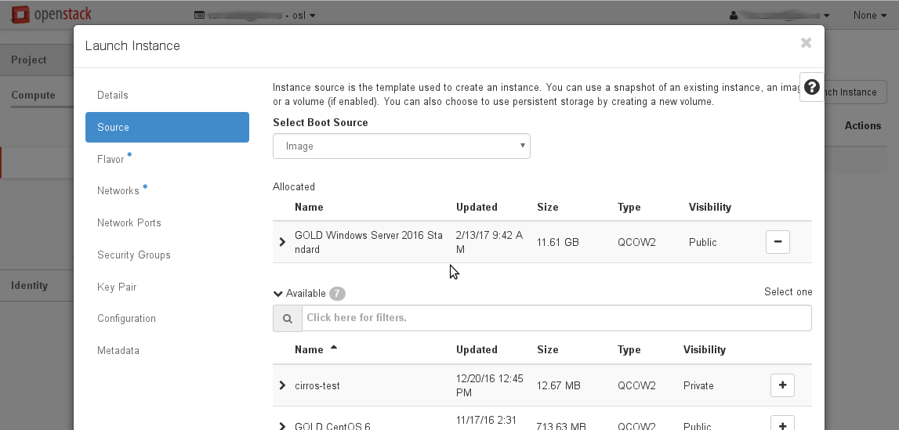

**Select Boot Source** should be left at "Image", which is the
default. In this case, the virtual machine will boot from a standard
cloud image. When selecting this option, you can choose from a list of
images. In our example, we have selected "GOLD Windows Server 2016 Standard".

When finished with this tab, select the next, "Flavor":

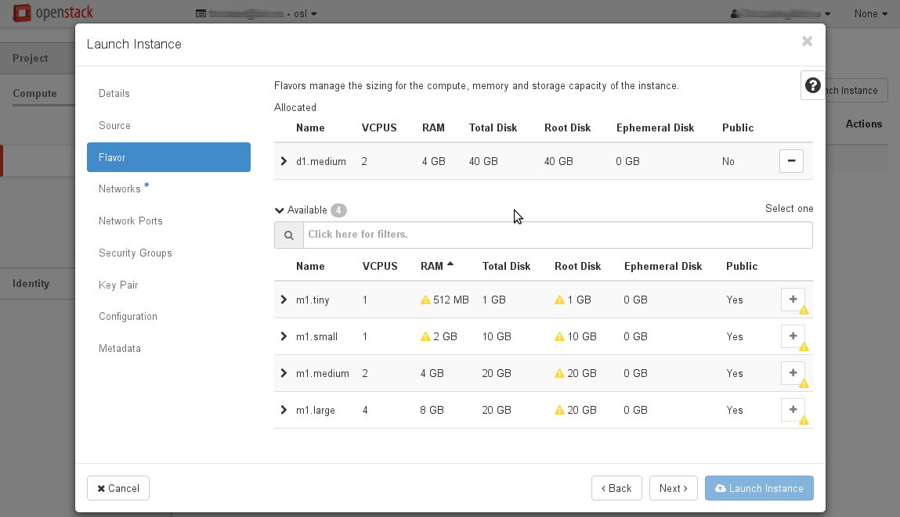

This is where you select the flavor for the virtual machine, i.e. a
pre-defined set of compute resources. In our example, we've selected
the "win.small" flavor, which is just enough to run our Windows instance. By
default, you don't have access to this flavor. Ask in your project request, or
post a support case.

When finished with this tab, select the next, "Networks":

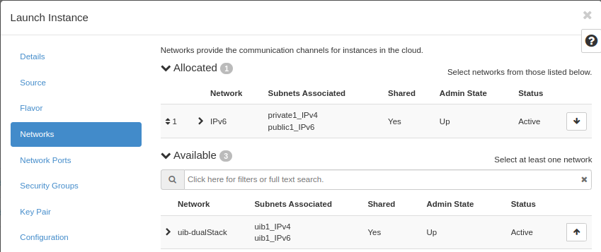

In the UH-IaaS cloud, there are two networks to choose from, "dualStack"
and "IPv6". Both networks provides a public IPv6 address, so the difference
lays in IPv4. "dualStack" provides a public IPv4 address as well, while
"IPv6" provides a "private" IPv4 address (rfc 1918) which gives the
instance outbound IPv4 connectivity through NAT. IPv6 is the future
of internet addressing, but unfortunately not all computers are
IPv6 enabled as yet. Check your IPv6 connectivity before choosing "IPv6".

When finished with this tab, you can optionally add security groups. In
our example, we skip this stage (we will create and add security group later)

Select the "Key Pair" tab:

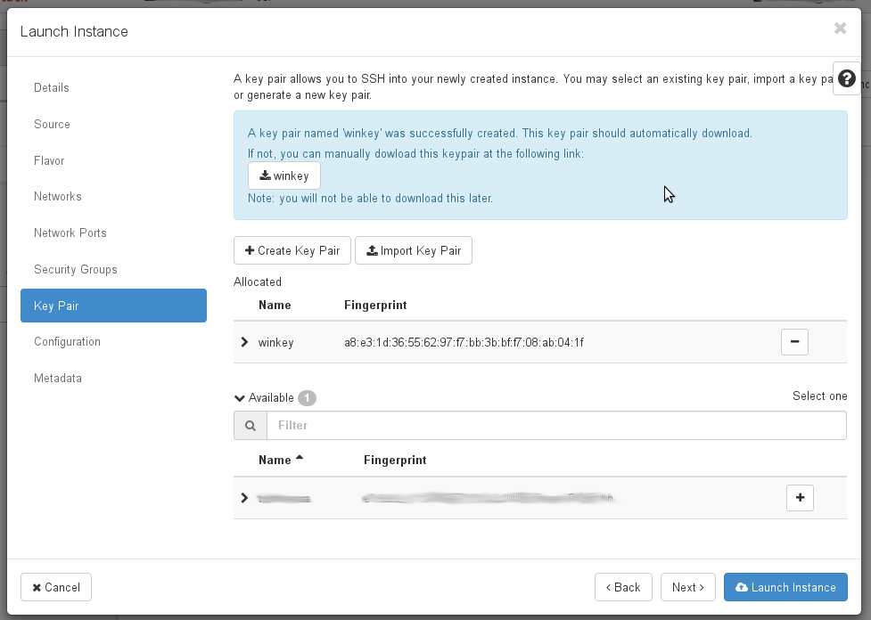

Here, choose a SSH keypair you want to assign to this virtual
machine for password retrieval. In this example, we have created a new
key pair, and we have downloaded the .pem-file to our local computer.

When satisfied, clik "Launch Instance" to create your virtual machine.

Allowing RDP access
-------------------

.. TIP::
   Starting with Windows Server 2019, a SSH server is automatically configured
   and started in your Windows Instance. You will have to create a security group
   that opens for port 22 in order to access the service. Unlike on linux instances,
   the username is "Admin". When you ssh into your Windows instance, you will
   start in a CMD shell. If you want powershell instead, just type "powershell"

While we wait for our virtual machine to be created and configured, we can
create a security group for the Remote Desktop protocol in order to grant
ourselves access to the new virtual machine:

Select the "Access & Security" tab and select "Create Security Group":

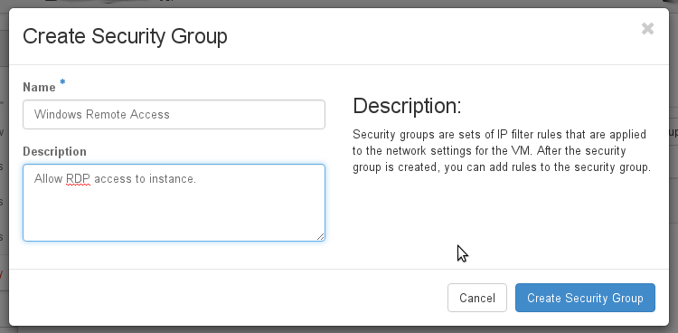

Here, enter a name and optionally a description, then click "Create Security
Group". Click "Manage Rules" on your newly created security group, then
"Add Rule":

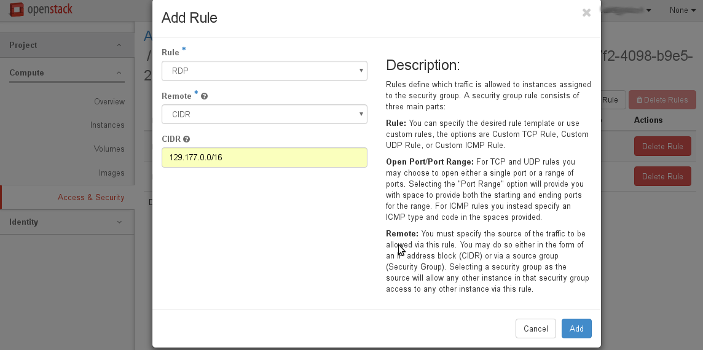

"RDP" is pre-defined in the system, so select that from the menu. In this
example we limit access to a CIDR mask corresponding to the campus network for
The University of Bergen. If you instead enter 0.0.0.0/0 or ::/0, that will translate
to the entire Internet, granting global access. Click "Add".

.. IMPORTANT::
   Unlike linux instances, the Windows instances have both an internal "Windows
   Firewall" and external security groups. By default the internal "Windows Firewall"
   has the ports for RDP and SSH (on Windows Server 2019 and later) open, but you still
   have to create the proper security groups and associate them with the instance in order
   to consume the services.

If the instance is ready, we can now assign our new rule to the virtual machine.
Click on your instance in "Instances" tab, then select "Edit Security Groups":

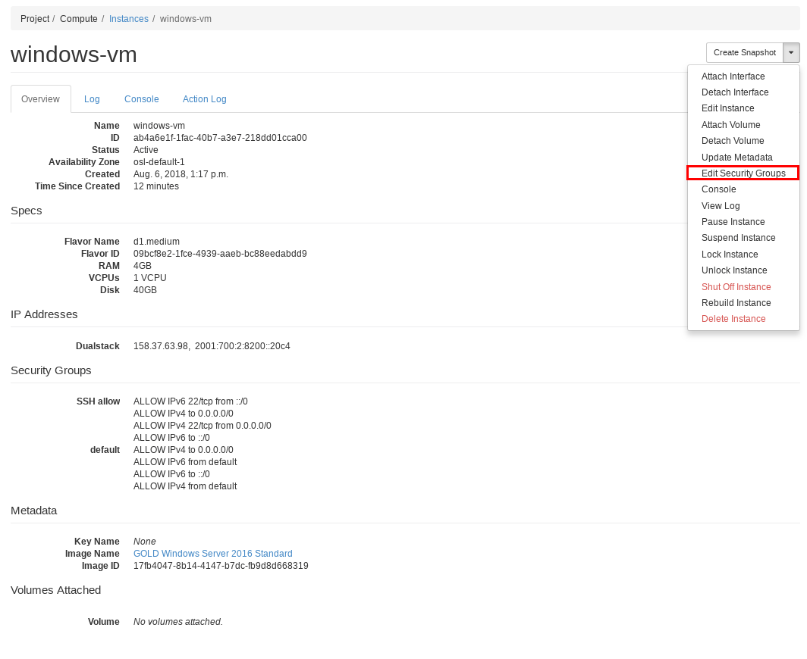

Click on the plus sign associated with our new rule, so that the rule
moves to the right hand box, "Instance Security Groups", then click "Save":

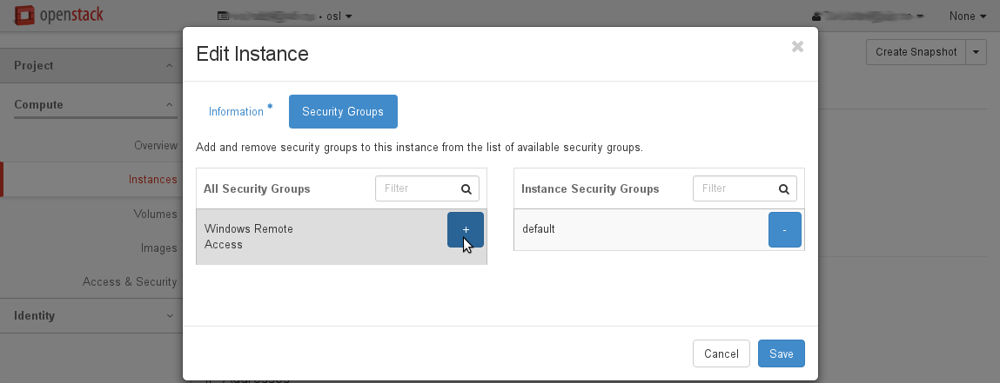

Optionally, you can also add a rule for ICMP access, so that you can ping the
instance. This is described in the previous chapter, "Create a Linux virtual machine"

Retrieve Admin password
-----------------------

.. IMPORTANT::
   The local "Administrator" account is disabled by the system a short while after
   your instance is spawned. "Admin" is the only account available for logon.

We are now almost ready to log on to our new Windows virtual machine, but first
we must retrieve a password. Select "Retrieve Password" from the drop down menu:

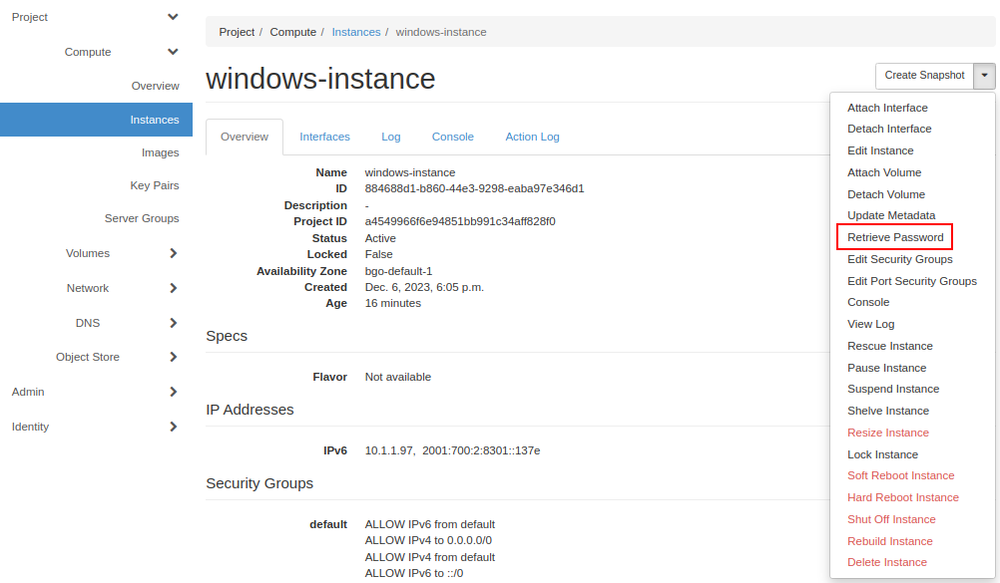

.. IMPORTANT::
   It takes a while until the password retrieval feature is ready in a newly
   launched instance - please be patient. Until the system is ready, the Retrieve
   Instance Password will tell you "Instance Password is not set or is not yet available"

When the system is ready to decrypt your password, you will be asked for your
private key. In this case we click "Choose File" and point to the .pem file we
downloaded when we created the key pair:

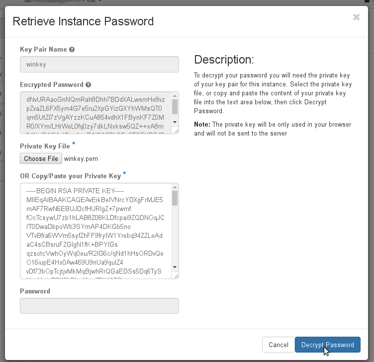

When you click "Decrypt Password", the password will be shown in the "Password" field.

.. TIP::
   You can retrieve the passord from the command line, using the "nova" client. The
   openstack client has not yet implemented this feature. Every instance has a name
   and ID:

   .. code-block:: console

     $ openstack server list 
     +--------------------------------------+-----------------+--------+----------------------+-----------------------------------+
     | ID                                   | Name            | Status | Networks             | Image Name                        |
     +--------------------------------------+-----------------+--------+----------------------+-----------------------------------+
     | e88b1380-65a5-4975-9338-7213d8df47f2 | windows-machine | ACTIVE | public=158.37.63.197 | GOLD Windows Server 2016 Standard |
     +--------------------------------------+-----------------+--------+----------------------+-----------------------------------+
   
   Now you can use the name or ID to retrieve your password:

   .. code-block:: console

     $ nova get-password e88b1380-65a5-4975-9338-7213d8df47f2 /home/user/winkey.pem
     ceq26oGb2xw8RQR3Gcdn

   If your private key is password protected, you will be asked for the password. If
   the system is not yet ready to give you the password, you will receive no output at
   all. Wait a while and try again.

.. IMPORTANT::
   If you have a password protected private key, you **must** use the nova command line
   client, as this feature is unavailable in the dashboard.

Launch Remote Desktop
---------------------

When you have retrieved the password, you are ready to log on. For example, from a linux
client:

   .. code-block:: console

     $ rdesktop -g 1280x1024 -k no -u Admin -p ceq26oGb2xw8RQR3Gcdn 158.37.63.197

This will create a session with a fixed size (the "-g" option), and Norwegian keyboard layout
with the user "Admin", which is an account that is automatically created in the virtual
machine. From a windows machine, you can launch "Remote Desktop Connection":

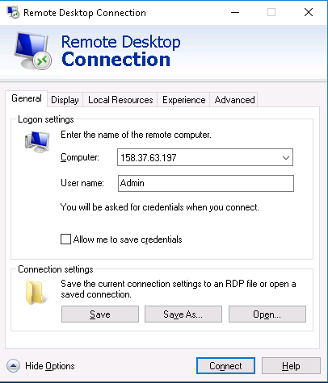

Congratulations! You now have a virtual machine running Windows. You can now proceed to
create and mount volumes and install software:

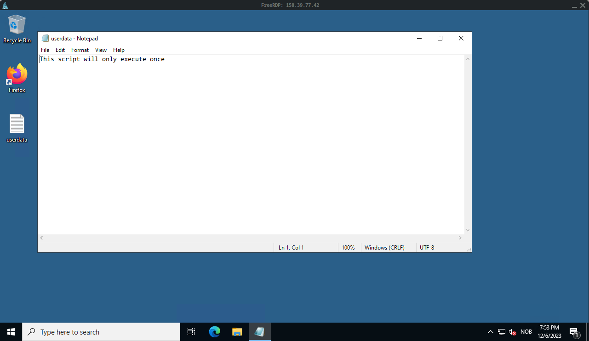
