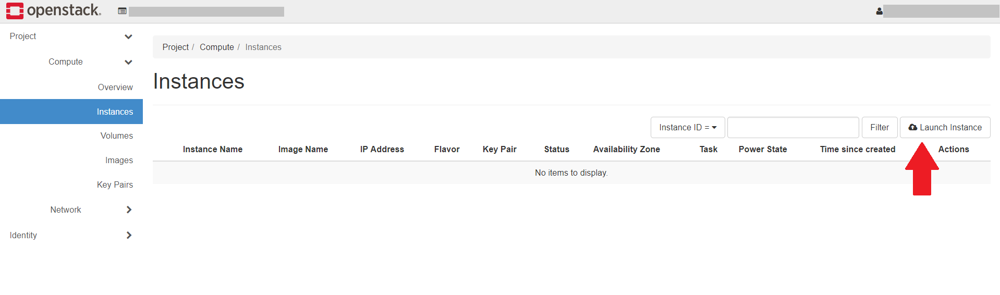

.. |date| date::

Create a Windows virtual machine
================================

Last changed: |date|

.. _IPv6 or dualStack: networking.html#ipv6-or-dualstack

.. contents::

.. # .. IMPORTANT::
.. #    Because of Windows' rather steep resource demands, a demo
.. #    project will have insufficient disk quota to launch windows
.. #    instances. In other words, you will need another project with
.. #    higher quotas in order to run Windows. Ask for access to the "win" flavor.
.. # 
.. # .. TIP::
.. #    An SSH server is automatically configured
.. #    and started in your Windows Instance. It takes some time from the instance
.. #    appears configured until it is actually finished. Be patient if you want
.. #    to start an SSH session to your Windows instance.
.. # 
.. # .. NOTE::
.. #    When launching Windows instances in the BGO region, these will automatically
.. #    be activated. However, for licensing reasons, this will not as yet happen
.. #    in the OSL region, and the Windows instances there will run unactivated.
.. # 
.. # .. WARNING::
.. #    If you want to create a snapshot of a windows instance as a base for new
.. #    instances, you must run sysprep.exe in order for any instances launched from
.. #    the snapshot to work.

Caveats and Limitations
-----------------------

.. _Virtual Desktop Infrastructure (VDI) at UiO: https://www.uio.no/english/services/it/computer/vdi/

NREC as a platform does not offer Windows specific services that you
may find in large commercial clouds, like Microsoft Azure and Amazon
AWS. There are a few things to consider when running Windows in NREC,
compared to e.g. Linux, mostly due to the need for graphical console
and the fact that Windows is a commercial product that needs licensing
to work securely over time.

The following is a list of caveats and limitations that you should
keep in mind when considering running Windows in NREC:

* NREC does not (mostly) license its hypervisors for running
  Windows. Microsoft offers updates for unlicensed Windows hosts for a
  short period of time. If your Windows instance should exist for
  longer than that, you will need to supply your own license for it in
  order to receive updates.

  There is an exception for UiB users, who may get access to
  the **win** flavor. Instances of this flavor will run on licensed
  hypervisors in the BGO region.

* NREC offers basic VNC for remote console access. This is a simple
  service that does not provide advanced remote display functions. You
  should set up remote access via RDP, which is superior to the NREC
  console. For even more advanced remote display functions such as GPU
  acceleration, consider `Virtual Desktop Infrastructure (VDI) at
  UiO`_

* Because of Windows' rather steep resource demands, a demo project
  will have insufficient disk quota to launch windows instances. You
  will need another project with higher quotas in order to run
  Windows. Ask for access to the **d1** or **win** flavors.

* An SSH server is automatically configured and started in your Windows
  Instance. It takes some time from the instance appears configured until
  it is actually finished. Be patient if you want to start an SSH session
  to your Windows instance.

* If you want to create a snapshot of a Windows instance as a base for
  new instances, you must run ``sysprep.exe`` with specific parameters
  in order for any instances launched from the snapshot to work correctly.
  The procedure with the necessary parameters is described on this page.

* The NREC platform supports Windows Server Standard Edition
  only. If you need other variants like the Core Edition, please let
  us know. For supported windows versions, see :doc:`nrec-gold-images`

.. # 
.. # Supported Windows versions
.. # --------------------------
.. # 
.. # The NREC platform supports Windows Server Standard Edition only. If you
.. # need other variants like the Core Edition, please let us know.

Setting up a keypair
--------------------

For Windows instances SSH keys may be used to retreive a random generated
password or to create an SSH session to the instance. Either way you will need
an SSH keypair to go with your Windows instance. Refer to :doc:`create-virtual-machine`
for more information on how to create an SSH keypair.

Create a virtual machine
------------------------

Once you have an SSH keypair defined, you can proceed with creating a
virtual machine (instance). In the **Project** tab,
select **Instances**:

Click "Launch Instance". The following window will appear:

.. image:: images/dashboard-create-windows-01.png
   :align: center
   :alt: Dashboard - Launch instance

In this window, enter the following values:

* **Instance Name**: Select a name for your new virtual machine
* **Availability Zone**: bgo-default-1 or osl-default-1 (based on region)
* **Instance Count**: How many virtual machines to create (usually only 1)

When finished with this tab, select the next, "Source":

.. image:: images/dashboard-create-windows-02.png
   :align: center
   :alt: Dashboard - Launch instance - Source

**Select Boot Source** should be left at "Image", which is the
default. In this case, the virtual machine will boot from a standard
cloud image. When selecting this option, you can choose from a list of
images. In our example, we have selected "GOLD Windows Server 2022 Standard".

When finished with this tab, select the next, "Flavor":

.. image:: images/dashboard-create-windows-03.png
   :align: center
   :alt: Dashboard - Launch instance - Flavor

This is where you select the flavor for the virtual machine, i.e. a
pre-defined set of compute resources. In our example, we've selected
the "win.medium" flavor, which is enough to run our Windows instance. By
default, you don't have access to this flavor. Ask in your project request, or
post a support case.

When finished with this tab, select the next, "Networks":

.. image:: images/dashboard-create-windows-04.png
   :align: center
   :alt: Dashboard - Launch instance - Networks

In NREC, there are two networks to choose from, "dualStack" and
"IPv6". Both networks provide a public IPv6 address, so the difference
lays in IPv4.

* **IPv6** provides a "private" IPv4 address (RFC 1918), which gives
  the instance outbound IPv4 connectivity through NAT

* **dualStack** provides a public IPv4 address and a public IPv6
  address.

For more information, see `IPv6 or dualStack`_.

.. NOTE::
   **Only one network!**

   The instance will not work correctly if more than one network is
   applied. Only choose one of **IPv6** or **dualStack**.

   If unsure, choose **IPv6**. Our IPv4 address space is very
   limited. Login hosts at UiO and UiB have IPv6 configured, and can
   be used to manage your instances via IPv6.

When finished with this tab, you can optionally add security groups. In
our example, we skip this stage (we will create and add security group later)

Select the "Key Pair" tab:

.. image:: images/dashboard-create-windows-05.png
   :align: center
   :alt: Dashboard - Launch instance - Key Pair

Here, choose an SSH keypair you want to assign to this virtual
machine for password retrieval and SSH login. In this example, we have created
a new SSH key pair, and we have downloaded the .pem-file to our local computer,
naming the private key ``windowskey.pem``.

Optionally, you may specify a one shot configuration to be executed when
the instance starts for the first time. In this example we want to execute a
simple powershell script.

.. image:: images/dashboard-create-windows-05-conf.png
   :align: center
   :alt: Dashboard - Launch instance - Customization script

When satisfied, clik "Launch Instance" to create your virtual machine.

Allowing RDP access
-------------------

.. _Working with Security Groups: security-groups.html

.. TIP::
   An SSH server is automatically configured and started in your Windows Instance.
   You will have to create a security group that opens for port 22 in order to
   access the service. Unlike on linux instances, the username is "Admin". When
   you ssh into your Windows instance, you will start in a CMD shell. If you want
   powershell instead, just type "powershell"

While we wait for our virtual machine to be created and configured, we can
create a security group for the Remote Desktop protocol in order to grant
ourselves access to the new virtual machine:

Select the "Access & Security" tab and select "Create Security Group":

.. image:: images/dashboard-create-windows-06.png
   :align: center
   :alt: Dashboard - Access and Security - Create Security Group

Here, enter a name and optionally a description, then click "Create Security
Group". Click "Manage Rules" on your newly created security group, then
"Add Rule":

.. image:: images/dashboard-create-windows-07.png
   :align: center
   :alt: Dashboard - Access and Security - Add Rule

"RDP" is pre-defined in the system, so select that from the menu. In this
example we limit access to an IPv4 CIDR mask corresponding to the campus network for
The University of Bergen. Click "Add". Please refer to `Working with Security Groups`_
for more information on this important topic.

.. IMPORTANT::
   Unlike linux instances, the Windows instances have both an internal "Windows
   Firewall" and external security groups. By default the internal "Windows Firewall"
   has the ports for SSH open, but you still have to create the proper security groups
   and associate them with the instance in order to consume the services.

.. WARNING::
   In the wake of recent security conserns about the RDP protocol we have been
   forced to limit the internal Windows Firewall to only allow connections from
   the campus networks of the universities of Bergen and Oslo (for IPv4 and IPv6).
   If you are not situated on one of the campuses' network, you will have to use
   a VPN service. Specificially, we have modified the rules "Remote Desktop -
   User Mode (TCP-In)" and "Remote Desktop - User Mode (UDP-In)".

If the instance is ready, we can now assign our new rule to the virtual machine.
Click on your instance in "Instances" tab, then select "Edit Security Groups":

.. image:: images/dashboard-create-windows-08.png
   :align: center
   :alt: Dashboard - Access and Security - Edit Security Groups

Click on the plus sign associated with our new rule, so that the rule
moves to the right hand box, "Instance Security Groups", then click "Save":

.. image:: images/dashboard-create-windows-09.png
   :align: center
   :alt: Dashboard - Access and Security - Edit Instance

Optionally, you can also add a rule for ICMP access, so that you can ping the
instance. This is described in the previous chapter, "Create a Linux virtual machine"

Retrive Admin password
----------------------

.. IMPORTANT::
   2025-09-29: The "Retrieve Password" option is currently not available in the dashboard. For this functionality, you need to use the command line. Please see below for how.

.. TIP:: See below for how to set the Admin password instead of
	 retrieving it

The local "Administrator" account is disabled by the system a short
while after your instance is spawned. "Admin" is the only account
available for logon.

We are now almost ready to log on to our new Windows virtual machine,
but first we must retrieve a password.Select "Retrieve Password" from
the drop down menu:

.. image:: images/dashboard-create-windows-10.png
   :align: center
   :alt: Dashboard - Access and Security - Retrieve Password

.. IMPORTANT::
   It takes a while until the password retrieval feature is ready in a newly
   launched instance - please be patient. Until the system is ready, the Retrieve
   Instance Password will tell you "Instance Password is not set or is not yet available"

When the system is ready to decrypt your password, you will be asked for your
private key. In this case we click "Choose File" and point to the .pem file we
downloaded when we created the key pair:

.. image:: images/dashboard-create-windows-11.png
   :align: center
   :alt: Dashboard - Access and Security - Retrieve Instance Password

When you click "Decrypt Password", the password will be shown in the "Password" field.

.. TIP::
   You can retrieve the passord from the command line, using the "nova" client. The
   openstack client has not yet implemented this feature. Every instance has a name
   and ID:

   .. code-block:: console

     $ openstack server list 
     +--------------------------------------+------------------+--------+----------------------+-----------------------------------+
     | ID                                   | Name             | Status | Networks             | Image Name                        |
     +--------------------------------------+------------------+--------+----------------------+-----------------------------------+
     | e88b1380-65a5-4975-9338-7213d8df47f2 | windows-instance | ACTIVE | public=158.37.63.197 | GOLD Windows Server 2022 Standard |
     +--------------------------------------+------------------+--------+----------------------+-----------------------------------+
   
   Now you can use the name or ID to retrieve your password:

   .. code-block:: console

     $ nova get-password e88b1380-65a5-4975-9338-7213d8df47f2 /home/user/windowskey.pem
     ceq26oGb2xw8RQR3Gcdn

   If your private key is password protected, you will be asked for the password. If
   the system is not yet ready to give you the password, you will receive no output at
   all. Wait a while and try again.

.. IMPORTANT::
   If you have a password protected private key, you **must** use the nova command line
   client, as this feature is unavailable in the dashboard.

Set Admin Password
------------------

It is not necessary to retrieve the password as described above. If
you wish to set the password for the "Admin" account instead, you may
do so via SSH (provided you created a security group that opens for
SSH access). To set the password via SSH, use the following command:

.. code-block:: console

   $ ssh -l Admin -i <ssh-key> <ip-address> net user Admin <password>

In the command above, replace:

* ``<ssh-key>`` should be the private part of the ssh key used when
  creating the Windows instance, e.g. "windowskey.pem"
* ``<ip-address>`` is the IPv6 or IPv4 address of the instance
* ``<password>`` is the new password

In the example below, we use **pwmake** to generate a password, and
proceed to set the new password for the Admin account:

.. code-block:: console

   $ pwmake 96
   iDyS+UqePIwoqOhariK0m

   $ ssh -l Admin -i ~/.ssh/windowskey.pem 2001:700:2:8201::2a3c net user Admin 'iDyS+UqePIwoqOhariK0m'
   The command completed successfully.

Launch Remote Desktop
---------------------

When you have retrieved the password, you are ready to log on. For example, from a linux
client:

.. code-block:: console

  $ xfreerdp /cert:ignore /w:1280 /h:1024 /kbd:Norwegian /u:Admin /p:ceq26oGb2xw8RQR3Gcdn /v:158.37.63.197

This will create a session with a fixed size (the "/w:" and "/h:" options), and Norwegian
keyboard layout with the user "Admin", which is an account that is automatically created
in the virtual machine. From a windows machine, you can launch "Remote Desktop Connection":

.. image:: images/dashboard-create-windows-12.png
   :align: center
   :alt: Remote Desktop Connection

Congratulations! You now have a virtual machine running Windows. You can now proceed to
create and mount volumes and install software:

.. image:: images/dashboard-create-windows-13.png
   :align: center
   :alt: Windows desktop

Creating a snapshot image
-------------------------

A Windows instance has specific and necessary steps needed to be taken if you intend to use
your snapshot as a base image for new instances:

* Before running ``sysprep.exe``, you **must** have restarted the instance
  at least once after the initial login with the Admin user.

* ``sysprep.exe`` needs elevated privileges. In order to get an elevated
  shell, start powershell.exe with the "Run as Administrator" option. The
  procedure will **not** work without elevated privileges.

* To circumvent an IPv6 bug, and to rearm Cloud Init to initialize on the
  next boot, run ``sysprep.exe`` in the following manner (in the elevated
  powershell):

  .. code-block:: pwsh-session

    PS C:\Users\Admin> $unattendedXmlPath = "c:\Program Files\Cloudbase Solutions\Cloudbase-Init\conf\Unattend.xml" ; ipconfig /release6 ; c:\windows\system32\sysprep\Sysprep /generalize /oobe /shutdown /unattend:"$unattendedXmlPath"

If you have connected to your Windows instance over the IPv6 protocol, your connection will
now be broken. Sysprep should do its job regardless, and after a while the windows instance
will shutdown. You can then proceed to create your snapshot.
