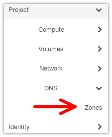
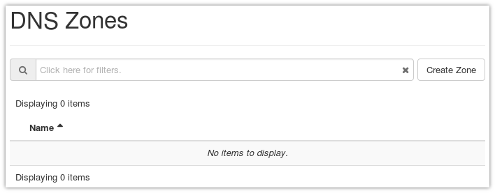
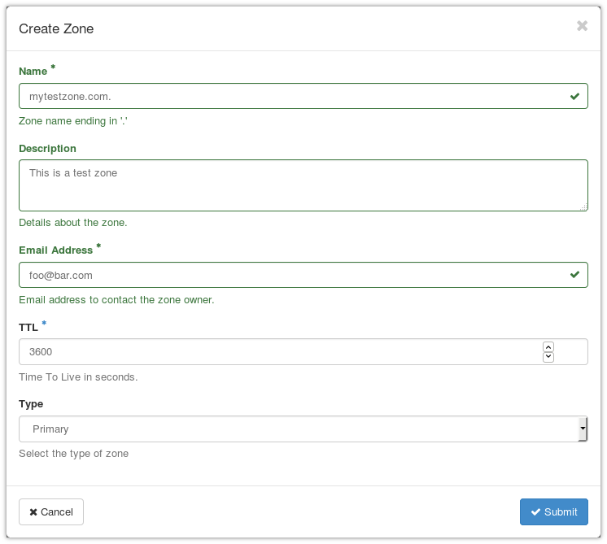
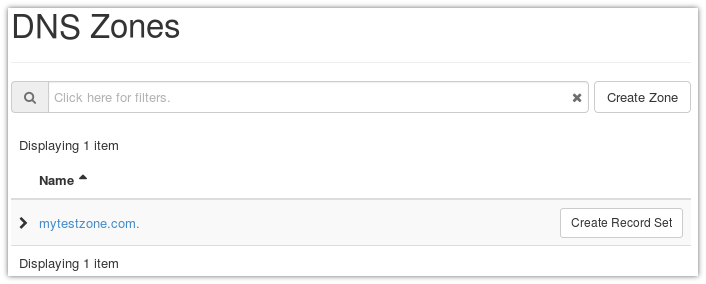
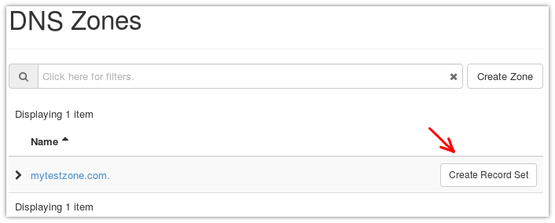
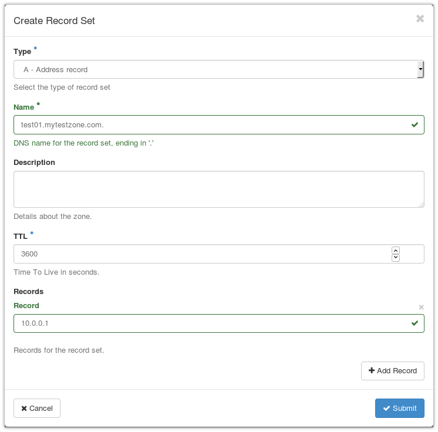
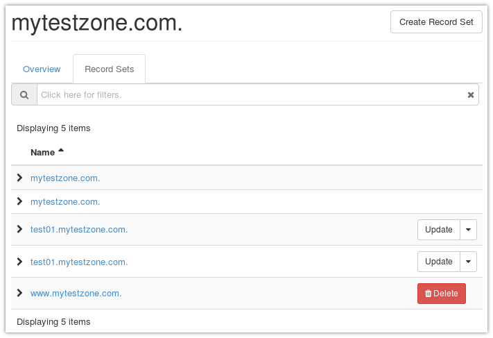

.. |date| date::

The NREC DNS service
=======================

Last changed: |date|

.. contents::

.. _this Wikipedia article: https://en.wikipedia.org/wiki/Domain_Name_System
.. _Designate: https://docs.openstack.org/designate/latest/

The NREC **DNS** (**Domain Name System**) service is based on an
OpenStack component named Designate_. With this, you can create DNS
zones (domain names) and DNS records within your zones. Read more
about DNS in `this Wikipedia article`_.

When to use the DNS service
---------------------------

The NREC DNS service allows for the registration and management of
DNS zones using the OpenStack GUI, API and command line interface
(CLI). Any zone can be registered and managed, providing it is using a
legal top-level domain (TLD). You don't have to own the zone in
question, but registering and managing an unowned zone doesn't make
sense unless for testing purposes. DNS is a global namespace, and in
order to use this service properly, the global DNS namespace needs to
know which name servers are authoritative for your zone. The following
lists the requirements for using the NREC DNS service for
production purposes:

#. You need to own a zone or have it delegated. There are a number of
   DNS vendors from which you can purchase DNS zones.

#. Instruct the DNS vendor, or the entity that is delegating this zone
   to you, that the authoritative DNS servers for the zone should be:

   * **ns1.nrec.no** (IPv4 address: ``158.37.63.251``, IPv6
     address: ``2001:700:2:82ff::251``)

   * **ns2.nrec.no** (IPv4 address: ``158.39.77.251``, IPv6
     address: ``2001:700:2:83ff::251``)

   You can verify that this change has been made by the vendor, by
   querying DNS (example):

   .. code-block:: console

     $ host -t ns mytestzone.com
     mytestzone.com name server ns1.nrec.no.
     mytestzone.com name server ns2.nrec.no.

When these requirements are in place, you can manage the zone and its
records completely using the NREC DNS service.

Special case for UiO users
~~~~~~~~~~~~~~~~~~~~~~~~~~

UiO has acquired the DNS zone **uiocloud.no**, and can delegate
subzones to projects using NREC. In order to have a subzone
of **uiocloud.no** delegated, contact hostmaster@usit.uio.no

Accessing the DNS zones GUI panel
---------------------------------

In the menu to the left in the dashboard, click on **DNS** and
then **Zones**:

You will then see the zones window, which looks like this if there are
no currently configured DNS zones in the project:

Creating a new zone
-------------------

In order to create a new zone, click on **Create Zone**. You will
presented with the following form:

Here, you need to fill in:

* The name of the zone, ending with a dot ("**.**"). In the example,
  we've chosen ``mytestzone.com.``.
* Email address, which will be presented to the world as the point of
  contact for this DNS zone.

The rest is optional or has default values that you usually don't need
to adjust unless you know what you're doing. When you're satisfied,
click **Submit** and the zone will be created:

Adding an A record
------------------

An **A** record is perhaps the most basic of DNS records. It creates a
mapping between an IPv4 address and a name in DNS.

In your zones summary, click on **Create Record Set**:

The following form will appear:

You need to fill out the following:

* The type of record. In this case **A - Address Record**, which is
  the default.
* The name of the record, which includes your zone name and ending in
  a dot ("**.**"). In the example, we've chosen
  ``test01.mytestzone.com.``.
* The record, which is the IPv4 address that you want the name to
  point to in DNS. In the example: ``10.0.0.1``.

When you're satisfied, click **Submit** and the record will be
created.

Adding an AAAA record
---------------------

An **AAAA** record is exactly the same as an **A** record, except that
it applies to IPv6 addresses instead of IPv4.

Follow the guide for **Adding an A record** above, but:

* In the type selection, select **AAAA - IPv6 address record**
* For the record, enter an IPv6 address. In our example, we've chosen
  ``fd32:100:200:300::12``.

Adding a CNAME record
---------------------

A **CNAME** record is an alias to another DNS record. In our example,
we wish to create an alias ``www.mytestzone.com`` that points to
``test01.mytestzone.com``.

Click on **Create Record Set** as before. In the form, select **CNAME
- Canonical name record** as the type. Here, the name is the alias and
the record is the DNS entry which it points to:

.. image:: images/dns-create-recordset-06.png
   :align: center
   :alt: Create a CNAME record

Listing your DNS records
------------------------

In order to list the records for a given zone, click on the zone name
in the zones listing, and select **Record Sets**:

Testing your records
--------------------

In order to test your record, you can query the NREC name servers,
which are authoritative for all zones created via the NREC DNS
service. Example:

.. code-block:: console

  $ host test01.mytestzone.com ns1.nrec.no
  Using domain server:
  Name: ns1.nrec.no
  Address: 2001:700:2:82ff::251#53
  Aliases: 
  
  test01.mytestzone.com has address 10.0.0.1
  test01.mytestzone.com has IPv6 address fd32:100:200:300::12
  
  $ host www.mytestzone.com ns2.nrec.no
  Using domain server:
  Name: ns2.nrec.no
  Address: 2001:700:2:83ff::251#53
  Aliases: 
  
  www.mytestzone.com is an alias for test01.mytestzone.com.
  test01.mytestzone.com has address 10.0.0.1
  test01.mytestzone.com has IPv6 address fd32:100:200:300::12

You can test against either **ns1.nrec.no** or **ns2.nrec.no**,
it doesn't matter. Both are authoritative name servers in the NREC
infrastructure, and does not resolve other domains than they serve
themselves.

Deleting records
----------------

.. _currently not possible due to a bug: known-issues.html#cannot-delete-dns-zones-or-records-in-dashboard

Deleting records is `currently not possible due to a bug`_ in the GUI
component of the DNS service. Please see below for how to do this with
command line.

Deleting a zone
---------------

.. _currently not possible due to a bug: known-issues.html#cannot-delete-dns-zones-or-records-in-dashboard

Deleting zones is `currently not possible due to a bug`_ in the GUI
component of the DNS service. Please see below for how to do this with
command line.

------------

Doing the same with CLI
-----------------------

Installing the CLI extension
~~~~~~~~~~~~~~~~~~~~~~~~~~~~

In order to use the command line interface to work with the DNS
service, you need to install the extension. On RHEL/CentOS/etc. and
Fedora, you can install this extension via the package manager:

* For Fedora and RHEL, Alma Linux, Rocky Linux and CentOS Stream 8.x and later:

  .. code-block:: console

    # yum install python3-designateclient

Creating a new zone
~~~~~~~~~~~~~~~~~~~

Creating the zone via ``openstack zone create``:

.. code-block:: console

  $ openstack zone create --email foo@bar.com mytestzone.com.
  +----------------+--------------------------------------+
  | Field          | Value                                |
  +----------------+--------------------------------------+
  | action         | CREATE                               |
  | attributes     |                                      |
  | created_at     | 2019-01-22T14:32:57.000000           |
  | description    | None                                 |
  | email          | foo@bar.com                          |
  | id             | ffdba4fd-0e04-4edb-8756-e4944c148d0a |
  | masters        |                                      |
  | name           | mytestzone.com.                      |
  | pool_id        | 794ccc2c-d751-44fe-b57f-8894c9f5c842 |
  | project_id     | a56e80c7c777419585b13ebafe024330     |
  | serial         | 1548167577                           |
  | status         | PENDING                              |
  | transferred_at | None                                 |
  | ttl            | 3600                                 |
  | type           | PRIMARY                              |
  | updated_at     | None                                 |
  | version        | 1                                    |
  +----------------+--------------------------------------+

List your zones:

.. code-block:: console

  $ openstack zone list
  +--------------------------------------+-----------------+---------+------------+--------+--------+
  | id                                   | name            | type    |     serial | status | action |
  +--------------------------------------+-----------------+---------+------------+--------+--------+
  | ffdba4fd-0e04-4edb-8756-e4944c148d0a | mytestzone.com. | PRIMARY | 1548167577 | ACTIVE | NONE   |
  +--------------------------------------+-----------------+---------+------------+--------+--------+

Adding an A record
~~~~~~~~~~~~~~~~~~

Creating an **A** record (IPv4 pointer), i.e. a DNS entry for
``test01.mytestzone.com`` that points to the IPv4 address ``10.0.0.1``:

.. code-block:: console

  $ openstack recordset create mytestzone.com. test01 --type A --records 10.0.0.1
  +-------------+--------------------------------------+
  | Field       | Value                                |
  +-------------+--------------------------------------+
  | action      | CREATE                               |
  | created_at  | 2019-01-22T14:36:04.000000           |
  | description | None                                 |
  | id          | 6910a762-d1aa-4e48-b14e-d9c44ecb81a3 |
  | name        | test01.mytestzone.com.               |
  | project_id  | a56e80c7c777419585b13ebafe024330     |
  | records     | 10.0.0.1                             |
  | status      | PENDING                              |
  | ttl         | None                                 |
  | type        | A                                    |
  | updated_at  | None                                 |
  | version     | 1                                    |
  | zone_id     | ffdba4fd-0e04-4edb-8756-e4944c148d0a |
  | zone_name   | mytestzone.com.                      |
  +-------------+--------------------------------------+

Adding an AAAA record
~~~~~~~~~~~~~~~~~~~~~

Creating a **AAAA** record (IPv6 pointer), i.e. a DNS entry for
``test01.mytestzone.com`` that points to the IPv6 address
``fd32:100:200:300::12``:

.. code-block:: console

  $ openstack recordset create mytestzone.com. test01 --type AAAA --records fd32:100:200:300::12
  +-------------+--------------------------------------+
  | Field       | Value                                |
  +-------------+--------------------------------------+
  | action      | CREATE                               |
  | created_at  | 2019-01-22T14:37:38.000000           |
  | description | None                                 |
  | id          | aead6644-b5e7-4f67-be23-f3ce3423c0e7 |
  | name        | test01.mytestzone.com.               |
  | project_id  | a56e80c7c777419585b13ebafe024330     |
  | records     | fd32:100:200:300::12                 |
  | status      | PENDING                              |
  | ttl         | None                                 |
  | type        | AAAA                                 |
  | updated_at  | None                                 |
  | version     | 1                                    |
  | zone_id     | ffdba4fd-0e04-4edb-8756-e4944c148d0a |
  | zone_name   | mytestzone.com.                      |
  +-------------+--------------------------------------+

Adding a CNAME record
~~~~~~~~~~~~~~~~~~~~~

Creating a **CNAME** record, i.e. an alias for another DNS entry:

.. code-block:: console

  $ openstack recordset create mytestzone.com. www --type CNAME --records test01.mytestzone.com.
  +-------------+--------------------------------------+
  | Field       | Value                                |
  +-------------+--------------------------------------+
  | action      | CREATE                               |
  | created_at  | 2019-01-22T14:45:30.000000           |
  | description | None                                 |
  | id          | da6708fd-4023-48a0-adb6-5c3373605e37 |
  | name        | www.mytestzone.com.                  |
  | project_id  | a56e80c7c777419585b13ebafe024330     |
  | records     | test01.mytestzone.com.               |
  | status      | PENDING                              |
  | ttl         | None                                 |
  | type        | CNAME                                |
  | updated_at  | None                                 |
  | version     | 1                                    |
  | zone_id     | ffdba4fd-0e04-4edb-8756-e4944c148d0a |
  | zone_name   | mytestzone.com.                      |
  +-------------+--------------------------------------+

Listing your DNS records
~~~~~~~~~~~~~~~~~~~~~~~~

Listing your DNS records for ``mytestzone.com``:

.. code-block:: console

  $ openstack recordset list mytestzone.com.
  +--------------------------------------+------------------------+-------+-------------------------------------------------------------+--------+--------+
  | id                                   | name                   | type  | records                                                     | status | action |
  +--------------------------------------+------------------------+-------+-------------------------------------------------------------+--------+--------+
  | 2cddfc55-00d5-49fd-bd0d-ead0650efa19 | mytestzone.com.        | SOA   | ns2.nrec.no. foo.bar.com. 1548168330 3519 600 86400 3600 | ACTIVE | NONE   |  
  | bc9a8f9e-73ad-4604-a292-0612629a51af | mytestzone.com.        | NS    | ns1.nrec.no.                                             | ACTIVE | NONE   |  
  |                                      |                        |       | ns2.nrec.no.                                             |        |        |  
  | 6910a762-d1aa-4e48-b14e-d9c44ecb81a3 | test01.mytestzone.com. | A     | 10.0.0.1                                                    | ACTIVE | NONE   |
  | aead6644-b5e7-4f67-be23-f3ce3423c0e7 | test01.mytestzone.com. | AAAA  | fd32:100:200:300::12                                        | ACTIVE | NONE   |
  | da6708fd-4023-48a0-adb6-5c3373605e37 | www.mytestzone.com.    | CNAME | test01.mytestzone.com.                                      | ACTIVE | NONE   |
  +--------------------------------------+------------------------+-------+-------------------------------------------------------------+--------+--------+

Deleting records
~~~~~~~~~~~~~~~~

A record (recordset) can be deleted using the following command::

  openstack recordset delete <zone_id> <id>

Example:

.. code-block:: console

  $ openstack recordset delete mytestzone.com. test08.mytestzone.com.
  +-------------+--------------------------------------+
  | Field       | Value                                |
  +-------------+--------------------------------------+
  | action      | DELETE                               |
  | created_at  | 2019-03-07T14:56:10.000000           |
  | description | None                                 |
  | id          | 988ae646-a1ce-4b60-b235-60c1d1d01199 |
  | name        | test08.mytestzone.com.               |
  | project_id  | a56e80c7c777419585b13ebafe024330     |
  | records     | 10.0.0.8                             |
  | status      | PENDING                              |
  | ttl         | None                                 |
  | type        | A                                    |
  | updated_at  | 2019-03-15T11:17:07.000000           |
  | version     | 2                                    |
  | zone_id     | ffdba4fd-0e04-4edb-8756-e4944c148d0a |
  | zone_name   | mytestzone.com.                      |
  +-------------+--------------------------------------+

You can also use the ID of the zone and the recordset, respectively.

Deleting a zone
~~~~~~~~~~~~~~~

A zone (and all it contains) can be deleted using the following
command::

  openstack zone delete <id>

Example:

.. code-block:: console

  $ openstack zone delete mytestzone.com.
  +----------------+--------------------------------------+
  | Field          | Value                                |
  +----------------+--------------------------------------+
  | action         | DELETE                               |
  | attributes     |                                      |
  | created_at     | 2019-01-22T12:38:57.000000           |
  | description    | None                                 |
  | email          | foo@bar.com                          |
  | id             | ffdba4fd-0e04-4edb-8756-e4944c148d0a |
  | masters        |                                      |
  | name           | mytestzone.com.                      |
  | pool_id        | 794ccc2c-d751-44fe-b57f-8894c9f5c842 |
  | project_id     | a56e80c7c777419585b13ebafe024330     |
  | serial         | 1548164918                           |
  | status         | PENDING                              |
  | transferred_at | None                                 |
  | ttl            | 3600                                 |
  | type           | PRIMARY                              |
  | updated_at     | 2019-03-15T11:21:06.000000           |
  | version        | 5                                    |
  +----------------+--------------------------------------+

Note that deleting a zone also deletes all records within that zone.
