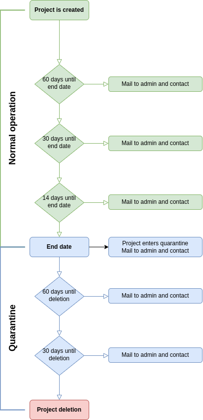

.. |date| date::

End Date Policy
===============

Last changed: 2022-04-04

.. contents::

.. IMPORTANT:: **This page is under construction. The end date policy
	       is not yet live**

All NREC projects shall have an end date, which defines its lifetime
as an active project. This document outlines what happens **before** a
project reaches its end date, **when** a project reaches its end date, and
**after** the end date.

The main motivation for enforcing a limited life span for projects is
to make sure that projects are deleted when they are no longer in
use. This mitigates security issues that would otherwise arise as the
result of unmaintained instances (servers), and frees up resources for
other users.

Policy
------

Before a project reaches its end date, the administrator of the
project, as well as the contact if it exists, will be notified by
email. When a project reaches end date, it is put into quarantine for
90 days and then deleted. When a project is deleted, all of its
resources (instances, volumes, snapshots etc.) and all data contained
within those resources are deleted forever. There are no backups.

Detailed description of the policy:

* **60 days before end date**: An email is sent to the project admin (and
  contact, if it exists) warning about pending end date

* **30 days before end date**: An email is sent to the project admin (and
  contact, if it exists) warning about pending end date

* **14 days before end date**: An email is sent to the project admin (and
  contact, if it exists) warning about pending end date

* **At end date**: The project is put into quarantine. The following
  happens to a project that enters quarantine:

  - All instances are shut off
  - The project is disabled. Disabled projects can not be interacted
    with, and they are not visible in the dashboard
  - The project is tagged as being in quarantine
  
* **30 days after entering quarantine**: An email is sent to the
  project admin (and contact, if it exists) warning about pending
  deletion

* **60 days after entering quarantine**: An email is sent to the
  project admin (and contact, if it exists) warning about pending
  deletion

* **90 days after entering quarantine**: The project is deleted

This process may be interrupted at any time. See `End Date Extension`_
below. If a project is enabled from quarantine, the project's
administrator and members are responsible for activating instances
that were shut off when the project entered quarantine.

End Date Extension
------------------

A project's end date can be extended at any time. The maximum allowed
lifetime for a project is two years from today. Extending the lifetime
is an administrative task and must be performed by the NREC team. To
change the end date for a project, please contact NREC support by
sending an email to

* support@nrec.no

In normal circumstances, end date extension is merely a formality and
is granted without question. Do not hesitate to ask for an extension
if needed.
