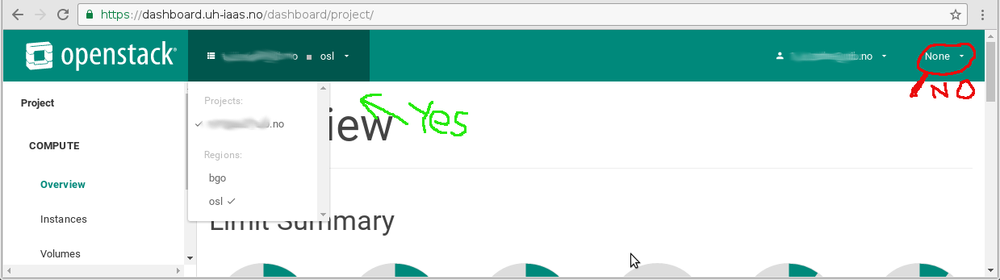

.. |date| date::

Known Issues
============

Last changed: |date|

.. contents::

API access
----------

All new users will get a pass phrase to use with API when they provision
a demo project (see :doc:`login`). We do not have any easy way to recrate
the pass phrase at the moment. If you lose yours please contact us.

Demo projects
-------------

When you first sign in, you are given a demo project. This project is
personal and for testing purposes. The quota in the demo project is
very limited. If you need more resources, or a project in which you
wish to collaborate with other users, please contact us.

The demo project uses excess resources that usually are available in
the cluster. If we experience a shortage of resources, we may
terminate instances running in the demo project without notice.

Console considerations
----------------------

The instance web console is configured with EN keymapping. This may be
an issue for users with other locales, like NO. If you experience problems
with keymapping (for example, special characthers may map to unexpected keys,
or not at all), change keymapping for your local browser to EN. This is
done differently in different operating systems. Please refer to the
operating system documentation.

Dashboard region selecton
-------------------------

When selecting region and project, use the dropdown menu to the top left
beside the logo. Do not attempt to use the dropdown menu in the upper right
corner.

SSH keys different in API and dashboard
---------------------------------------

For now, when uploading SSH keys in dashboard, those keys are not accessable
from the API (and vice versa). Work around this issue by uploading the SSH
keys both in dashboard and via the API.

Limitations on distributed workloads
------------------------------------

Because of resource constraints, it's not possible to order distribution over
more than two compute hosts in the same region. Trying to do so will result in a
"No valid host" error message. A workaround is to distribute workloads over
two regions. These constraints will be lifted as more hardware is deployed in
the IaaS.

Cannot create volume from image
-------------------------------

When attempting to create a volume based on an image (for example, an instance
snapshot), the task will fail. This is a bug in our installation, but considered
to be a corner use case which may be fixed in the future. If you want to launch
an instance based on a snapshot, select launch instance and select "instance 
snapshot" as boot source (which may be what you actually wanted in the first
place).

Network availability
--------------------

While you control the access to your own virtual machines, the network
access to the infrastructure is limited. To use the dashboard and
access web pages, as well as the API, you need to use a computer at
your educational institution. Usually, this implies only the wired
network at the universities and colleges that are allegeable for
access.

No access after changed email address
-------------------------------------

Sometimes a user's primary email address changes. This is a problem
because Dataporten uses this email address as the user ID, and
therefore the user ID and demo/personal project in UH-IaaS is this
address. This happens when users e.g. changes their status from
student to employee or vice versa. If this happens to you, please send
an email to support@uh-iaas.no which includes your current and
previous primary email address. You will then be given further
instructions on how to proceed.
