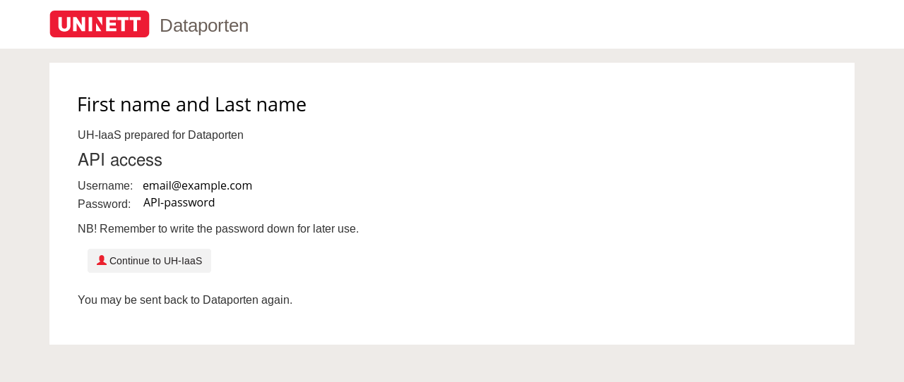
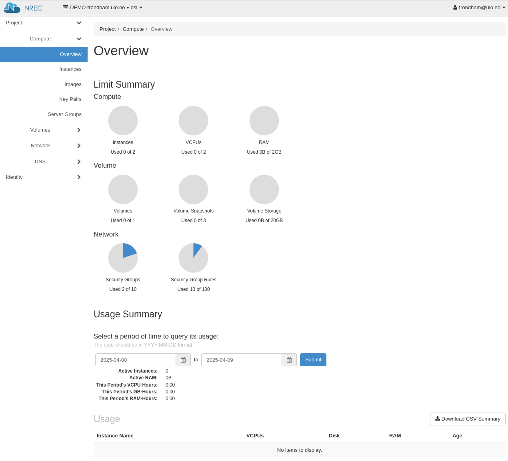

.. |date| date::

Logging in
==========

Last changed: |date|

.. contents::

.. _Dataporten: https://www.uninett.no/en/service-platform-dataporten
.. _UNINETT: https://www.uninett.no/en

First time login
----------------

.. NOTE::
   This step is only needed if you've never logged in before. For
   the normal login procedure, skip this step and go directly to
   `Subsequent logins`_.

In order to successfully log in, you first need to provision yourself
as a user with an appropriate group and project. This is accomplished
by following the steps below.

To provision yourself as a user, visit the following URL:

  https://access.iaas.uib.no/

The following window will appear:

.. image:: images/access-01.png
   :align: center
   :alt: Access

Click ``Logg inn``:

.. image:: images/access-02.png
   :align: center
   :alt: Access

Here, you need to select your login provider. You should find your
university or college in the list. Simply select it and the following
appears:

.. image:: images/access-03.png
   :align: center
   :alt: Access

In order to use this service, and to authenticate using `Dataporten`_,
you need to accept that the service stores some information about
you. Click ``Yes, I accept`` to continue.

This finishes the initial login and provision procedure. In order to
continue to the dashboard, click ``Fortsett til UH-IaaS``.

Subsequent logins
-----------------

To log in to the UH-IaaS dashboard, point your browser to:

  https://dashboard.iaas.uib.no/

You'll be presented with the following:

.. image:: images/dashboard-login-01.png
   :align: center
   :alt: The default login screen

There are two methods for logging in. The method labelled "Dataporten"
is correct for regular users. The "Local user" method is reserved for
administrator and testing purposes. Dataporten_ is an external
authentication service provided by UNINETT_. To log in, choose
"Dataporten" as authentication mechanism, then click "Connect". You'll
be redirected to this page:

.. image:: images/dashboard-login-02.png
   :align: center
   :alt: Dataporten: choose institution

Select the correct educational institution, by clicking on it. You'll
then reach this page:

.. image:: images/dashboard-login-03.png
   :align: center
   :alt: Dataporten: login

Type in your regular user name and password, and click "Login". You
should then be redirected back to the UH-IaaS dashboard:

You are now logged in, and can proceed with using OpenStack.
