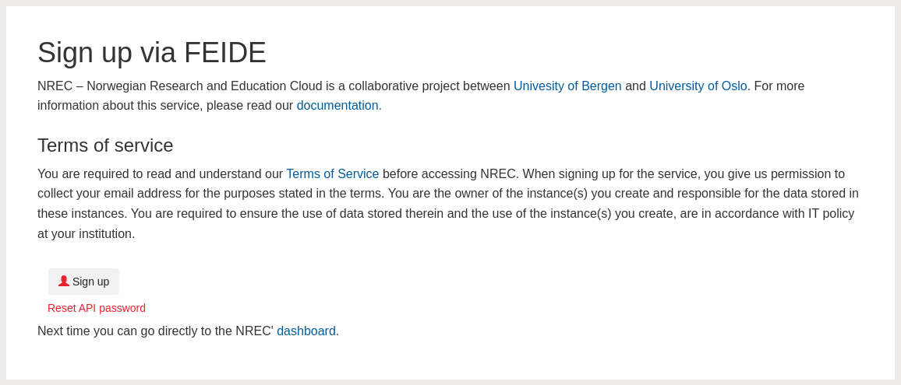

.. |date| date::

Logging in
==========

Last changed: |date|

.. contents::

.. _Dataporten: https://www.uninett.no/en/service-platform-dataporten
.. _UNINETT: https://www.uninett.no/en

First time login
----------------

.. NOTE::
   This step is only required if you've never previously logged in. For
   normal login procedure, skip this step and go directly to
   `Subsequent logins`_.

For first-time login, you need to provision yourself as a user with
an appropriate group and project. Do this by following the steps below.

To provision yourself as a user, visit the following URL:

  https://access.nrec.no/

The following window will appear:

Click ``Sign up``:

Here, you need to select your login provider. You should find your
university or college in the list. 

.. image:: images/access-02.png
   :align: center
   :alt: Access

In order to use this service, and to authenticate using `Dataporten`_,
you need to accept that the service stores some information about
you.

The password for API access is generated and shown here. 

.. image:: images/access-03.png
   :align: center
   :alt: Access

This finishes the initial login and provision procedure.

.. IMPORTANT::
   **Copy and save the API password**

   This is **the only time** that the API password is generated and shown
   to you. If you misplace or forget the API password and need another
   one, you have to reset it usimg the *Reset API password* link on the
   Access login page. Alternatively contact our support.

In order to continue to the dashboard, click ``Continue to NREC``.

Subsequent logins
-----------------

To log in to the NREC dashboard, point your browser to:

  https://dashboard.nrec.no/

You'll be presented with the following:

.. image:: images/dashboard-login-01.png
   :align: center
   :alt: The default login screen

There are two methods for logging in. The method labelled "Dataporten"
is correct for regular users. The "Local user" method is reserved for
administrator and testing purposes. Dataporten_ is an external
authentication service provided by UNINETT_. To log in, choose
"Dataporten" as authentication mechanism, then click "Connect". You'll
be redirected to this page:

Select the correct educational institution, by clicking on it, and log in.

You should then be redirected back to the NREC dashboard:

.. image:: images/dashboard-login-overview.png
   :align: center
   :alt: Log in finished

You are now logged in, and can proceed with using OpenStack.
