.. |date| date::

Create and manage volumes
=========================

Last changed: |date|

.. contents::

Volumes are block storage devices that you attach to instances to
enable persistent storage. You can attach a volume to a running
instance or detach a volume and attach it to another instance at any
time. You can also create a snapshot from or delete a volume.

There are different volume types, including

* **mass-storage-default**: Storage backed by spinning hard drives,
  available to everybody and is the default type.
* **rbd**: Legacy storage backed by spinning hard drives.
* **mass-storage-ssd**: Fast storage backed by solid state drives.
  This volume type is only available after access has been granted by
  the NREC Team. In addition, some projects have access to more specialized storage.

Create a volume
---------------

In the dashboard, select **Volumes** in the **Volumes** tab:

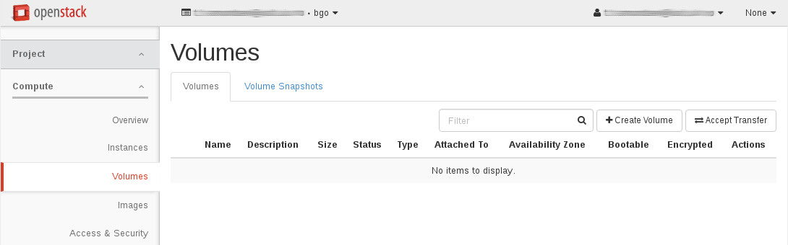

Click on ``Create Volume``, and the following window appears:

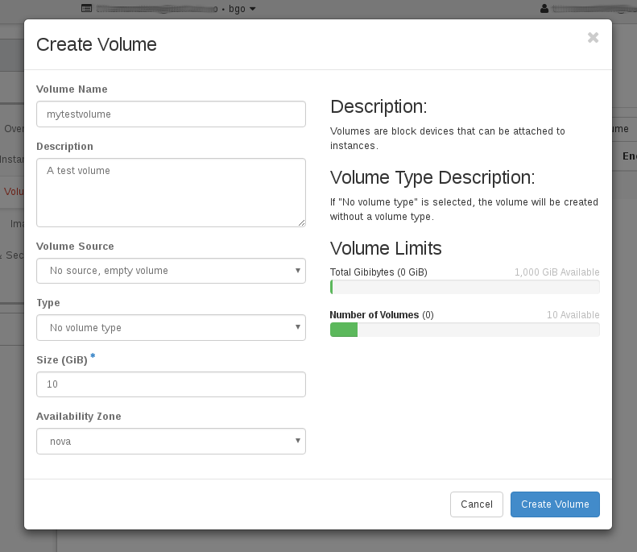

Fill in the form:

* **Volume Name**: A name for the volume, which you will recognize
  (Required)
* **Description**: An optional description
* **Volume Source**: Either no source, i.e. an empty volume, or create
  a volume from an image
* **Type**: Normally you can use the default setting - change to the desired
  type if you need SSD backed storage or have other special needs
* **Size**: The size of the volume, in GB
* **Availability Zone**: Choose "nova"

Then click ``Create Volume``. The volume will be instantly created and
available:

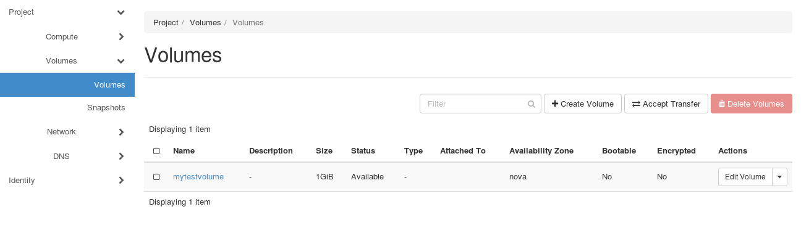

You can also ``Create Snapshot`` of the volume. The snapshot of the volume
will be located under **Volumes** tab:

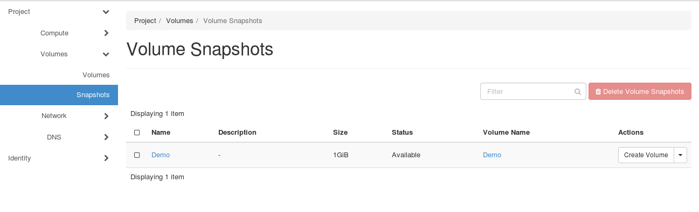

Attach a volume to a virtual machine
------------------------------------

After creating one or more volumes, you can attach them to virtual
machines (instances). A volume is a block storage device, and can only
be attached to one virtual machine at a time. In the **Volumes** tab
under **Volumes**, select *Manage Attachments* from the dropdown menu:

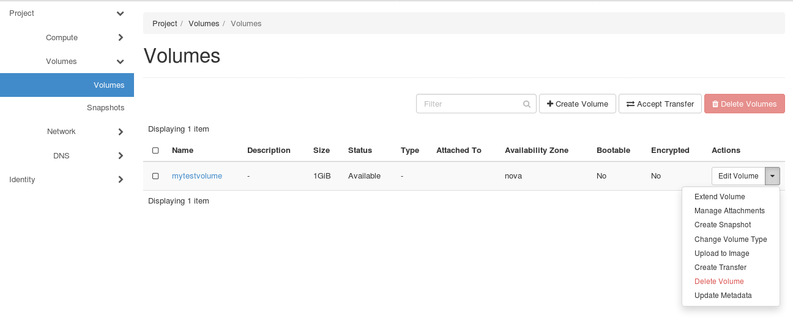

Select the virtual machine (instance) that you wish to attach this
volume to. You usually don't need to change the device name. Then
click on ``Attach Volume``.

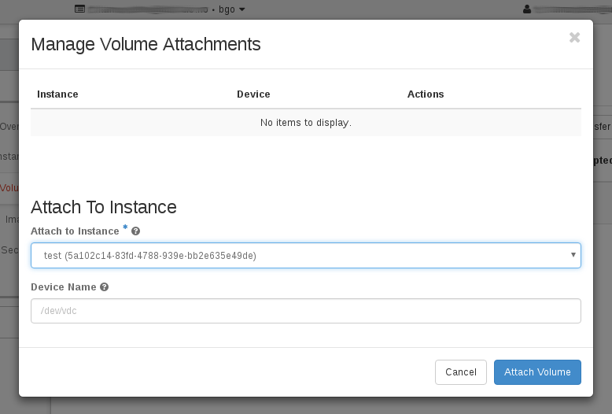

The volume is now attached to the virtual machine.

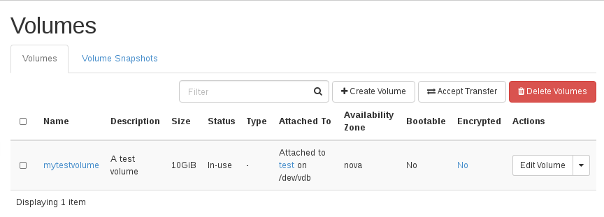

Detach a volume from a virtual machine
--------------------------------------

In order to detach a volume from a virtual machine (instance),
select *Manage Attachments* from the dropdown menu in the **Volumes**:

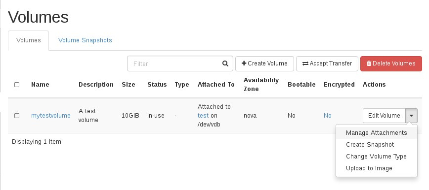

Select the attachment and click on ``Detach Volume``:

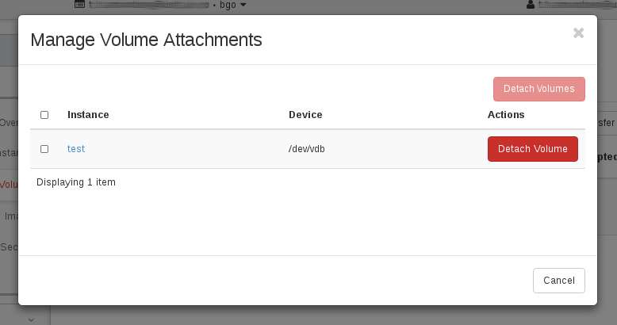

You will have to confirm this action. Click ``Detach Volume`` in the
confirmation dialog that appears:

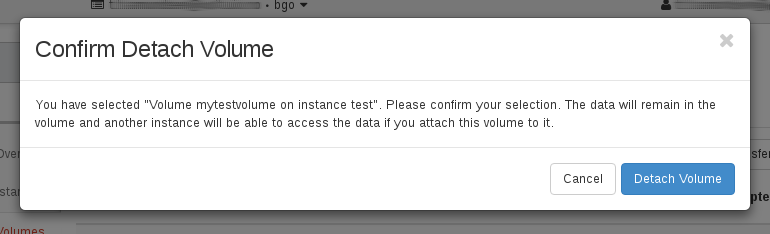

The volume is now detached.

Delete a volume
---------------

Deleting a volume is pretty straightforward. In the **Volumes**, select the appropriate check boxes for the volumes
that you want to delete, and click ``Delete Volumes``:

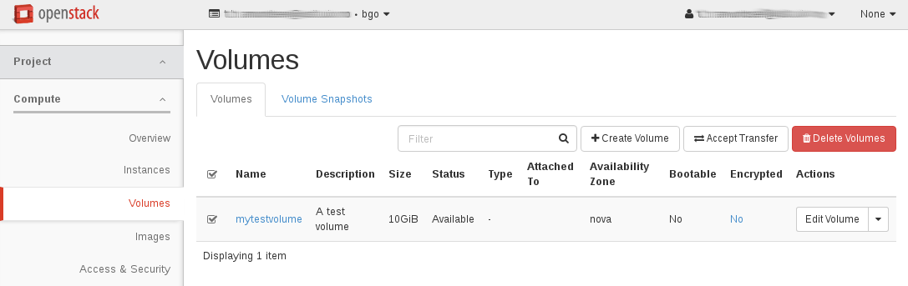

Then confirm your choice, click ``Delete Volumes``:

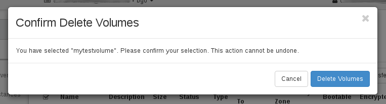

The volume is then deleted.

Doing the same with CLI
-----------------------

#. Creating the volume:

   .. code-block:: console

     $ openstack volume create --size 10 --description "A test volume" mytestvolume
     +---------------------+--------------------------------------+
     | Field               | Value                                |
     +---------------------+--------------------------------------+
     | attachments         | []                                   |
     | availability_zone   | nova                                 |
     | bootable            | false                                |
     | consistencygroup_id | None                                 |
     | created_at          | 2016-11-11T15:41:00.171512           |
     | description         | A test volume                        |
     | encrypted           | False                                |
     | id                  | a7234dda-a97a-44c3-aa93-9b2952fd2bcf |
     | multiattach         | False                                |
     | name                | mytestvolume                         |
     | properties          |                                      |
     | replication_status  | disabled                             |
     | size                | 10                                   |
     | snapshot_id         | None                                 |
     | source_volid        | None                                 |
     | status              | creating                             |
     | type                | None                                 |
     | updated_at          | None                                 |
     | user_id             | 6bb8dbcdc9b94fff89258094bc56a49f     |
     +---------------------+--------------------------------------+

#. Listing the servers and volumes:

   .. code-block:: console

     $ openstack volume list
     +--------------------------------------+--------------+-----------+------+-------------+
     | ID                                   | Display Name | Status    | Size | Attached to |
     +--------------------------------------+--------------+-----------+------+-------------+
     | a7234dda-a97a-44c3-aa93-9b2952fd2bcf | mytestvolume | available |   10 |             |
     +--------------------------------------+--------------+-----------+------+-------------+

     $ openstack server list
     +--------------------------------------+----------+--------+----------------------+------------+
     | ID                                   | Name     | Status | Networks             | Image Name |
     +--------------------------------------+----------+--------+----------------------+------------+
     | 5a102c14-83fd-4788-939e-bb2e635e49de | myserver | ACTIVE | public=158.39.77.147 | Fedora 24  |
     +--------------------------------------+----------+--------+----------------------+------------+

#. Attaching the volume to the server:

   .. code-block:: console

     $ openstack server add volume myserver mytestvolume

   You may also use the IDs of the server and volume instead of the names.

#. Confirming that the volume is attached:

   .. code-block:: console

     $ openstack volume list
     +--------------------------------------+--------------+--------+------+-----------------------------------+
     | ID                                   | Display Name | Status | Size | Attached to                       |
     +--------------------------------------+--------------+--------+------+-----------------------------------+
     | a7234dda-a97a-44c3-aa93-9b2952fd2bcf | mytestvolume | in-use |   10 | Attached to myserver on /dev/vdb  |
     +--------------------------------------+--------------+--------+------+-----------------------------------+

#. Mounting the volume:

   When you have attached the volume, it can be used as a regular block device from within the
   virtual machine (example):

   .. code-block:: console

     If this is the first time using this volume, you need to create a file system on it.
     Check if there is already an available block device:
     # lsblk
     NAME   MAJ:MIN RM    SIZE RO TYPE MOUNTPOINT
     vda    253:0    0      1G  0 disk
     `-vda1 253:1    0 1011.9M  0 part /
     vdb    253:16   0     10G  0 disk

  .. Important::
     Do NOT perform the next step unless this is the very first time you use this volume, and there are NO filesystem on it.
     If you have any data on it whatsoever, skip the 'mkfs' commands! Otherwise you will experience data loss!

  .. code-block:: console

     If there are not any file systems, you need to create one:
     # mkfs.ext4 /dev/vdb
     [...]

     Create a folder and mount the volume on it:
     # mkdir /persistent01 && mount /dev/vdb /persistent01

     Check the amount of disk space available on the file system, and start storing data:
     # df -h /persistent01
     Filesystem                Size      Used Available Use% Mounted on
     /dev/vdb                  9.8G    150.5M      9.2G   2% /persistent01

   Note that in order for the volume to be mounted automatically after a reboot,
   you will have to add an entry to /etc/fstab.

#. Detaching the volume:

   .. code-block:: console

     $ openstack server remove volume myserver mytestvolume

#. Deleting the volume:

   .. code-block:: console

     $ openstack volume delete mytestvolume

#. Confirming that the volume is deleted:

   .. code-block:: console

     $ openstack volume list
