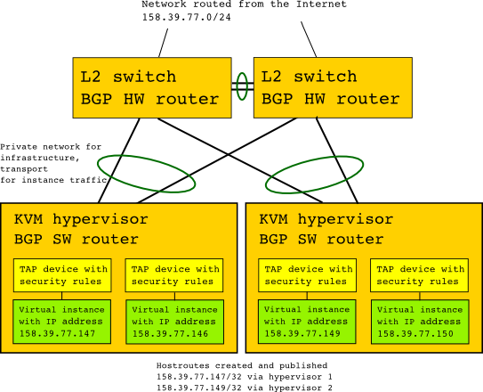

.. |date| date::

Networking considerations
=========================

Last changed: |date|

.. contents::

Background
----------

A common networking model in infrastructure clouds is virtualization of
Layer 2 domains, meaning that the tenants/projects are given one or more
private networks, available only for them. Then, public IP addresses are
connected to virtual routers and DNATed to the target instance. For the
end user, this presents great flexibility and enables them to create rather
complex network designs inside the cloud. However, it also creates a great
deal of complexity and overhead. In this model, all traffic is NATed, and
Layer 2 domains span entire data centers and beyond, adding encapsulation
cost. To achieve this, linux kernel IP namespacing is employed to isolate
the tenant networks. In addition, all traffic passes through dedicated servers
acting as network nodes, adding infrastructure cost. Another problem with
this model is that it is very stateful, so whenever something goes wrong,
there's a lot of labor involved in fixing the system back to it's desired
state. All this complexity also comes at the price of performance.

In UH-IaaS we have chosen another, much simpler, model. This model is based
on the project calico openstack neutron core plugin, which provides a pure
Layer 3 model for the instance IP traffic. Our hypervisors are connected
together with a higly redundant Layer 2 network utilizing the modern linux
teaming driver in an active/active 802.3ad configuration (LACP) with 10gbit
interconnects. Then, all hypervisors, which are running on linux, employes a
BGP router (bird), BGP in short being the protocol that runs the Internet.
The hypervisors are connected to hardware routers in a leaf-spine topology,
the spines acting as route reflectors for the hypervisor's routers. So, when
an instance is spawned, a host route to a TAP device on the hypervisor is
created locally (ip-address/32), then reflected to all routers, including
those running on the other hypervisors. The instances themselves, where the
TAP device appears as a network adapter, are isolated in their own
Layer 2 domain, neighboring only a virtual device answering ARP requests
with arbitrary MAC addresses. All security group rules are implemented on
the TAP device by the networking system.

Our chosen networking model provides a host of benefits:

Simplicity
~~~~~~~~~~
Layer 2 domains are kept small, and only a single IP name space is used
on each host. Therefore, all traffic is easily visible. This makes
troubleshooting a lot easier, hopefully saving us a lot of headaches.

Less state
~~~~~~~~~~
As our cloud network is mostly stateless, recovering after some sort of
failure or outage should be much easier, saving still a lot of headaches
for both end users and engineers.

Performance
~~~~~~~~~~~
Without the need for NAT, DNAT and dedicated servers pushing network
traffic, both throughput and latency shows great performance, with each
hypervisor able to push and receive traffic near line speed.

Scalability
~~~~~~~~~~~
With BGP running the internet, it proves to be able to also scale in the
data center while keeping our failure domains rather small

Cost
~~~~
Our routers and switches are running linux on the control plane,
running on commodity switch hardware, avoiding vendor lock-in or proprietary
control systems. Because we configure our networking equipment the same way
we configure our servers, management overhead and hardware cost is reduced.

Implications
------------
While our chosen networking model in most cases is invisible for the end user,
there are some use cases where popular and traditional methodologies won't work.
In short, every system that needs Layer 2 visibility from instance to instance
will not work. While there are not many systems which need this Layer 2
connectivity, there are exceptions, the most popular these days being the
deployment of container clusters. Container cluster networking itself is not
trivial, but trying to deploy it on top of our networking model is a challenge.
While it can be done, failover mechanisms would require a load balancer outside
the IaaS infrastructure. Still, a single host deployment should be rather trivial.
In short, we strongly encourage you to contact the UH-IaaS team if you run into
problems caused by the networking model. Often your problems can be solved in
other ways than you originally envisioned.

So, in short, for now, we don't offer Load-balancing as a Service, or other
networking features requiring host to host Layer 2 connectivity. Thus, private
networking is unavailable. You must secure your instances with security groups
and/or other mechanisms.
