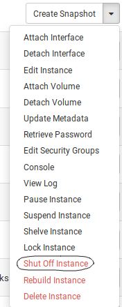
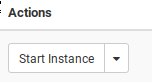

How to power cycle an instance
==============================

Last changed: 2019-02-13

.. highlight:: none

From the dashboard
------------------

From the dashboard, select "Shut Off Instance" from the "Actions" drop down
menu.

When the instance is fully shut off, "Create Snapshot" should be replaced by a
button that says "Start Instance". Click on it to start the instance.

From Openstack CLI
------------------

To stop the server, run:

   .. parsed-literal::

     $ openstack server stop <name or id>

Wait until finished, then run:

   .. parsed-literal::

     $ openstack server start <name or id>
