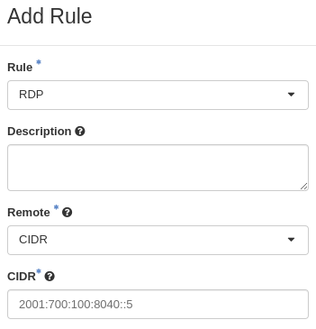
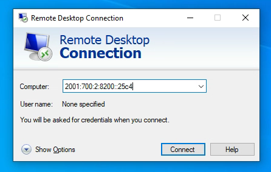
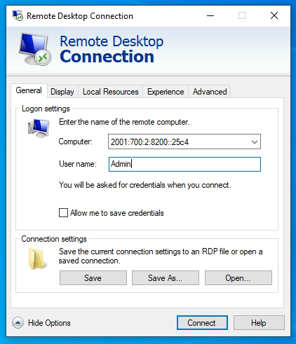
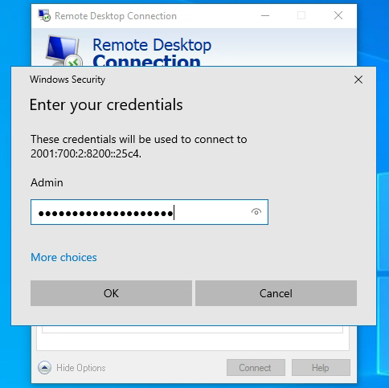
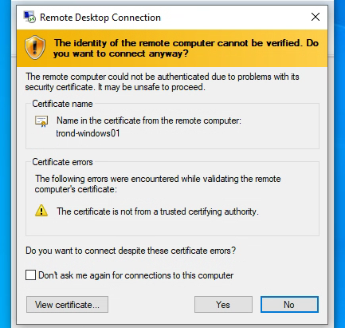
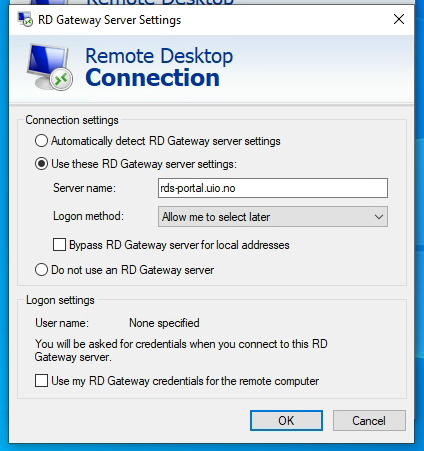
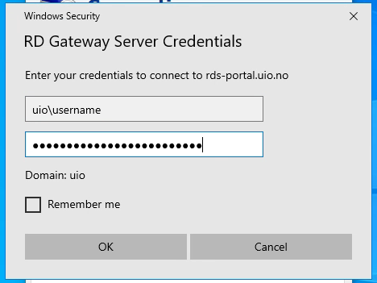

.. |date| date::

Using Remote Desktop
====================

Last changed: |date|

.. contents::

.. _Remote Desktop Protocol: https://en.wikipedia.org/wiki/Remote_Desktop_Protocol
   
You may want to access virtual Windows servers in NREC via Windows
Remote Desktop (RDP). More info about `Remote Desktop Protocol`_.

There are two ways to reach the Windows instance using RDP:

* **Directly**: You establish an direct connection between your client
  computer and the NREC Windows server

* **Via an RD Gateway**: You utilize an RD Gateway as a proxy
  between your client and the NREC Windows server

Using an RDP gateway is will be necessary if connecting from outside
the Norwegian university network, once RDP is blocked as planned.

Allowing Access
---------------

.. _Working with Security Groups: security-groups.html

Refer to `Working with Security Groups`_ for an in-depth explanation
about security groups and how to create them. In order to allow Remote
Desktop, choose "RDP" as the Rule and apply a proper CIDR address:

Here, we allow RDP only from ``2001:700:100:8040::5``, which is the
IPv6 address of rds-portal.uio.no. Depending on your usecase, you may
want something else here. You may also want to allow incoming traffic
via IPv4, the example shows only IPv6.

Direct Connection
-----------------

.. NOTE:: **Only from network of Norwegian universities and colleges**
   Incoming traffic to port 3389 (RDP) is blocked (pending) if the origin is
   outside of networks belonging to Norwegian universities and
   colleges. Direct RDP connection is limited to these networks.

Windows
~~~~~~~
   
From your Windows client, open the **Remote Desktop Connection** app
and type in the IP address or hostname of your NREC Windows instance:

Click on **Show Options** and type the username (usually "Admin"):

Then click **Connect**. You will then be asked to provide the
password:

Usually, you will then get a complaint about the certificate being
unverified. This is normal for NREC Windows instances and can be
ignored:

Click **Yes** and you will then connect to the instance via remote
desktop.

Linux
~~~~~

.. IMPORTANT::
   Due to the frequent changes to the RDP protocol, free software and
   Linux distributions struggle to keep up with the changes
   implemented by Microsoft. For this reason, RDP clients on Linux are
   "unstable" and may not work properly. Using RDP from Windows is a
   much safer bet.

In order to connect from Linux, you need to use xfreerdp or similar
software. For xfreerdp, we will connect to the same host as above with
the following command:

.. code-block:: console

  xfreerdp /cert:ignore /size:1280x1024 /kbd:Norwegian /u:Admin /v:[2001:700:2:8200::25c4]

The following options are used:

* ``/cert:ignore``: We ask that it ignores the unverifiable
  certificate
* ``/size:1280x1024``: The size of the window. Specify whatever size
  you want, or use ``/f`` instead for fullscreen
* ``/kbd:Norwegian``: Specifies Norwegian keyboard layout
* ``/u:Admin``: The username, usually "Admin"
* ``/v:[2001:700:2:8200::25c4]``: The IP address of the Windows
  instance. For IPv6 as shown here, the address must be enclosed in
  brackets

Via RD Gateway (UiO)
--------------------

.. NOTE:: This is only applicable for UiO users

There are two reasons why you may want to use an RDP gateway:

#. You are connecting from outside of a network belonging to a
   Norwegian university or college; and/or

#. Your client only has IPv4, and you need to connect to the instance
   via IPv6

The RPD gateway can be used as an IPv4-to-IPv6 proxy.

Windows
~~~~~~~

From your Windows client, open the **Remote Desktop Connection** app
and type in the IP address or hostname of your NREC Windows instance:

Click on **Show Options** and type the username (usually "Admin"):

Click on the **Advanced** pane to open the advanced menu:

.. figure:: images/rdp-windows-gw-01.png
   :align: center
   :alt: Windows Remote Desktop Connection via GW (1)

Under "Connect from anywhere", click on **Settings...** and the
following will appear:

Select "Use these RD Gateway server settings" and fill in the hostname
``rds-portal.uio.no``. You may need to uncheck "Bypass RD Gateway
server for local addresses" to make sure that it will use the RD
gateway. Click on **OK** to proceed, and you will be asked to provide
the credentials to connect to the RD gateway:

You need to provide the domain and username as ``uio\username`` as the
image shows. Replace "username" with your actual UiO username. The
password is your regular UiO password. Click **OK** to proceed, and
the next thing you need to provide is the passord for the account
selected for the NREC instance:

Usually, you will then get a complaint about the certificate being
unverified. This is normal for NREC Windows instances and can be
ignored:

Click **Yes** and you will then connect to the instance via remote
desktop, using ``rds-portal.uio.no`` as an RD gateway.

Linux
~~~~~

.. IMPORTANT::
   Due to the frequent changes to the RDP protocol, free software and
   Linux distributions struggle to keep up with the changes
   implemented by Microsoft. For this reason, RDP clients on Linux are
   "unstable" and may not work properly. Using RDP from Windows is a
   much safer bet.

As for direct connection, we will use xfreerdp to connect. You just
need a three extra options to connect through an RD gateway:

.. code-block:: console

  xfreerdp /cert:ignore /size:1280x1024 /kbd:Norwegian /u:Admin /v:[2001:700:2:8200::25c4] /g:rds-portal.uio.no /gu:username /gt:rpc

The following options are exactly as before:

* ``/cert:ignore``: We ask that it ignores the unverifiable
  certificate
* ``/size:1280x1024``: The size of the window. Specify whatever size
  you want, or use ``/f`` instead for fullscreen
* ``/kbd:Norwegian``: Specifies Norwegian keyboard layout
* ``/u:Admin``: The username, usually "Admin"
* ``/v:[2001:700:2:8200::25c4]``: The IP address of the Windows
  instance. For IPv6 as shown here, the address must be enclosed in
  brackets

The following options are added to use ``rds-portal.uio.no`` as RD
gateway:

* ``/g:rds-portal.uio.no``: Specifies the hostname of the RD gateway
* ``/gu:username``: The username for connecting to the RD
  gateway. This should be your regular UiO username
* ``/gt:rpc``: The gateway transport type

