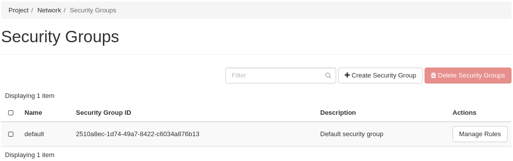
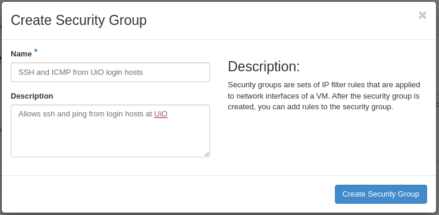
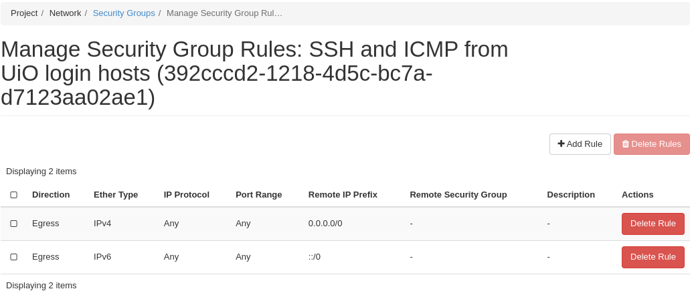
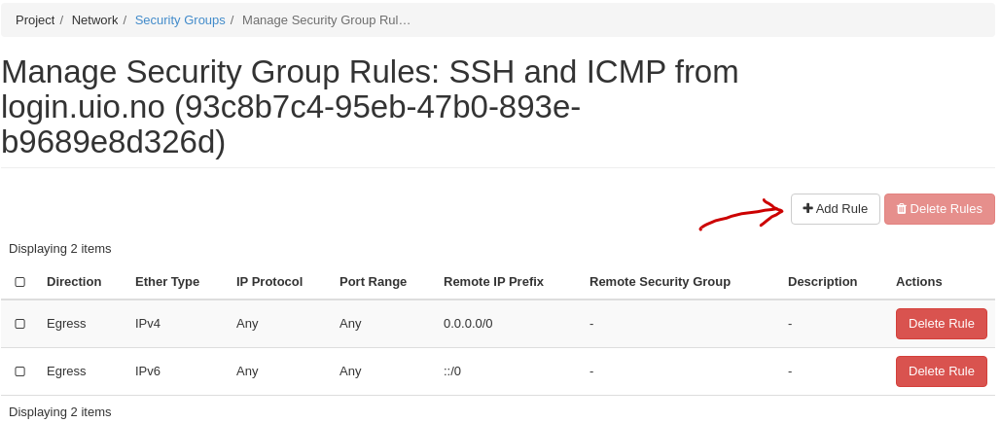
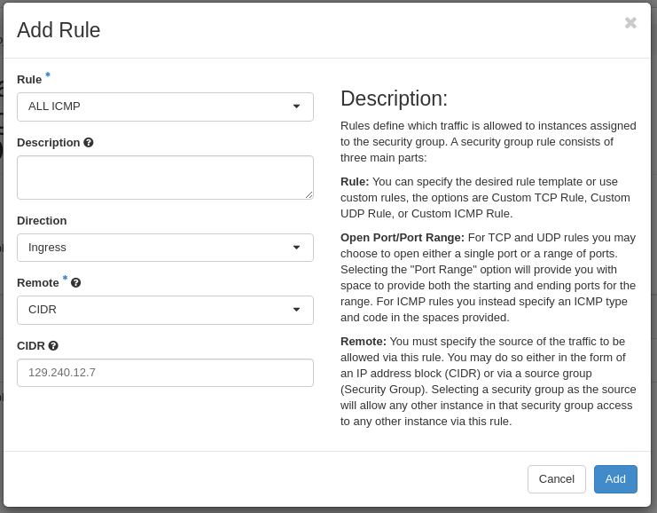
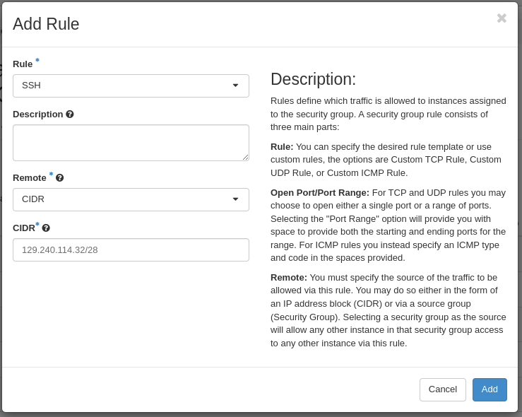
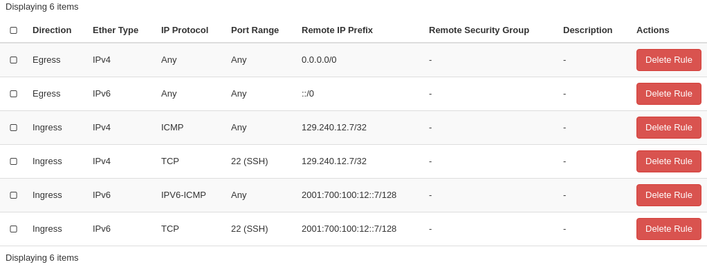

.. |date| date::

Working with Security Groups
============================

Last changed: |date|

.. contents::

.. _CIDR: https://en.wikipedia.org/wiki/Classless_Inter-Domain_Routing
.. _CIDR (Wikipedia): https://en.wikipedia.org/wiki/Classless_Inter-Domain_Routing
.. _CIDR Calculator IPv6: https://www.vultr.com/resources/subnet-calculator-ipv6/
.. _CIDR Calculator IPv4: https://www.vultr.com/resources/subnet-calculator/

.. WARNING::
   **WARNING WARNING WARNING** This document is under construction and
   may contain errors.

Security groups is an essential tool to understand in order for you to
ensure the security and integrity of your instances, as well as making
your application work correctly and as intended. This document
attempts to explain what security groups are and how they work. We
provide practical examples that you can use in your projects on NREC.

What is a Security Group?
-------------------------

The very short answer to this question is that a security group is a
firewall. A security group contains a number of rules that define
which traffic is allowed into (ingress) and out from (egress) your
virtual machines (instances). The rules within a security group may
allow only a single IP address/port combination, or they may open up
completely and thereby negating the effect and protection of a
firewall. It is utterly important that you understand what your
security groups and the rules do and how they work, in order to
properly secure your instances and applications.

Traffic to and from instances in NREC is by default completely
closed. It is only by creating security groups and applying them that
traffic is allowed to flow to and from the instances.

The "default" security group
----------------------------

A newly created project in NREC will have a security group called
"default". To find it in the dashboard GUI, navigate to **Project**
-> **Network** -> **Security Groups** and click on it. This security
group contains four rules:

In order to view the same using the CLI, issue these commands:

.. code-block:: console

  $ openstack security group list
  +--------------------------------------+--------------+------------------------+----------------------------------+------+
  | ID                                   | Name         | Description            | Project                          | Tags |
  +--------------------------------------+--------------+------------------------+----------------------------------+------+
  | f6c0499c-0a3c-4756-8527-9cb58e0501b1 | default      | Default security group | a56e80c7c777419585b13ebafe024330 | []   |
  +--------------------------------------+--------------+------------------------+----------------------------------+------+

  $ openstack security group rule list default --long
  +--------------------------------------+-------------+-----------+-----------+------------+-----------+--------------------------------------+
  | ID                                   | IP Protocol | Ethertype | IP Range  | Port Range | Direction | Remote Security Group                |
  +--------------------------------------+-------------+-----------+-----------+------------+-----------+--------------------------------------+
  | 078cf6db-fe5b-4573-9c69-33c1f45b475d | None        | IPv6      | ::/0      |            | egress    | None                                 |
  | 35aade0c-545d-4a22-bb15-a49a72968149 | None        | IPv4      | 0.0.0.0/0 |            | ingress   | f6c0499c-0a3c-4756-8527-9cb58e0501b1 |
  | 51141d27-2d64-47db-a7a3-71f155a8ff3d | None        | IPv6      | ::/0      |            | ingress   | f6c0499c-0a3c-4756-8527-9cb58e0501b1 |
  | 9193943c-6ee2-4a80-8eed-a97dae9f5244 | None        | IPv4      | 0.0.0.0/0 |            | egress    | None                                 |
  +--------------------------------------+-------------+-----------+-----------+------------+-----------+--------------------------------------+

As we can see, the "default" security group contains two **egress**
(outgoing traffic) rules and two **ingress** rules (incoming
traffic). We will discuss the egress rules first.

Egress rules (outgoing traffic)
~~~~~~~~~~~~~~~~~~~~~~~~~~~~~~~

The two egress rules do exactly the same, but one of them targets IPv4
and the other targets IPv6. They open up the firewall completely, as
we can see clearly in the dashboard by the use of the word **Any**,
but remember the this is outgoing traffic, i.e. from the instance to
the outside world.

While the dashboard simplifies this by using the word **Any** for the
protocol, port range and IP range, the CLI offers the same by having
**None** for protocol, not defining any port range and using the CIDR_
notations **0.0.0.0/0** and **::/0** for the IP range. More about
using CIDR notations later.

Ingress rules (incoming traffic)
~~~~~~~~~~~~~~~~~~~~~~~~~~~~~~~~

As we can see, the ingress rules opens up in the same way as the
egress rules. However, this is mitigated by the **Remote Security
Group** value applied to the ingress rules. This limits the rules such
that they only apply to instances that has applied the listed remote
security group.

In case of the "default" security group, the remote security group
listed is itself. You can see this in the dashboard as it is listed by
name. In the CLI, we see that the ID of the remote security group in
the ingress rules matches the ID of the "default" security group.

Summary
~~~~~~~

In summary, the "default" security group does the following:

* All outgoing traffic is allowed. The instance may initiate contact
  and communicate with any host on the internet, on any port using any
  protocol

* All incoming traffic is allowed from instances that has the
  "default" security group applied.

In short, this security group allows the instances to communicate with
hosts on the internet as long as it's initiated from the inside, and
communicate freely with each other.

Our recommendation regarding the "default" security group is:

* Don't change anything about this security group. Leave it intact

* Apply this security group on all your instances unless there are
  special security concerns, specifically regarding the egress rules
  which you may want to tighten

Most instances will run services that require additional firewall
rules. Our recommendation is to create new security groups with the
required ruleset, and apply those in addition to the default security
group.

Understanding CIDR notations
----------------------------

For the gritty details about CIDR see `CIDR (Wikipedia)`_. In short,
CIDR notation is a way to specify a set if consecutive IP addresses
(i.e. an "IP block") in a standardized way. CIDR notation is a compact
representation of an IP address and its associated network mask. In
order to fully understand this a deep dive into IPv4 and IPv6 address
masking using binary numbers is required. This is beyond the scope of
this document. We will try to explain this more superficially. This is
an example of a IPv4 blocks using CIDR:

======================  =================================================================
**192.168.0.0/16**      All 16,384 addresses from `192.168.0.0` through `192.168.255.255`
**192.168.100.0/24**    All 256 addresses from `192.168.100.0` through `192.168.100.255`
**192.168.100.64/27**   All 32 addresses from `192.168.100.64` through `192.168.100.95`
**192.168.100.200/32**  The single IPv4 address `192.168.100.200`
======================  =================================================================

The important thing to understand is that the last number designates
the size of the block. The larger the number, the smaller the
block. CIDR notation applies to IPv6 as well:

=====================================  ==========================================================================================
**2001:db8::/32**                      All addresses from `2001:db8:0:0:0:0:0:0` through `2001:db8:ffff:ffff:ffff:ffff:ffff:ffff`
**2001:db8:aaaa::/56**                 All addresses from `2001:db8:a:0:0:0:0:0` through `2001:db8:a:00ff:ffff:ffff:ffff:ffff`
**2001:db8:aaaa::/64**                 All addresses from `2001:db8:a:0:0:0:0:0` through `2001:db8:a:0:ffff:ffff:ffff:ffff`
**2001:db8:aaaa:bbbb:cccc:dddd::/96**  All addresses from `2001:db8:a:b:c:d:0:0` through `2001:0db8:a:b:c:d:ffff:ffff`
**2001:db8:a:b:c:d:e:100/128**         The single IPv6 address `2001:db8:a:b:c:d:e:100`
=====================================  ==========================================================================================

The actual number of IPv6 addresses that the ranges cotain is so large
we have omitted them from this list.

.. IMPORTANT::
   When you wish to specify a single IP address, be careful when using
   CIDR notation. Use **/32** and **/128** for IPv4 and IPv6,
   respectively, or just omit the mask and simply specify the IP
   address without a mask.

   A mask of **/0** will be accepted by the system even if the IP
   address part is not what we would consider to be "correct". This
   means that `129.240.12.7/0` will be interpreted as `0.0.0.0/0` for
   IPv4. The same applies to IPv6.

When unsure about what range of addresses that a CIDR notation
contains, visit a CIDR Calculator to make sure. There are many of them
on the internet, but here are a couple of suggestions:

* `CIDR Calculator IPv4`_
* `CIDR Calculator IPv6`_
   
Useful CIDR addresses
~~~~~~~~~~~~~~~~~~~~~

Below is a list of CIDR addresses that you may find useful when
creating security group rules.

+-------------------+-------------+----------------------------------+
| CIDR              | IP Protocol | Comment                          |
+===================+=============+==================================+
| 129.240.0.0/16    | IPv4        | UiO network                      |
+-------------------+-------------+----------------------------------+
| 2001:700:100::/40 | IPv6        | UiO network                      |
+-------------------+-------------+----------------------------------+
| 129.177.0.0/16    | IPv4        | UiB network                      |
+-------------------+-------------+----------------------------------+
| 2001:700:200::/48 | IPv6        | UiB network                      |
+-------------------+-------------+----------------------------------+

Creating a Security Group
-------------------------

In order to create a new security group using the dashboard, navigate
to **Project** -> **Network** -> **Security Groups**:

Click on **Create Security Group** and the following dialog window
appears:

You have to give the new security group a name, and optionally a
description. After creating the security group, you are redirected to
the page in which you will create and edit its rules:

In order to create a security group using the CLI, use the command
`openstack security group create`:

.. code-block:: console

  $ openstack security group create --description 'Allow ssh and ping from login.uio.no' 'SSH and ICMP from login.uio.no'
  (...output omitted...)

As in the dashboard, the description is optional.

We have successfully created a security group. This security group
will by default have the same two egress rules (outgoing traffic) that
are present in the "default" security group, i.e. all outgoing traffic
is allowed. You may wish to edit or delete these two rules.

Adding rules
------------

In order to add security group rules, navigate to the security group
that you wish to edit and click **Add Rule**:

In our case, we wish to add SSH and ICMP (ping) access from the host
login.uio.no:

.. code-block:: console

  $ host login.uio.no
  login.uio.no is an alias for sauron.uio.no.
  sauron.uio.no has address 129.240.12.7
  sauron.uio.no has IPv6 address 2001:700:100:12::7

We need to add 4 rules:

* ICMP over IPv4
* ICMP over IPv6
* SSH over IPv4
* SSH over IPv6

We start with ICMP over IPv4. We select **All ICMP** for the rule,
omit the optional description, and leave the **Direction**
and **Remote** as "Ingress" and "CIDR", respectively. In the **CIDR**
field, we enter the IPv4 address of login.uio.no, which we found
above:

For the ICMP over IPv6 rule, we do exactly the same except entering
the IPv6 address in the **CIDR** field.

For the SSH rules, we repeat the steps for ICMP, except choosing "SSH"
in the **Rule** drop-down menu:

After creating the four rules, it should look like this:

Adding rules with CLI
~~~~~~~~~~~~~~~~~~~~~

First we list our security groups:

.. code-block:: console

  $ openstack security group list
  +--------------------------------------+--------------------------------+--------------------------------------+----------------------------------+------+
  | ID                                   | Name                           | Description                          | Project                          | Tags |
  +--------------------------------------+--------------------------------+--------------------------------------+----------------------------------+------+
  | 5157dbad-f96b-4921-b9ba-520b5e2ce995 | SSH and ICMP from login.uio.no | Allow ssh and ping from login.uio.no | 24823ac5a6dd4d27966310600abce54d | []   |
  | 6743c744-1a06-462e-82e6-85c9d0b2399f | default                        | Default security group               | 24823ac5a6dd4d27966310600abce54d | []   |
  +--------------------------------------+--------------------------------+--------------------------------------+----------------------------------+------+

When specifying the security group we can use either the ID or the
name of the security group. Since the name in our case contains spaces
we're opting to use the ID. Adding the rules:

.. code-block:: console

  $ openstack security group rule create --ethertype IPv4 --protocol icmp --remote-ip 129.240.12.7 5157dbad-f96b-4921-b9ba-520b5e2ce995
  (...output omitted...)
  
  $ openstack security group rule create --ethertype IPv6 --protocol ipv6-icmp --remote-ip 2001:700:100:12::7 5157dbad-f96b-4921-b9ba-520b5e2ce995
  (...output omitted...)

  $ openstack security group rule create --ethertype IPv4 --protocol tcp --dst-port 22 --remote-ip 129.240.12.7 5157dbad-f96b-4921-b9ba-520b5e2ce995
  (...output omitted...)
  
  $ openstack security group rule create --ethertype IPv6 --protocol tcp --dst-port 22 --remote-ip 2001:700:100:12::7 5157dbad-f96b-4921-b9ba-520b5e2ce995
  (...output omitted...)

After creating the rules, we can list all rules in the security group
for inspection:

.. code-block:: console

  $ openstack security group rule list --long 5157dbad-f96b-4921-b9ba-520b5e2ce995
  +--------------------------------------+-------------+-----------+------------------------+------------+-----------+-----------------------+
  | ID                                   | IP Protocol | Ethertype | IP Range               | Port Range | Direction | Remote Security Group |
  +--------------------------------------+-------------+-----------+------------------------+------------+-----------+-----------------------+
  | 1cae9fa2-d8e3-4a65-bd7e-e61f43f71a3f | ipv6-icmp   | IPv6      | 2001:700:100:12::7/128 |            | ingress   | None                  |
  | 4fd75388-8561-4b94-ba39-b689d3b3dbd0 | None        | IPv6      | ::/0                   |            | egress    | None                  |
  | 5b536357-c390-4056-9c50-59bc116546bd | None        | IPv4      | 0.0.0.0/0              |            | egress    | None                  |
  | 6dddba09-c782-4971-84f5-e09de159c6b4 | tcp         | IPv6      | 2001:700:100:12::7/128 | 22:22      | ingress   | None                  |
  | b7895523-aadc-4756-b8b9-2eab8091ce96 | tcp         | IPv4      | 129.240.12.7/32        | 22:22      | ingress   | None                  |
  | b7cab74e-d023-4504-b4f6-2e50e9e9a52f | icmp        | IPv4      | 129.240.12.7/32        |            | ingress   | None                  |
  +--------------------------------------+-------------+-----------+------------------------+------------+-----------+-----------------------+

foo
