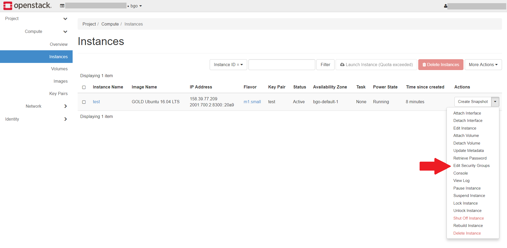

.. |date| date::

Working with Security Groups
============================

Last changed: |date|

.. contents::

.. _CIDR: https://en.wikipedia.org/wiki/Classless_Inter-Domain_Routing
.. _CIDR (Wikipedia): https://en.wikipedia.org/wiki/Classless_Inter-Domain_Routing
.. _CIDR Calculator IPv6: https://www.vultr.com/resources/subnet-calculator-ipv6/
.. _CIDR Calculator IPv4: https://www.vultr.com/resources/subnet-calculator/

Security groups is an essential tool to understand in order for you to
ensure the security and integrity of your instances, as well as making
your application work correctly and as intended. This document
attempts to explain what security groups are and how they work. We
provide practical examples that you can use in your projects on NREC.

What is a Security Group?
-------------------------

The very short answer to this question is that a security group is a
firewall. A security group contains a number of rules that define
which traffic is allowed into (ingress) and out from (egress) your
virtual machines (instances). The rules within a security group may
allow only a single IP address/port combination, or they may open up
completely and thereby negating the effect and protection of a
firewall. It is utterly important that you understand what your
security groups and the rules do and how they work, in order to
properly secure your instances and applications.

Traffic to and from instances in NREC is by default completely
closed. It is only by creating security groups and applying them that
traffic is allowed to flow to and from the instances.

The "default" Security Group
----------------------------

A newly created project in NREC will have a security group called
"default". This security group is unique for this project, and all
project will have a security group called "default". This security
group cannot be deleted. To find it in the dashboard GUI, navigate
to **Project** -> **Network** -> **Security Groups** and click on
it. This security group contains four rules:

.. figure:: images/security-groups-default.png
   :align: center
   :alt: Dashboard - Project -> Network -> Security Groups -> default

----------------------------------------------------------------------

In order to view the same using the CLI, issue these commands:

.. code-block:: console

  $ openstack security group list
  +--------------------------------------+--------------+------------------------+----------------------------------+------+
  | ID                                   | Name         | Description            | Project                          | Tags |
  +--------------------------------------+--------------+------------------------+----------------------------------+------+
  | f6c0499c-0a3c-4756-8527-9cb58e0501b1 | default      | Default security group | a56e80c7c777419585b13ebafe024330 | []   |
  +--------------------------------------+--------------+------------------------+----------------------------------+------+

  $ openstack security group rule list default --long
  +--------------------------------------+-------------+-----------+-----------+------------+-----------+--------------------------------------+
  | ID                                   | IP Protocol | Ethertype | IP Range  | Port Range | Direction | Remote Security Group                |
  +--------------------------------------+-------------+-----------+-----------+------------+-----------+--------------------------------------+
  | 078cf6db-fe5b-4573-9c69-33c1f45b475d | None        | IPv6      | ::/0      |            | egress    | None                                 |
  | 35aade0c-545d-4a22-bb15-a49a72968149 | None        | IPv4      | 0.0.0.0/0 |            | ingress   | f6c0499c-0a3c-4756-8527-9cb58e0501b1 |
  | 51141d27-2d64-47db-a7a3-71f155a8ff3d | None        | IPv6      | ::/0      |            | ingress   | f6c0499c-0a3c-4756-8527-9cb58e0501b1 |
  | 9193943c-6ee2-4a80-8eed-a97dae9f5244 | None        | IPv4      | 0.0.0.0/0 |            | egress    | None                                 |
  +--------------------------------------+-------------+-----------+-----------+------------+-----------+--------------------------------------+

As we can see, the "default" security group contains two **egress**
(outgoing traffic) rules and two **ingress** rules (incoming
traffic). We will discuss the egress rules first.

Egress Rules (outgoing traffic)
~~~~~~~~~~~~~~~~~~~~~~~~~~~~~~~

The two egress rules do exactly the same, but one of them targets IPv4
and the other targets IPv6. They open up the firewall completely, as
we can see clearly in the dashboard by the use of the word **Any**,
but remember the this is outgoing traffic, i.e. from the instance to
the outside world.

While the dashboard simplifies this by using the word **Any** for the
protocol, port range and IP range, the CLI offers the same by having
**None** for protocol, not defining any port range and using the CIDR_
notations **0.0.0.0/0** and **::/0** for the IP range. More about
using CIDR notations later.

Ingress Rules (incoming traffic)
~~~~~~~~~~~~~~~~~~~~~~~~~~~~~~~~

As we can see, the ingress rules opens up in the same way as the
egress rules. However, this is mitigated by the **Remote Security
Group** value applied to the ingress rules. This limits the rules such
that they only apply to instances that has applied the listed remote
security group.

In case of the "default" security group, the remote security group
listed is itself. You can see this in the dashboard as it is listed by
name. In the CLI, we see that the ID of the remote security group in
the ingress rules matches the ID of the "default" security group.

Summary
~~~~~~~

In summary, the "default" security group does the following:

* All outgoing traffic is allowed. The instance may initiate contact
  and communicate with any host on the internet, on any port using any
  protocol

* All incoming traffic is allowed from other instances within the same
  project, if they also have the "default" security group applied.

In short, this security group allows the instances to communicate with
hosts on the internet as long as the traffic is initiated from the
inside, and to communicate freely with each other:

.. figure:: images/security-groups-default-02.png
   :align: center
   :alt: Default security group

   This figure shows how the "default" security group works, if
   applied to two instances in the same project. Incoming traffic from
   the outside is blocked, while outgoing traffic and all
   inter-instance traffic is allowed.

Our recommendations about the "default" security group are:

* Don't change anything about this security group. Leave it intact

* Apply this security group on all your instances unless there are
  special security concerns, specifically regarding the egress rules
  which you may want to tighten

Most instances will run services that require additional firewall
rules. Our recommendation is to create new security groups with the
required ruleset, and apply those in addition to the default security
group.

Understanding CIDR notations
----------------------------

For the gritty details about CIDR see `CIDR (Wikipedia)`_. In short,
CIDR notation is a way to specify a set of consecutive IP addresses
(i.e. an "IP block") in a standardized way, via a compact
representation of an IP address and its associated network mask. In
order to fully understand this a deep dive into IPv4 and IPv6 address
masking using binary numbers is required. This is beyond the scope of
this document. We will try to explain this more superficially. This is
an example of a IPv4 blocks using CIDR:

**0.0.0.0/0**
  All IPv4 addresses in the known universe

**192.168.0.0/16**
  All 16,384 addresses from ``192.168.0.0`` through ``192.168.255.255``

**192.168.100.0/24**
  All 256 addresses from ``192.168.100.0`` through ``192.168.100.255``

**192.168.100.64/27**
  All 32 addresses from ``192.168.100.64`` through ``192.168.100.95``

**192.168.100.200/32**
  The single IPv4 address ``192.168.100.200``

The important thing to understand is that the last number designates
the size of the block. The larger the number, the smaller the
block. CIDR notation applies to IPv6 as well:

**::/0**
  All IPv6 addresses in the known universe

**2001:db8::/32**
  All addresses from ``2001:db8:0:0:0:0:0:0`` through ``2001:db8:ffff:ffff:ffff:ffff:ffff:ffff``

**2001:db8:aaaa::/56**
  All addresses from ``2001:db8:a:0:0:0:0:0`` through ``2001:db8:a:00ff:ffff:ffff:ffff:ffff``

**2001:db8:aaaa::/64**
  All addresses from ``2001:db8:a:0:0:0:0:0`` through ``2001:db8:a:0:ffff:ffff:ffff:ffff``

**2001:db8:aaaa:bbbb:cccc:dddd::/96**
  All addresses from ``2001:db8:a:b:c:d:0:0`` through ``2001:0db8:a:b:c:d:ffff:ffff``

**2001:db8:a:b:c:d:e:100/128**
  The single IPv6 address ``2001:db8:a:b:c:d:e:100``

The actual number of IPv6 addresses that the ranges cotain is so large
we have omitted them from this list.

.. IMPORTANT::
   When you wish to specify a single IP address, be careful when using
   CIDR notation. Use ``/32`` and ``/128`` for IPv4 and IPv6,
   respectively, or just omit the mask and simply specify the IP
   address without a mask.

   A mask of ``/0`` will be accepted by the system even if the IP
   address part is not what we would consider to be "correct". This
   means that ``129.240.12.61/0`` will be interpreted as ``0.0.0.0/0`` for
   IPv4. The same applies to IPv6.

When unsure about what range of addresses that a CIDR notation
contains, visit a CIDR Calculator to make sure. There are many of them
on the internet, but here are a couple of suggestions:

* `CIDR Calculator IPv4`_
* `CIDR Calculator IPv6`_
   
Useful CIDR addresses
~~~~~~~~~~~~~~~~~~~~~

Below is a list of CIDR addresses that you may find useful when
creating security group rules.

+----------------------------+-------------+------------------------------+
| CIDR                       | IP Protocol | Comment                      |
+============================+=============+==============================+
| ``129.240.0.0/16``         | IPv4        | Entire UiO network           |
+----------------------------+-------------+------------------------------+
| ``2001:700:100::/41``      | IPv6        | Entire UiO network           |
+----------------------------+-------------+------------------------------+
| ``129.177.0.0/16``         | IPv4        | Entire UiB network           |
+----------------------------+-------------+------------------------------+
| ``2001:700:200::/48``      | IPv6        | Entire UiB network           |
+----------------------------+-------------+------------------------------+
| ``129.240.114.32/28``      | IPv4        | UiO login service            |
| ``129.240.114.48/28``      |             |                              |
+----------------------------+-------------+------------------------------+
|``2001:700:100:8070::/64``  | IPv6        | UiO login service            |
|``2001:700:100:8071::/64``  |             |                              |
+----------------------------+-------------+------------------------------+
|  ``129.177.13.204/32``     | IPv4        | UiB login service            |
+----------------------------+-------------+------------------------------+
|``2001:700:200:13::204/128``| IPv6        | UiB login service            |
+----------------------------+-------------+------------------------------+

IP ranges in NREC may change as more blocks are added. You can list
the NREC subnets (CIDR addresses) with this command, which is region
specific. Example for the OSL region:

.. code-block:: console

  $ openstack subnet list -c Name -c Subnet
  +---------------+----------------------+
  | Name          | Subnet               |
  +---------------+----------------------+
  | public2_IPv4  | 158.39.75.0/24       |
  | public2_IPv6  | 2001:700:2:8200::/64 |
  | public1_IPv6  | 2001:700:2:8201::/64 |
  | private1_IPv4 | 10.2.0.0/22          |
  | public1_IPv4  | 158.37.63.0/24       |
  | public4_IPv4  | 158.39.48.0/24       |
  | public5_IPv4  | 158.39.200.0/24      |
  +---------------+----------------------+

Creating a Security Group
-------------------------

In order to create a new security group using the dashboard, navigate
to **Project** -> **Network** -> **Security Groups**:

.. figure:: images/security-groups-create-01.png
   :align: center
   :alt: Dashboard - Project -> Network -> Security Groups

Click on **Create Security Group** and the following dialog window
appears:

.. figure:: images/security-groups-create-02.png
   :align: center
   :alt: Create Security Group

You have to give the new security group a name, and optionally a
description. After creating the security group, you are redirected to
the page in which you will create and edit its rules:

.. figure:: images/security-groups-create-03.png
   :align: center
   :alt: Create Security Group done

----------------------------------------------------------------------

In order to create a security group using the CLI, use the command
``openstack security group create``:

.. code-block:: console

  $ openstack security group create --description 'Allows ssh and ping from login hosts at UiO' 'SSH and ICMP from UiO login hosts'
  (...output omitted...)

As in the dashboard, the description is optional.

We have successfully created a security group. This security group
will by default have the same two egress rules (outgoing traffic) that
are present in the "default" security group, i.e. all outgoing traffic
is allowed. You may wish to edit or delete these two rules.

Adding Rules
------------

In order to add security group rules, navigate to the security group
that you wish to edit and click **Add Rule**:

.. figure:: images/security-groups-add-rule-01.png
   :align: center
   :alt: Add security group rule

In our case, we wish to add SSH and ICMP (ping) access from the host
login.uio.no:

.. code-block:: console

  $ host login.uio.no
  login.uio.no is an alias for login-2fa-azure.uio.no.
  login-2fa-azure.uio.no has address 129.240.114.36
  login-2fa-azure.uio.no has address 129.240.114.52
  login-2fa-azure.uio.no has IPv6 address 2001:700:100:8070::36
  login-2fa-azure.uio.no has IPv6 address 2001:700:100:8071::52

As we can see, login.uio.no is actually two hosts. In order to future
proof our security group wrt. changes to the login sercice, we should
allow traffic from these subnets that are specifically used for login
hosts at UiO:

* ``129.240.114.32/28`` / ``2001:700:100:8070::/64``
* ``129.240.114.48/28`` / ``2001:700:100:8071::/64``
  
We want to add rules that allow:

* ICMP over IPv4 from ``129.240.114.32/28`` and ``129.240.114.48/28``
* ICMP over IPv6 from ``2001:700:100:8070::/64`` and ``2001:700:100:8071::/64``
* SSH over IPv4 from ``129.240.114.32/28`` and ``129.240.114.48/28``
* SSH over IPv6 from ``2001:700:100:8070::/64`` and ``2001:700:100:8071::/64``

We start with ICMP over IPv4. We select **All ICMP** for the rule,
omit the optional description, and leave the **Direction**
and **Remote** as "Ingress" and "CIDR", respectively. In the **CIDR**
field, we enter the first IPv4 CIDR address (``129.240.114.32/28``)
for login hosts as mentioned above:

.. figure:: images/security-groups-add-rule-02.png
   :align: center
   :alt: Add first ICMP/IPv4 security group rule

And the same for the second CIDR address (``129.240.114.48/28``):

.. figure:: images/security-groups-add-rule-02b.png
   :align: center
   :alt: Add second ICMP/IPv4 security group rule

For the ICMP over IPv6 rules, we do exactly the same except entering
the IPv6 CIDR addresses in the **CIDR** field:

.. figure:: images/security-groups-add-rule-02c.png
   :align: center
   :alt: Add first ICMP/IPv6 security group rule

.. figure:: images/security-groups-add-rule-02d.png
   :align: center
   :alt: Add second ICMP/IPv6 security group rule

For the SSH rules, we repeat the steps for ICMP, except choosing "SSH"
in the **Rule** drop-down menu (example for the first Ipv4 CIDR
address):

.. figure:: images/security-groups-add-rule-03.png
   :align: center
   :alt: Add SSH/IPv6 security group rule

After creating all rules, it should look like this:

.. figure:: images/security-groups-add-rule-04.png
   :align: center
   :alt: Security group rule listing

----------------------------------------------------------------------

Creating security group rules can also be done using CLI. First we
list our security groups:

.. code-block:: console

  $ openstack security group list
  +--------------------------------------+-----------------------------------+---------------------------------------------+----------------------------------+------+
  | ID                                   | Name                              | Description                                 | Project                          | Tags |
  +--------------------------------------+-----------------------------------+---------------------------------------------+----------------------------------+------+
  | 502bd0d6-91ab-4772-8fab-4ec1275372cf | SSH and ICMP from UiO login hosts | Allows ssh and ping from login hosts at UiO | e55fe3f025894c62a100713e92193e64 | []   |
  | 5e3a9975-667b-46b7-9fdc-629ae8d09368 | default                           | Default security group                      | e55fe3f025894c62a100713e92193e64 | []   |
  +--------------------------------------+-----------------------------------+---------------------------------------------+----------------------------------+------+

When specifying the security group we can use either the ID or the
name of the security group. Since the name in our case contains spaces
we're opting to use the ID. Adding the rules (omitting output):

.. code-block:: console

  $ openstack security group rule create --ethertype IPv4 --protocol icmp \
      --remote-ip 129.240.114.32/28 502bd0d6-91ab-4772-8fab-4ec1275372cf

  $ openstack security group rule create --ethertype IPv4 --protocol icmp \
      --remote-ip 129.240.114.48/28 502bd0d6-91ab-4772-8fab-4ec1275372cf

  $ openstack security group rule create --ethertype IPv6 --protocol ipv6-icmp \
      --remote-ip 2001:700:100:8070::/64 502bd0d6-91ab-4772-8fab-4ec1275372cf

  $ openstack security group rule create --ethertype IPv6 --protocol ipv6-icmp \
      --remote-ip 2001:700:100:8071::/64 502bd0d6-91ab-4772-8fab-4ec1275372cf

  $ openstack security group rule create --ethertype IPv4 --protocol tcp --dst-port 22 \
      --remote-ip 129.240.114.32/28 502bd0d6-91ab-4772-8fab-4ec1275372cf
  
  $ openstack security group rule create --ethertype IPv4 --protocol tcp --dst-port 22 \
      --remote-ip 129.240.114.48/28 502bd0d6-91ab-4772-8fab-4ec1275372cf

  $ openstack security group rule create --ethertype IPv6 --protocol tcp --dst-port 22 \
      --remote-ip 2001:700:100:8070::/64 502bd0d6-91ab-4772-8fab-4ec1275372cf

  $ openstack security group rule create --ethertype IPv6 --protocol tcp --dst-port 22 \
      --remote-ip 2001:700:100:8071::/64 502bd0d6-91ab-4772-8fab-4ec1275372cf

After creating the rules, we can list all rules in the security group
for inspection:

.. code-block:: console

  $ openstack security group rule list 502bd0d6-91ab-4772-8fab-4ec1275372cf
  +--------------------------------------+-------------+-----------+------------------------+------------+-----------+-----------------------+----------------------+
  | ID                                   | IP Protocol | Ethertype | IP Range               | Port Range | Direction | Remote Security Group | Remote Address Group |
  +--------------------------------------+-------------+-----------+------------------------+------------+-----------+-----------------------+----------------------+
  | 11698bdf-6fcd-45e3-b69d-d08811dbdce9 | tcp         | IPv6      | 2001:700:100:8070::/64 | 22:22      | ingress   | None                  | None                 |
  | 24b8ab82-c596-4a59-bb8e-3733626ce6a3 | ipv6-icmp   | IPv6      | 2001:700:100:8070::/64 |            | ingress   | None                  | None                 |
  | 28f5795b-012a-4be6-909a-70ff6ee3fb0e | ipv6-icmp   | IPv6      | 2001:700:100:8071::/64 |            | ingress   | None                  | None                 |
  | 38fa042b-f865-42fe-8604-664439a062fb | icmp        | IPv4      | 129.240.114.32/28      |            | ingress   | None                  | None                 |
  | 767edc46-65d0-47cd-9ac5-8e72a1305cc5 | tcp         | IPv4      | 129.240.114.48/28      | 22:22      | ingress   | None                  | None                 |
  | ac765beb-9d4b-415a-b449-64ba9036b74d | tcp         | IPv4      | 129.240.114.32/28      | 22:22      | ingress   | None                  | None                 |
  | bd4d4340-d014-4e2d-82f3-680a521ce16d | None        | IPv6      | ::/0                   |            | egress    | None                  | None                 |
  | c697fb13-c555-4a54-ab98-a6440dfc799a | tcp         | IPv6      | 2001:700:100:8071::/64 | 22:22      | ingress   | None                  | None                 |
  | dba5f73d-a7ec-4452-aec9-07b9f8b82373 | icmp        | IPv4      | 129.240.114.48/28      |            | ingress   | None                  | None                 |
  | df890224-2b36-4ad9-a298-699b99d21036 | None        | IPv4      | 0.0.0.0/0              |            | egress    | None                  | None                 |
  +--------------------------------------+-------------+-----------+------------------------+------------+-----------+-----------------------+----------------------+

Remote Security Group
~~~~~~~~~~~~~~~~~~~~~

When creating a security group rule we have the option of using a
security group as remote, instead of a CIDR address. This can be
particularly useful for internal communication between instances in
the same project running different layers of an application. As
instances are deleted and recreated, they will have a different set of
IP addresses. Using CIDR addresses in this situation can present a
maintenance challenge.

We have already seen use of remote security groups when we discussed
the "default" security group above. If you're applying the "default"
security group on all your instances anyway you don't need additional
inter-instance communication rules. The "default" security group
already allows any communication between instances on which it is
applied. However, for extra security you may want to opt out of the
"default" security group and specify a narrower window of
communication between instances.

The remote security group will work regardless it the hosts have a
private IPv4 address (i.e. the "IPv6" network) or they have a public
IPv4. There are a couple of limitations when using a security group as
remote:

* It only works between security groups in the same project
* It only works within the same region

Consider the following situation:

.. figure:: images/security-groups-remote-01.png
   :align: center
   :alt: Database-web-server hypothetical

In this hypothetical scenario we have three web servers that uses two
database servers as backend. In order to protect the infrastructure we
want to restrict communication as follows:

#. The web servers are exposed to the internet via port 443 (HTTPS)

#. The database servers are not exposed on the internet at all

#. There should be intercommunication between the database servers and
   the web servers. The database servers should allow traffic over the
   database port from the web servers and nothing else

We can solve the last problem by using a security group as remote. In
our hypothetical scenario, we already have security groups for the
database and web servers:

.. figure:: images/security-groups-remote-02.png
   :align: center
   :alt: Database-web-server security group listing

The "database" security group is applied on the database servers, and
the "web" security group is applied on the web servers. In order to
allow the web servers to initiate a connection to the MySQL port on
the database servers, we need to add a rule in the "database" security
group, using the "web" security group as remote:

.. figure:: images/security-groups-remote-03.png
   :align: center
   :alt: Database-web-server security group new rule

We select "Security Group" as our **Remote** instead of CIDR, which is
the default. We then select the "web" security group as the
remote. The security group rules now contains this new rule:

.. figure:: images/security-groups-remote-04.png
   :align: center
   :alt: Database-web-server security group listing 2

----------------------------------------------------------------------

Creating a security group rule that uses another security group as
remote can also be done using CLI. First, we list our security groups:

.. code-block:: console

  $ openstack security group list
  +--------------------------------------+----------+------------------------+----------------------------------+------+
  | ID                                   | Name     | Description            | Project                          | Tags |
  +--------------------------------------+----------+------------------------+----------------------------------+------+
  | 6698059e-c82b-4694-975c-55c47c8e0151 | database | database               | 24823ac5a6dd4d27966310600abce54d | []   |
  | 6743c744-1a06-462e-82e6-85c9d0b2399f | default  | Default security group | 24823ac5a6dd4d27966310600abce54d | []   |
  | ad67b1c0-32bd-44a9-919b-64195870e136 | web      | web                    | 24823ac5a6dd4d27966310600abce54d | []   |
  +--------------------------------------+----------+------------------------+----------------------------------+------+

We then add the new rule:

.. code-block:: console

  $ openstack security group rule create --ethertype IPv4 --protocol tcp --dst-port 3306 --remote-group web database
  (...output omitted...)

As before, you can use the security group name or ID with these
commands. We list the contents of the "database" security group for
verification:

.. code-block:: console

  $ openstack security group rule list --long database
  +--------------------------------------+-------------+-----------+-----------+------------+-----------+--------------------------------------+
  | ID                                   | IP Protocol | Ethertype | IP Range  | Port Range | Direction | Remote Security Group                |
  +--------------------------------------+-------------+-----------+-----------+------------+-----------+--------------------------------------+
  | 7c5ac04f-b1f9-4801-a6d2-ed2102a46b42 | None        | IPv6      | ::/0      |            | egress    | None                                 |
  | 8148364c-93d5-4fdd-a5ac-04ec6d9215e4 | tcp         | IPv4      | 0.0.0.0/0 | 3306:3306  | ingress   | ad67b1c0-32bd-44a9-919b-64195870e136 |
  | 961a5cc5-fe0b-4d31-9aad-826e5cbed232 | None        | IPv4      | 0.0.0.0/0 |            | egress    | None                                 |
  +--------------------------------------+-------------+-----------+-----------+------------+-----------+--------------------------------------+

Deleting Rules
--------------

To delete a security group rule using the dashboard, first navigate
to **Project** -> **Network** -> **Security Groups** and click
on **Manage Rules** for the security group in question.

.. figure:: images/security-groups-delete-rule-01.png
   :align: center
   :alt: Click on "Manage Rules"

In the rules listing, click on **Delete Rule** for the rule you wish
to delete:

.. figure:: images/security-groups-delete-rule-02.png
   :align: center
   :alt: Click on "Delete Rule"

Optionally, you can mark the rule using the radio buttons to the left
and click **Delete Rules**. This is faster if you want to delete
several rules simultaneously.

----------------------------------------------------------------------

Deleting a security group rule using the CLI can be done like this:

#. First we list the contents of the security group, in order to find
   the ID of the rule we want to delete:

   .. code-block:: console

     $ openstack security group rule list --long database
     +--------------------------------------+-------------+-----------+-----------+------------+-----------+--------------------------------------+
     | ID                                   | IP Protocol | Ethertype | IP Range  | Port Range | Direction | Remote Security Group                |
     +--------------------------------------+-------------+-----------+-----------+------------+-----------+--------------------------------------+
     | 7c5ac04f-b1f9-4801-a6d2-ed2102a46b42 | None        | IPv6      | ::/0      |            | egress    | None                                 |
     | 8148364c-93d5-4fdd-a5ac-04ec6d9215e4 | tcp         | IPv4      | 0.0.0.0/0 | 3306:3306  | ingress   | ad67b1c0-32bd-44a9-919b-64195870e136 |
     | 961a5cc5-fe0b-4d31-9aad-826e5cbed232 | None        | IPv4      | 0.0.0.0/0 |            | egress    | None                                 |
     +--------------------------------------+-------------+-----------+-----------+------------+-----------+--------------------------------------+

#. Once we know the ID, we can delete the rule:

   .. code-block:: console

     $ openstack security group rule delete 8148364c-93d5-4fdd-a5ac-04ec6d9215e4

#. Lastly, we list the rules again to verify that the rule was
   deleted:

   .. code-block:: console

     $ openstack security group rule list --long database
     +--------------------------------------+-------------+-----------+-----------+------------+-----------+-----------------------+
     | ID                                   | IP Protocol | Ethertype | IP Range  | Port Range | Direction | Remote Security Group |
     +--------------------------------------+-------------+-----------+-----------+------------+-----------+-----------------------+
     | 7c5ac04f-b1f9-4801-a6d2-ed2102a46b42 | None        | IPv6      | ::/0      |            | egress    | None                  |
     | 961a5cc5-fe0b-4d31-9aad-826e5cbed232 | None        | IPv4      | 0.0.0.0/0 |            | egress    | None                  |
     +--------------------------------------+-------------+-----------+-----------+------------+-----------+-----------------------+

Deleting a Security Group
-------------------------

To delete a security group using the dashboard, navigate
to **Project** -> **Network** -> **Security Groups**. Use the menu on
the right of the security group you want to delete an select **Delete
Security Group**:

.. figure:: images/security-groups-delete-group-01.png
   :align: center
   :alt: Click on "Delete Rule"

Optionally, you can mask the security group using radio buttons to the
left and click **Delete Security Groups**. This is faster if you want
to delete several security groups simultaneously.

----------------------------------------------------------------------

To delete a security group using the CLI:

#. We first list our security groups:

   .. code-block:: console

     $ openstack security group list
     +--------------------------------------+----------+------------------------+----------------------------------+------+
     | ID                                   | Name     | Description            | Project                          | Tags |
     +--------------------------------------+----------+------------------------+----------------------------------+------+
     | 6698059e-c82b-4694-975c-55c47c8e0151 | database | database               | 24823ac5a6dd4d27966310600abce54d | []   |
     | 6743c744-1a06-462e-82e6-85c9d0b2399f | default  | Default security group | 24823ac5a6dd4d27966310600abce54d | []   |
     | ad67b1c0-32bd-44a9-919b-64195870e136 | web      | web                    | 24823ac5a6dd4d27966310600abce54d | []   |
     +--------------------------------------+----------+------------------------+----------------------------------+------+

#. We then delete the security group, specifying it either by name or
   ID:

   .. code-block:: console

     $ openstack security group delete 6698059e-c82b-4694-975c-55c47c8e0151

#. Finally, we list the security groups again to verify:

   .. code-block:: console

     $ openstack security group list
     +--------------------------------------+---------+------------------------+----------------------------------+------+
     | ID                                   | Name    | Description            | Project                          | Tags |
     +--------------------------------------+---------+------------------------+----------------------------------+------+
     | 6743c744-1a06-462e-82e6-85c9d0b2399f | default | Default security group | 24823ac5a6dd4d27966310600abce54d | []   |
     | ad67b1c0-32bd-44a9-919b-64195870e136 | web     | web                    | 24823ac5a6dd4d27966310600abce54d | []   |
     +--------------------------------------+---------+------------------------+----------------------------------+------+

Apply or Remove Security Groups
-------------------------------

A security group is meaningless unless applied to one or more virtual
machines (instances). In order to apply or remove security groups from
an instance, navigate to **Project** -> **Compute** -> **Instances**,
and select **Edit Security Groups** from the drop-down menu for the
instance:

The following dialog window will appear:

.. figure:: images/dashboard-instance-edit-secgroup-02.png
   :align: center
   :alt: Dashboard - Edit Security Group

Edit the security groups for the instance by adding or removing with
the **+** and **-** buttons, and click **Save**:

----------------------------------------------------------------------

Adding and removing security groups from a server can also be done
using the CLI. First, we list our servers and security groups:

.. code-block:: console

  $ openstack server list
  +--------------------------------------+------+--------+----------------------------------------+---------------+----------+
  | ID                                   | Name | Status | Networks                               | Image         | Flavor   |
  +--------------------------------------+------+--------+----------------------------------------+---------------+----------+
  | da187bf2-ff3d-43f4-8256-90482061fd04 | test | ACTIVE | IPv6=10.1.2.137, 2001:700:2:8301::1366 | GOLD CentOS 8 | m1.small |
  +--------------------------------------+------+--------+----------------------------------------+---------------+----------+
  
  $ openstack security group list
  +--------------------------------------+--------------+------------------------------+----------------------------------+------+
  | ID                                   | Name         | Description                  | Project                          | Tags |
  +--------------------------------------+--------------+------------------------------+----------------------------------+------+
  | 2510a8ec-1d74-49a7-8422-c6034a876b13 | default      | Default security group       | 24823ac5a6dd4d27966310600abce54d | []   |
  | 5471b535-b3e3-4ed7-96b0-885e71148537 | SSH and ICMP | Allows incoming SSH and ICMP | 24823ac5a6dd4d27966310600abce54d | []   |
  +--------------------------------------+--------------+------------------------------+----------------------------------+------+

We can see which security groups are applied to a server by inspecting
the server using ``openstack server show``:

.. code-block:: console

  $ openstack server show test
  ...
  | security_groups             | name='default'                                           |
  ...

In this case only the "default" security group is applied. To apply
our "SSH and ICMP" security group:

.. code-block:: console

  $ openstack server add security group test 'SSH and ICMP'

We can then inspect the server again:

.. code-block:: console

  $ openstack server show test
  ...
  | security_groups             | name='default'                                           |
  |                             | name='SSH and ICMP'                                      |
  ...

We can also remove a security group from a server. Here, we are
removing the "SSH and ICMP" security group from the server "test":

.. code-block:: console

  $ openstack server remove security group test 'SSH and ICMP'

As with most Openstack commands, we can use either the ID or the name
when specifying security groups and instances.
