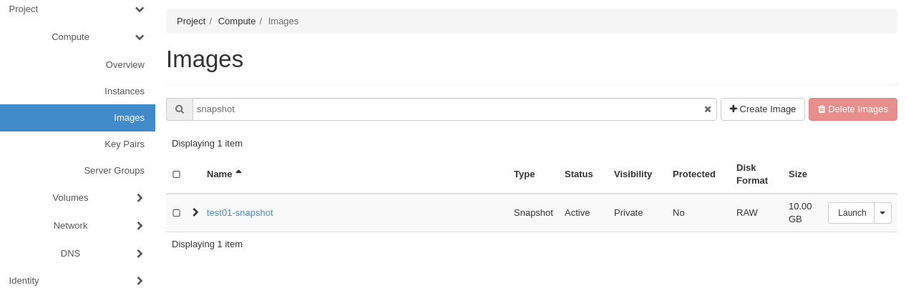
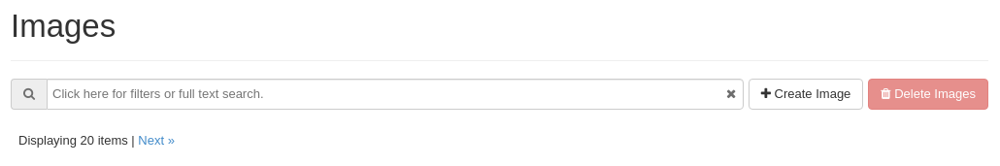
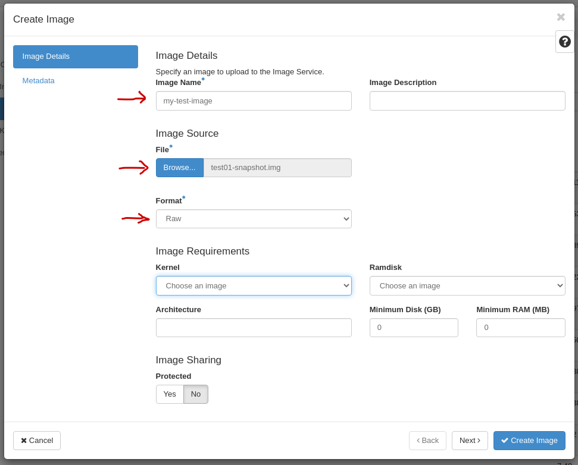
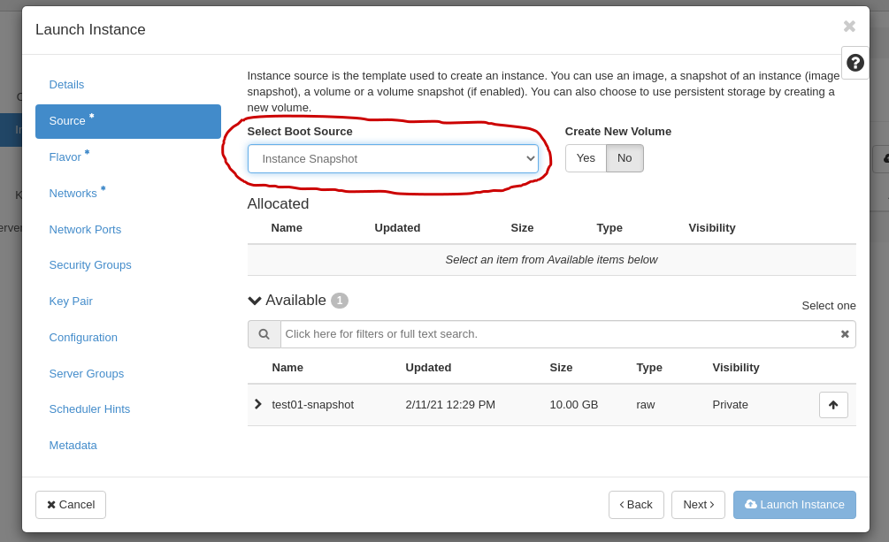
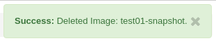

.. |date| date::

.. _Create a Linux virtual machine: create-virtual-machine.html

Create and manage snapshots
===========================

.. contents::

You can create a snapshot from an instance, either as a backup, or to
use it as the source image when creating new instances. Either way,
there are a couple of things to consider before creating the snapshot:

* Does the instance have one or more volumes attached? If so, you may
  need to comment out mounts from **/etc/fstab** first, to ensure that
  new instances are able to boot without failures, if using the
  snapshot as a source image for new instances.

* In order to ensure consistency when using the snapshot as a source
  image for new instances, it is always best to shut down the instance
  before taking a snapshot of it.

Creating
--------

Follow these steps to create a snapshot of an instance.

#. In the dashboard, select **Instances** in the **Compute** tab:

   .. image:: images/snapshot-01.png
      :align: center
      :alt: Dashboard - Compute -> Instances

#. Use the drop-down menu and select ``Shut off instance``:

   .. image:: images/snapshot-02.png
      :align: center
      :alt: Dashboard - Compute -> Instances -> shutoff

#. When the instance is shut off, use the drop-down menu and select
   ``Create Snapshot``:

   .. image:: images/snapshot-03.png
      :align: center
      :alt: Dashboard - Compute -> Instances -> create snapshot
   
#. Fill in the **Snapshot Name** and click on ``Create Snapshot`` in
   the window that appears:

   .. image:: images/snapshot-04.png
      :align: center
      :alt: Dashboard - Snapshot Name

The snapshot is now created, and will be located under **Images** in
the **Compute** tab. The image list will be long, use the search field
to enter part of the name of your image and it should appear:

.. NOTE::
   Image creation may take a long time. You may need to reload the
   browser page.

Creating via CLI
~~~~~~~~~~~~~~~~

#. First list our servers:

   .. code-block:: console

     $ openstack server list
     +--------------------------------------+--------+--------+----------------------------------------+---------------+----------+
     | ID                                   | Name   | Status | Networks                               | Image         | Flavor   |
     +--------------------------------------+--------+--------+----------------------------------------+---------------+----------+
     | fd35e22f-6519-46d5-95c1-01e80b02ca17 | test01 | ACTIVE | IPv6=2001:700:2:8201::1246, 10.2.2.105 | GOLD CentOS 8 | m1.small |
     +--------------------------------------+--------+--------+----------------------------------------+---------------+----------+

#. Shut off the server for which you want a snapshot (this can be
   omitted at the risk of compromising the integrity of the OS within
   the snapshot):

   .. code-block:: console

     $ openstack server stop fd35e22f-6519-46d5-95c1-01e80b02ca17

#. Take a snapshot:

   .. code-block:: console

     $ openstack server image create --name test01-snapshot fd35e22f-6519-46d5-95c1-01e80b02ca17
     (output omitted...)

#. Turn on the server (optional):

   .. code-block:: console

     $ openstack server start fd35e22f-6519-46d5-95c1-01e80b02ca17

#. List images to verify that your snapshot has been created
   (optional):
   
   .. code-block:: console

     $ openstack image list --private
     +--------------------------------------+-----------------+--------+
     | ID                                   | Name            | Status |
     +--------------------------------------+-----------------+--------+
     | 6edb8ab8-df9b-4339-b5d0-9e33d9d36e5d | my-test-image   | active |
     | 8fae2165-ef86-4e36-91a5-5caad9698aab | test01-snapshot | active |
     +--------------------------------------+-----------------+--------+

Downloading
-----------

There are valid reasons to download the snapshot to a local
computer. One reason would be to have an off-site backup of the
instance. Another is to upload the snapshot to another project in
order to use it as a source image for instances in that project.

Downloading a snapshot is not possible via the dashboard, it is only
possible via the CLI or API. The steps needed to download the snapshot
via CLI are detailed below.

#. List images using the option ``--private``, thus excluding official
   NREC images:

   .. code-block:: console

     $ openstack image list --private
     +--------------------------------------+-----------------+--------+
     | ID                                   | Name            | Status |
     +--------------------------------------+-----------------+--------+
     | ada4524b-72f5-4b41-b28e-1ac57c6634a0 | test01-snapshot | active |
     +--------------------------------------+-----------------+--------+

#. Download the image using the image ID. Select a name of the file
   (here: ``test01-snapshot.img``) for the ``--file`` option:

   .. code-block:: console

      $ openstack image save --file test01-snapshot.img ada4524b-72f5-4b41-b28e-1ac57c6634a0
      $ ls -lh test01-snapshot.img 
      -rw-r--r--. 1 user group 10G Feb 11 14:18 test01-snapshot.img

Uploading
---------

If you have previously downloaded a snapshot as described in
`Downloading`_, you can upload it to a different project or
region. An snapshot is uploaded as an image. In order to upload the
snapshot, navigate to **Images** and click on ``Create Image``:

In the window that appears, you have to specify a name for the image
(here: "my-test-image"), select the file on your computer (here:
"test01-snapshot.img") and select the image format. In our case, and
for previously downloaded snapshots, the image format is "Raw":

You can also set an optional description, and metadata info such as
disk and memory requirements. Click on "Create Image" to proceed. Note
that images and snapshots are large files and uploading may take a
very long time.

After the image has been uploaded, it will appear in the **Images**
tab:

Uploading via CLI
~~~~~~~~~~~~~~~~~

If the purpose of uploading the snapshot is to move a workload or
instance between projects, make sure that your shell environment
variables are set correctly:

.. code-block:: console

  $ env | egrep '(OS_REGION_NAME|OS_PROJECT_NAME)'
  OS_REGION_NAME=osl
  OS_PROJECT_NAME=DEMO-xxxxxxxx.uio.no

Change these variables according to which project and region where you
want to upload the snapshot, e.g.:

.. code-block:: console

  $ export OS_PROJECT_NAME=PRIVATE-xxxxxxxx.uio.no

You can then upload the image:

.. code-block:: console

  $ openstack image create --file test01-snapshot.img --disk-format raw my-test-image
  (output omitted)

You need to specify the file name, disk format and a name for the
image. Other metadata for the image may be set with additional
options, se the output of ``openstack image create --help`` for more
information.

Launching
---------

Follow the steps outlined in `Create a Linux virtual machine`_. The
only difference is when choosing the image from which to launch the
new instance. Choose ``Instance Snapshot`` as the boot source and your
snapshots should appear. Then choose the preferred snapshot and
proceed as normal:

You can also launch an instance from the **Images** tab. Choose the
snapshot, and click on ``Launch``, and further steps are described
under `Create a Linux virtual machine`_.

The new instance contains now the expected customizations made earlier
in your previous instance.

Launching via CLI
~~~~~~~~~~~~~~~~~

This will be exactly as described in `Create a Linux virtual
machine`_. Use your snapshot as the source for the instance:

.. code-block:: console

  $ openstack server create --image "test01-snapshot" --flavor m1.small \
        --security-group SSH_and_ICMP --security-group default \
        --key-name mykey --nic net-id=IPv6 myserver

Deleting
--------

.. NOTE::
   You can not delete a snapshot that is being used as a source image
   for an instance. If you try to delete a snapshot that is in use as
   a source image, you will get an error:

   .. image:: images/snapshot-07.png
      :align: center
      :alt: Dashboard - Delete Snapshot ERROR

In order to delete a snapshot that no longer need, follow these steps:

#. Navigate to the **Images** tab under **Compute**. The image list
   will be long, use the search field to enter part of the name of
   your image and it should appear:

   .. image:: images/snapshot-05.png
      :align: center
      :alt: Dashboard - Compute -> Images

#. Select ``Delete Image`` to delete the snapshot:

   .. image:: images/snapshot-08.png
      :align: center
      :alt: Dashboard - Compute -> Images -> delete image

You should now get a confirmation that the snapshot is deleted:

Deleting via CLI
~~~~~~~~~~~~~~~~

#. List your private images:

   .. code-block:: console

     $ openstack image list --private
     +--------------------------------------+-----------------+--------+
     | ID                                   | Name            | Status |
     +--------------------------------------+-----------------+--------+
     | 6edb8ab8-df9b-4339-b5d0-9e33d9d36e5d | my-test-image   | active |
     | 8fae2165-ef86-4e36-91a5-5caad9698aab | test01-snapshot | active |
     +--------------------------------------+-----------------+--------+

#. Delete the snapshot using the ID or name:

   .. code-block:: console

     $ openstack image delete 8fae2165-ef86-4e36-91a5-5caad9698aab

