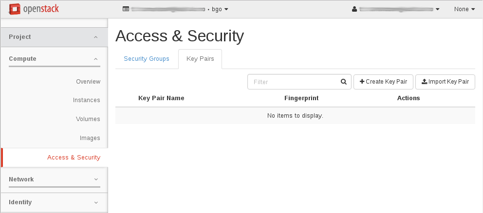
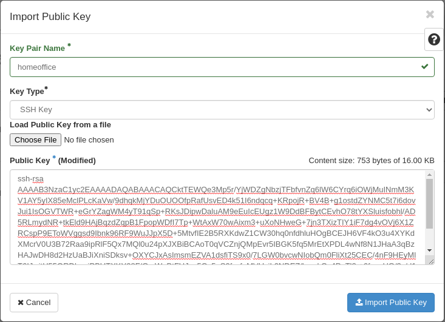
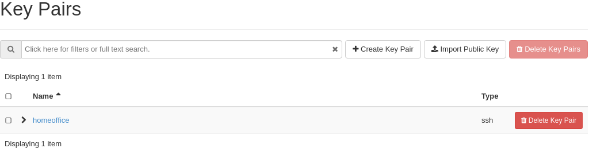
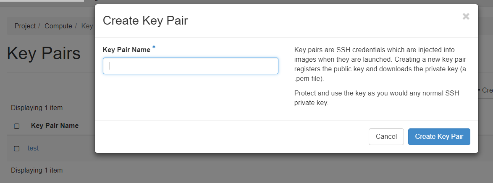
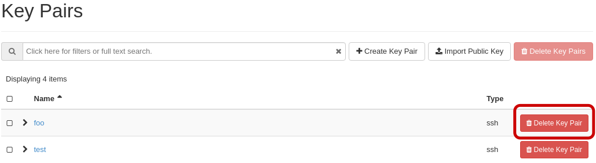

.. |date| date::

Using SSH
=========

Last changed: |date|

.. contents::

.. _Security Groups: security-groups.html
.. _the default security group: security-groups.html#the-default-security-group

Virtual machines in NREC are accessed using SSH key pairs. There are
numerous ways to achieve this, depending on the OS on your local
computer. The preferred method is to create an SSH key pair on your
local computer (or use an already existing one), and upload the public
key into NREC.

.. figure:: images/ssh.png
   :align: center
   :alt: SSH illustration

In order to access an instance in NREC, you need to specify the
correct ssh public key when creating the instance:

#. Create an SSH key pair (or use an existing one)

#. Upload the public key to NREC and give it a proper name

#. Specify this key by its name when creating the instance

#. Connect via SSH to the instance using the corresponding private key

We will go through these steps in more detail.

Creating a key pair
-------------------

There are two methods for creating an ssh key pair in NREC. To create
an ssh key pair you should **EITHER**

* `Importing an existing public key (recommended)`_: With this method
  you upload an existing public key into NREC. This is the recommended
  approach

**OR**

* `Letting OpenStack create a key pair`_: Here, NREC will create a new
  key pair and let you download the private key into a file

Most users should choose to create an ssh key pair on their client
machine, and upload the public key to NREC.

Importing an existing public key (recommended)
~~~~~~~~~~~~~~~~~~~~~~~~~~~~~~~~~~~~~~~~~~~~~~

**This is the recommended approach!**

If the local computer is Linux, any BSD variant such as FreeBSD, MacOS
or Windows 10, the easiest way is to create a key pair locally if you
don't already have one, using the command ``ssh-keygen`` (on Windows
it's called ``ssh-keygen.exe``):

.. code-block:: console

  $ cd ~
  $ ssh-keygen -C "NREC keypair 2024-04-05" -a 100 -t ed25519 -f .ssh/id_ed25519_nrec
  Generating public/private ed25519 key pair.
  Enter passphrase (empty for no passphrase): 
  Enter same passphrase again: 
  Your identification has been saved in .ssh/id_ed25519_nrec
  Your public key has been saved in .ssh/id_ed25519_nrec.pub
  The key fingerprint is:
  SHA256:bB/SoBMwTIXgWzgCfnRXy1i22rcgw5sZm49ouqwTuE0 NREC keypair 2024-04-05
  The key's randomart image is:
  +--[ED25519 256]--+
  |. .=++...+       |
  |o...+o. = o      |
  |..+.. ...+       |
  | ..+  .+oo       |
  |. .   o*Soo.     |
  |..E    oXoo..    |
  | +.    *  ..     |
  |..o  .. o        |
  | .o++. . .       |
  +----[SHA256]-----+

Before running ssh-keygen we're making sure that the current working
directory is our home directory. In this case we are creating a key
pair of type ed25519, which it recommended. We specify the output
filename **.ssh/id_ed25519_nrec**. The files created in your home directory are

**.ssh/id_ed25519_nrec**
  This is the *private key*. It should be kept safe.

**.ssh/id_ed25519_nrec.pub**
  This is the *public key*. It can be used to authenticate holders of
  the private key.

To import your existing public key into NREC, navigate to **Project**
-> **Compute** -> **Key Pairs**:

Click on **Import Key Pair**. In the dialog that appears, fill out the
following:

* **Key Pair Name**: Give the key pair a proper name, so you remember
  what it is and where it can be accessed from (here: "homeoffice")

* **Key Type**: Choose "SSH Key" from the drop-down menu

* Either use **Choose File** and find the **.ssh/id_ed25519_nrec.pub** file, or
  cut & paste the contents of **.ssh/id_ed25519_nrec.pub** into the "Public Key"
  field

Click "Import Key Pair" and the key is saved:

---------------------------------------------------------------------
	 
Uploading an existing public key via CLI is done with this command::

  openstack keypair create --public-key <file> <name>

Example:

.. code-block:: console

  $ openstack keypair create --public-key ~/.ssh/id_ed25519_nrec.pub homeoffice
  +-------------+-------------------------------------------------+
  | Field       | Value                                           |
  +-------------+-------------------------------------------------+
  | fingerprint | e2:2e:26:7f:5d:98:9e:8f:5e:fd:c7:d5:d0:6b:44:e7 |
  | name        | homeoffice                                      |
  | user_id     | 6bb8dacdc9b94fff89258094bc56a49f                |
  +-------------+-------------------------------------------------+

You can then list your keys:

.. code-block:: console

  $ openstack keypair list
  +----------+-------------------------------------------------+
  | Name     | Fingerprint                                     |
  +----------+-------------------------------------------------+
  |homeoffice| e2:2e:26:7f:5d:98:9e:8f:5e:fd:c7:d5:d0:6b:44:e7 |
  +----------+-------------------------------------------------+

Letting OpenStack create a key pair
~~~~~~~~~~~~~~~~~~~~~~~~~~~~~~~~~~~

You can let OpenStack create a key pair for you, if you don't wish to
create one locally or use an existing one. Navigate to **Project**
-> **Compute** -> **Key Pairs**:

.. figure:: images/dashboard-access-and-security-03.png
   :align: center
   :alt: Dashboard - Access & Security

Click on **Create Key Pair**:

Choose a name for you key pair (here: "nrec"), select "SSH Key" from
the **Key Type** drop-down menu, and click **Create Key Pair**. The newly
created private key will be downloaded by the browser automatically as
**<name>.pem** (here: "nrec.pem").

The name of the downloaded file is based on the name you provided
earlier. In this example the file is called "nrec.pem" as "nrec" was
provided as the key pair name. Remember to restrict the access to the
private key, as SSH will refuse to use unless it's properly
protected:

.. code-block:: console

  $ chmod 0600 nrec.pem

---------------------------------------------------------------------
	 
Using the CLI, you can have Openstack create a new key pair for you
using this command::

  openstack keypair create --private-key <file> <name>

Where **<file>** is the name of the file in which the private key will
be saved. If this option is omitted the contents of the private key
will be printed on the console.
  
Example:

.. code-block:: console

  $ openstack keypair create --private-key nrec.pem nrec
  +-------------+-------------------------------------------------+
  | Field       | Value                                           |
  +-------------+-------------------------------------------------+
  | fingerprint | 9d:b5:68:c9:d4:53:ab:73:95:f7:85:a2:74:a8:41:9e |
  | name        | nrec                                            |
  | user_id     | 6bb8dbcdc9b94fffa9258094bc56a49f                |
  +-------------+-------------------------------------------------+

You can then list your keys:

.. code-block:: console

  $ openstack keypair list
  +-------+-------------------------------------------------+
  | Name  | Fingerprint                                     |
  +-------+-------------------------------------------------+
  | nrec  | 9d:b5:68:c9:d4:53:ab:73:95:f7:85:a2:74:a8:41:9e |
  +-------+-------------------------------------------------+

Remember to restrict the access to the private key, as SSH will refuse
to use unless it's properly protected:

.. code-block:: console

  $ chmod 0600 nrec.pem

Connecting to the instance
--------------------------

.. _Working with Security Groups: security-groups.html
.. _NREC GOLD images: gold-image.html

.. IMPORTANT::
   Connecting to the instance requires that port 22 (the SSH port) is
   allowed through the firewall. For more information, see `Working
   with Security Groups`_

After creating an instance you will use the ssh key pair to connect to
it. During the instance creation, NREC has added the public key into
the **~/.ssh/authorized_keys** for the proper user. The username
varies with the Linux distribution at the discretion of the
vendor. The most common are:

==================== ==============
Image                User
==================== ==============
**CentOS Stream**    ``cloud-user``
**Rocky Linux**      ``rocky``
**Alma Linux**       ``almalinux``
**Fedora**           ``fedora``
**Ubuntu**           ``ubuntu``
**Debian**           ``debian``
**RHEL**             ``cloud-user``
**Windows Server**   ``Admin``
==================== ==============

This is a non-exhaustive list. For all gold images, see `NREC GOLD
images`_. For images not listed here, consult the image vendor's
documentation.

To connect via ssh, we specify the private key file, the username and
the IP address of the instance:

.. code-block:: console

  $ ssh -i <keyfile> <username>@<ip-address>

If the keyfile is the default, created using ssh-keygen and using
the default filename, you can omit the **-i <keyfile>**
option. Example for a CentOS instance, using a key called "nrec"
created with ssh-keygen:

.. code-block:: console

  $ ssh -i ~/.ssh/id_ed25519_nrec centos@2001:700:2:8201::13d0

In order to use the downloaded private key, you must specify the
private key file, like this (example for "nrec.pem" above):

.. code-block:: console

  $ ssh -i nrec.pem <username>@<ip-address>

After successfully connecting to the instance. You can then
use **sudo** to gain root access:

.. code-block:: console

  [centos@testvm ~]$ sudo -i
  [root@testvm ~]# whoami
  root

Connecting through a proxy
--------------------------

In this paragraph we will show how to

* Use a jump host (also known as bastion host) as an IPv4-to-IPv6
  proxy, and as a general access point that is particularly useful
  when on mobile devices such as laptops

* How to set up SSH multiplexing when using a jump proxy, for a
  better workflow when connecting to NREC instances

Using security groups, you should attempt to limit the access to the
instance as much as possible. This also applies to SSH access. We
encourage the use of login hosts such as login.uio.no and login.uib.no
to access your instances in NREC.

We also encourage users to choose the «IPv6» network rather than
«dualStack», if possible. With the «IPv6» network you need to connect
to your instance from a host that has IPv6 (such as the login hosts
mentioned above).

Working with your instance from a login host, rather than your
personal computer, can sometimes be cumbersome and make a less
efficient workflow. It is possible to use a "jump host", such as
login.uio.no and login.uib.no, as proxy when connecting to the
instance::

  ssh -J <username>@<proxyhost> <image-username>@<nrec-instance>

Example, if we were to connect to an Ubuntu instance using its IPv6
address via login.uio.no:

.. code-block:: console

  $ ssh -J uiouser@login.uio.no ubuntu@2001:700:2:8301::1265
  uiouser@login.uio.no's password: 

You don't need IPv6 on the client host for this to work! We're using
login.uio.no as an IPv4-to-IPv6 proxy.

There is a way to avoid having to specify ``-J <username>@<proxy>``
every time. For this we need to create an ssh config file:

.. code-block:: console

  $ touch ~/.ssh/config
  $ chmod 0600 ~/.ssh/config

The commands above creates an empty file with the correct
permissions. You can edit this file and add:

.. code-block:: none

  Host 2001:700:2:8200:* 2001:700:2:8201:* 2001:700:2:8301:* 2001:700:2:8300:*
      ProxyJump <username>@<proxy>

Replace ``<proxy>`` with the name or IP of the proxy host, and
``<username>`` with your username at the proxy host. This configures
ssh to use the proxy with all IPv6 addresses in NREC. With this config
in place, you don't need to specify the jump proxy on the command
line:

.. code-block:: console

  $ ssh ubuntu@2001:700:2:8301::1265
  uiouser@login.uio.no's password: 
  ubuntu@2001:700:2:8301::1265: Permission denied (publickey).

But what about the SSH key? You still need to provide the ssh key if
it's not the default, as the example above shows. You may give the key
on command line as described above, or you can specify the key in the
config:

.. code-block:: none

  Host 2001:700:2:8200:* 2001:700:2:8201:* 2001:700:2:8301:* 2001:700:2:8300:*
      ProxyJump uiouser@login.uio.no
      IdentityFile ~/.ssh/id_ed25519_nrec

Then it works. But we can enhance the experience even further by using
session multiplexing. We first add a directory under ``~/.ssh``, which
will hold our multiplexing sockets:

.. code-block:: console

  $ mkdir -m 0700 ~/.ssh/controlmasters

Then we add the following config for login.uio.no:

.. code-block:: none

  Host login.uio.no
      User uiouser
      ControlPath ~/.ssh/controlmasters/%r@%h:%p
      ControlMaster auto
      ControlPersist 10m

With this multiplexing config in place, we will have to authenticate
to login.uio.no the first time, while any subsequent connections will
use the same channel to the proxy host and not require
authentication. It will also be much faster. Other SSH commands, such
as scp, will also use this multiplexed session.

Our final ``~/.ssh/config``:

.. code-block:: none

  Host 2001:700:2:8200:* 2001:700:2:8201:* 2001:700:2:8301:* 2001:700:2:8300:*
      ProxyJump uiouser@login.uio.no
      IdentityFile ~/.ssh/id_ed25519_nrec
  
  Host login.uio.no
      User uiouser
      ControlPath ~/.ssh/controlmasters/%r@%h:%p
      ControlMaster auto
      ControlPersist 10m

Obviously, you should replace the username, proxy hostname and
identity file to work in your environment.

Transferring data
-----------------

At some point you may want to transfer data to or from your instance,
and SSH is a good tool for that as well. You can still use proxy host
(manually or via configuration) as described above. For ease and
simplicity we'll divide into to different scenarios: Transferring a
single file, and transferring a directory recursively.

Transferring single file via SCP
~~~~~~~~~~~~~~~~~~~~~~~~~~~~~~~~

When using SCP to transfer a file, use the syntax below. We provide
examples with and without advanced options.

From instance to local machine::

  scp <username>@<ip-address>:<file> <target-directory>

Examples:

#. Simple example with IPv4:

   .. code-block:: console

      $ scp ubuntu@258.37.63.217:/data/results.dat ~/thesis/

#. Simple example with IPv6 (notice brackets ``[]`` around IP address):

   .. code-block:: console

      $ scp ubuntu@[3001:700:2:8200::268f]:/data/results.dat ~/thesis/

#. Advanced example using proxy host and specifying key, with IPv6:

   .. code-block:: console

      $ scp -i ~/.ssh/id_ed25519_nrec -J uiouser@login.uio.no ubuntu@[3001:700:2:8200::268f]:/data/results.dat ~/thesis/

From local machine to instance::

  scp <file> <username>@<ip-address>:<target-directory>

Examples:

#. Simple example with IPv4:

   .. code-block:: console

      $ scp ~/thesis/analysis.dat ubuntu@258.37.63.217:/data/

#. Simple example with IPv6 (notice brackets ``[]`` around IP address):

   .. code-block:: console

      $ scp ~/thesis/analysis.dat ubuntu@[3001:700:2:8200::268f]:/data/

#. Advanced example using proxy host and specifying key, with IPv6:

   .. code-block:: console

      $ scp -i ~/.ssh/id_ed25519_nrec -J uiouser@login.uio.no ~/thesis/analysis.dat ubuntu@[3001:700:2:8200::268f]:/data/

Transferring single file via SFTP
~~~~~~~~~~~~~~~~~~~~~~~~~~~~~~~~~

With SFTP you can access the instance remotely and it behaves like an
FTP server. You can for the most part use familiar FTP
commands. Unlike with SCP, we connect to the server and have an open
session which we can use to transfer files to and from the local
machine, until we close the session. To open a session::

  sftp <username>@<ip-address>

This will open an SFTP session starting at the home directory of the
user. You can also specify a directory::

  sftp <username>@<ip-address>:<directory>

Examples:

#. Simple example with IPv4:

   .. code-block:: console

      $ sftp ubuntu@258.37.63.217

#. Simple example with IPv6 (notice brackets ``[]`` around IP address):

   .. code-block:: console

      $ sftp ubuntu@[3001:700:2:8200::268f]

#. Advanced example using proxy host and specifying key, with IPv6,
   and also specifying remote directory:

   .. code-block:: console

      $ sftp -i ~/.ssh/id_ed25519_nrec -J uiouser@login.uio.no ubuntu@[3001:700:2:8200::268f]:/data

Once you have opened an SFTP session, you can use common FTP
commands. The most used are:

* **get remote-path [local-path]** : Retrieve the remote-path and
  store it on the local machine.  If the local path name is not
  specified, it is given the same name it has on the remote machine.

* **put local-path [remote-path]** : Upload local-path and store it on
  the remote machine.  If the remote path name is not specified, it is
  given the same name it has on the local machine.

* **lpwd** : Print local working directory

* **pwd** : Display remote working directory

* **lls [path]** : Display local directory listing of either path or
  current directory if path is not specified.

* **ls [path]** : Display a remote directory listing of either path or
  the current directory if path is not specified

* **lcd [path]** : Change local directory to path.  If path is not
  specified, then change directory to the local user's home directory

* **cd [path]** : Change remote directory to path.  If path is not
  specified, then change directory to the one the session started in.

These are only the commands most commonly used. Refer to the manual
page of sftp for the rest, as well as more advanced usage of these
commands::

  man sftp

Transferring directory recursively via RSYNC
~~~~~~~~~~~~~~~~~~~~~~~~~~~~~~~~~~~~~~~~~~~~

Whenever you want to transfer an entire directory including its
contents to or from your instance, rsync is a good tool for the
job. If you're not relying on proxy hosts or other exotic SSH options
to make this work, you can use rsync very much like scp:

Rsync a directory to your instance from the local machine::

  rsync -av <source-dir> <username>@<ip-address>:<target-dir>

And vice versa::

  rsync -av <username>@<ip-address>:<source-dir> <target-dir>

We use the options ``-a`` for archive mode, that makes sure that
everything (permissions, owner etc.) is kept and the copy is as exact
as possible. The option ``-v`` triggers verbose mode and can be
omitted without altering the functionality.

Examples:

#. From local machine to instance using IPv4:

   .. code-block:: console

      $ rsync -av /tmp/analysis ubuntu@258.37.63.217:/data/

   And using IPv6:

   .. code-block:: console

      $ rsync -av /tmp/analysis ubuntu@[3001:700:2:8200::268f]:/data/

#. From instance to local machine using IPv4:

   .. code-block:: console

      $ rsync -av ubuntu@258.37.63.217:/data/results ~/thesis/

   And using IPv6:

   .. code-block:: console

      $ rsync -av ubuntu@[3001:700:2:8200::268f]:/data/results ~/thesis/

If you rely on SSH proxy hosts to connect to the instance, you will
need to also use the option ``-e`` to specify the remote shell to
use. In our case, we want to use ssh with options for specifying the
key and proxy host.

Rsync a directory to your instance from the local machine::

  rsync -av -e 'ssh -i <keyfile> -J <username>@<proxy-host>' <source-dir> <username>@<ip-address>:<target-dir>

And vice versa::

  rsync -av -e 'ssh -i <keyfile> -J <username>@<proxy-host>' <username>@<ip-address>:<source-dir> <target-dir>

Examples:

#. From local machine to instance using IPv4:

   .. code-block:: console

      $ rsync -av -e 'ssh -i ~/.ssh/id_ed25519_nrec -J uiouser@login.uio.no' /tmp/analysis ubuntu@258.37.63.217:/data/

   And using IPv6:

   .. code-block:: console

      $ rsync -av -e 'ssh -i ~/.ssh/id_ed25519_nrec -J uiouser@login.uio.no' /tmp/analysis ubuntu@[3001:700:2:8200::268f]:/data/

#. From instance to local machine using IPv4:

   .. code-block:: console

      $ rsync -av -e 'ssh -i ~/.ssh/id_ed25519_nrec -J uiouser@login.uio.no' ubuntu@258.37.63.217:/data/results ~/thesis/

   And using IPv6:

   .. code-block:: console

      $ rsync -av -e 'ssh -i ~/.ssh/id_ed25519_nrec -J uiouser@login.uio.no' ubuntu@[3001:700:2:8200::268f]:/data/results ~/thesis/

Deleting key pairs
------------------

In order to delete a key pair in the GUI, navigate to **Project**
-> **Compute** -> **Key Pairs**. In the list of key pairs use
the **Delete Key Pair** button to delete the key, or select keys and
use the **Delete Key Pairs** button on the top right:

Once a key pair is deleted, it is no longer accessible for use when
provisioning new instances. Deleting a key pair will not affect
running instances that uses that key pair.

---------------------------------------------------------------------

Deleting a key pair using the CLI is done with this command::

  openstack keypair delete [-h] <key> [<key> ...]

First we list our key pairs (this can be omitted if you know the name
of the key pair you want to delete):

.. code-block:: console

  $ openstack keypair list
  +-------+-------------------------------------------------+
  | Name  | Fingerprint                                     |
  +-------+-------------------------------------------------+
  | bar   | 9d:b5:68:c9:d5:53:ab:73:95:f7:85:a2:74:a8:41:9e |
  | foo   | 34:3c:b0:40:02:fa:2f:e4:6c:da:9f:7a:3b:44:23:34 |
  | mykey | e2:2e:26:df:5d:98:9e:8f:5e:fd:c7:d5:d0:6b:44:e7 |
  +-------+-------------------------------------------------+

Then we delete the key pair:

.. code-block:: console

  $ openstack keypair delete foo

You may specify more than one key pair to this command.

Caveats and limitations
-----------------------

There are a few caveats and limitations that you should be aware of
when using creating and using SSH key pairs in NREC:

* An SSH key pair in NREC follows the user-project-region
  combination. This differs from most attributes that does not have
  the user aspect. Due to the API/CLI user being a different user
  (albeit with the same username) as the GUI user, keys created in GUI
  are not visible in API/CLI, and vice versa.

* It is possible to create an SSH key pair within the process of
  creating an instance. This doesn't work properly. For best results,
  create the ssh key pair before creating the instance, as described
  in this document.
