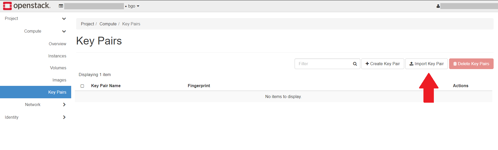
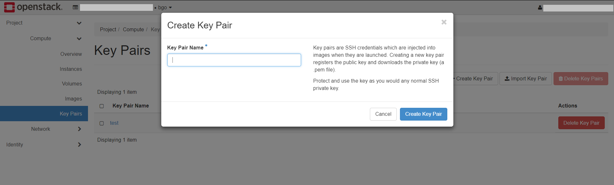

.. |date| date::

Using SSH
=========

.. WARNING::
   This document is under development.

Last changed: |date|

.. contents::

.. _Security Groups: security-groups.html
.. _the default security group: security-groups.html#the-default-security-group

Virtual machines in NREC are accessed using SSH keypairs. There are
numerous ways to achieve this, depending on the OS on your local
computer. The preferred method is to create an SSH key pair on your
local computer (or use an already existing one), and upload the public
key into NREC.

.. figure:: images/ssh.png
   :align: center
   :alt: SSH illustration

In order to access an instance in NREC, you need to specify the
correct ssh public key when creating the instance:

#. Create an SSH key pair (or use an existing one)

#. Upload the public key to NREC and give it a proper name

#. Specify this public key when creating the instance

#. Connect via SSH to the instance using the corresponding private key

We will go through these steps in more detail.

Setting up a keypair
--------------------

There are two methods for creating an ssh key pair in NREC. To create
an ssh key pair you should either

* `Importing an existing key (RECOMMENDED)`_

**OR**

* `Letting OpenStack create a keypair`_

Most users should choose to create an ssh key pair on their client
machine, and upload the public key to NREC.

Importing an existing key (RECOMMENDED)
~~~~~~~~~~~~~~~~~~~~~~~~~~~~~~~~~~~~~~~

This is the recommended approach.

If the local computer is Linux, any BSD variant such as FreeBSD, MacOS
or Windows 10, the easiest way is to create a keypair locally if you
don't already have one, using the command ``ssh-keygen`` (on Windows
it's called ``ssh-keygen.exe``):

.. code-block:: console

  $ cd ~
  $ ssh-keygen -b 4096 -t rsa -f .ssh/nrec
  Generating public/private rsa key pair.
  Enter passphrase (empty for no passphrase): 
  Enter same passphrase again: 
  Your identification has been saved in /home/username/.ssh/nrec
  Your public key has been saved in /home/username/.ssh/nrec.pub
  The key fingerprint is:
  SHA256:VoocD4z2ek4FpjB7UrX2CNo5yu3PdvLS1T7jOUAIgCk username@localhost.localdomain
  The key's randomart image is:
  +---[RSA 4096]----+
  |   o...          |
  |E o  +..         |
  | .o = O. ..      |
  |   O O O.o.      |
  |  + * = S. .     |
  | . = o o  o .    |
  |  o o o. . o     |
  |   . =+ o   =.   |
  |    .o+=.  .o+   |
  +----[SHA256]-----+

Before running ssh-keygen we're making sure that the current working
directory is our home directory. In this case we are creating a
keypair of type RSA and 4096 bits long, which should provide
sufficient security. We specify the output filename **.ssh/nrec**. The
files created in your home directory are

**.ssh/nrec**
  This is the *private key*. It should be kept safe.

**.ssh/nrec.pub**
  This is the *public key*. It can be used to authenticate holders of
  the private key.

To import your existing public key into NREC, navigate to **Project**
-> **Compute** -> **Key Pairs**:

Click on **Import Key Pair**. In the dialog that appears, fill out the
following:

* **Key Pair Name**: Give the key pair a proper name, so you remember
  what it is and where it can be accessed from (here: "homeoffice")

* **Key Type**: Choose "SSH Key" from the drop-down menu

* Either use **Choose File** and find the **.ssh/nrec.pub** file, or
  cut & paste the contents of **.ssh/nrec.pub** into the "Public Key"
  field

.. figure:: images/dashboard-import-keypair-01.png
   :align: center
   :alt: Dashboard - Import an SSH keypair

Click "Import Key Pair" and the key is saved:

.. figure:: images/dashboard-keypairs-01.png
   :align: center
   :alt: Dashboard - View keypairs

---------------------------------------------------------------------
	 
Uploading an existing public key via CLI is done with this command::

  openstack keypair create --public-key <file> <name>

Example:

.. code-block:: console

  $ openstack keypair create --public-key ~/.ssh/nrec.pub nrec
  +-------------+-------------------------------------------------+
  | Field       | Value                                           |
  +-------------+-------------------------------------------------+
  | fingerprint | e2:2e:26:7f:5d:98:9e:8f:5e:fd:c7:d5:d0:6b:44:e7 |
  | name        | nrec                                            |
  | user_id     | 6bb8dacdc9b94fff89258094bc56a49f                |
  +-------------+-------------------------------------------------+

You can then list your keys:

.. code-block:: console

  $ openstack keypair list
  +-------+-------------------------------------------------+
  | Name  | Fingerprint                                     |
  +-------+-------------------------------------------------+
  | nrec  | e2:2e:26:7f:5d:98:9e:8f:5e:fd:c7:d5:d0:6b:44:e7 |
  +-------+-------------------------------------------------+

Letting OpenStack create a keypair
~~~~~~~~~~~~~~~~~~~~~~~~~~~~~~~~~~

You can let OpenStack create a keypair for you, if you don't wish to
create one locally or use an existing one. Navigate to **Project**
-> **Compute** -> **Key Pairs**:

.. figure:: images/dashboard-access-and-security-03.png
   :align: center
   :alt: Dashboard - Access & Security

Click on **Create Key Pair**:

Choose a name for you key pair (here: "nrec"), select "SSH Key" from
the **Key Type** drop-down menu, and click **Create Key Pair**. The newly
created private key will be downloaded by the browser automatically as
**<name>.pem** (here: "nrec.pem").

The name of the downloaded file is based on the name you provided
earlier. In this example the file is called "nrec.pem" as "nrec" was
provided as the keypair name. Remember to restrict the access to the
private key, as SSH will refuse to use unless it's properly
protected:

.. code-block:: console

  $ chmod 0600 nrec.pem

---------------------------------------------------------------------
	 
Using the CLI, you can have Openstack create a new key pair for you
using this command::

  openstack keypair create --private-key <file> <name>

Where **<file>** is the name of the file in which the private key will
be saved. If this option is omitted the contents of the private key
will be printed on the console.
  
Example:

.. code-block:: console

  $ openstack keypair create --private-key nrec.pem nrec
  +-------------+-------------------------------------------------+
  | Field       | Value                                           |
  +-------------+-------------------------------------------------+
  | fingerprint | 9d:b5:68:c9:d4:53:ab:73:95:f7:85:a2:74:a8:41:9e |
  | name        | bar                                             |
  | user_id     | 6bb8dbcdc9b94fff89258094bc56a49f                |
  +-------------+-------------------------------------------------+

You can then list your keys:

.. code-block:: console

  $ openstack keypair list
  +-------+-------------------------------------------------+
  | Name  | Fingerprint                                     |
  +-------+-------------------------------------------------+
  | nrec  | e2:2e:26:7f:5d:98:9e:8f:5e:fd:c7:d5:d0:6b:44:e7 |
  +-------+-------------------------------------------------+

Remember to restrict the access to the
private key, as SSH will refuse to use unless it's properly
protected:

.. code-block:: console

  $ chmod 0600 nrec.pem

Connecting to the instance
--------------------------

.. _Working with Security Groups: security-groups.html

.. IMPORTANT::
   Connecting to the instance requires that port 22 (the SSH port) is
   allowed through the firewall. For more information, see `Working
   with Security Groups`_

After creating an instance you will use the ssh key pair to connect to
it. During the instance creation, NREC has added the public key into
the **~/.ssh/authorized_keys** for the proper user. The username
varies with the Linux distribution at the discretion of the
vendor. The most common are:

============== ==============
Image          User
============== ==============
**CentOS**     ``centos``
**Fedora**     ``fedora``
**Ubuntu**     ``ubuntu``
**Debian**     ``debian``
**RHEL**       ``cloud-user``
**CirrOS**     ``cirros``
============== ==============

This is a non-exhaustive list. For images not listed here, consult the
image vendor's documentation.

To connect via ssh, we specify the private key file, the username and
the IP address of the instance:

.. code-block:: console

  $ ssh -i <keyfile> <username>@<ip-address>

If the keyfile is the default, created using ssh-keygen and using
the default filename, you can omit the **-i <keyfile>**
option. Example for a CentOS instance, using a key called "nrec"
created with ssh-keygen:

.. code-block:: console

  $ ssh -i ~/.ssh/nrec centos@2001:700:2:8201::13d0

In order to use the downloaded private key, you must specify the
private key file, like this (example for "nrec.pem" above):

.. code-block:: console

  $ ssh -i nrec.pem <username>@<ip-address>

After successfully connecting to the instance. You can then
use **sudo** to gain root access:

.. code-block:: console

  [centos@testvm ~]$ sudo -i
  [root@testvm ~]# whoami
  root

Caveats and limitations
-----------------------

There are a few caveats and limitations that you should be aware of
when using creating and using SSH key pairs in NREC:

* The dashboard does not support some modern SSH ciphers. This is why
  we're using RSA in the examples, it's good enough and we know it
  works. The CLI does not have this limitation.

* An SSH key pair in NREC follows the user-project-region
  combination. This differs from most attributes that does not have
  the user aspect. Due to the API/CLI user being a different user
  (albeit with the same username) as the GUI user, keys created in GUI
  are not visible in API/CLI, and vice versa.

* It is possible to create an SSH key pair within the process of
  creating an instance. This doesn't work properly. For best results,
  create the ssh key pair before creating the instance, as described
  in this document.
