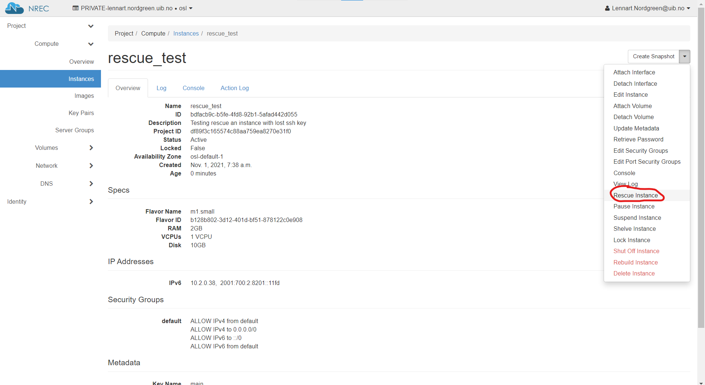
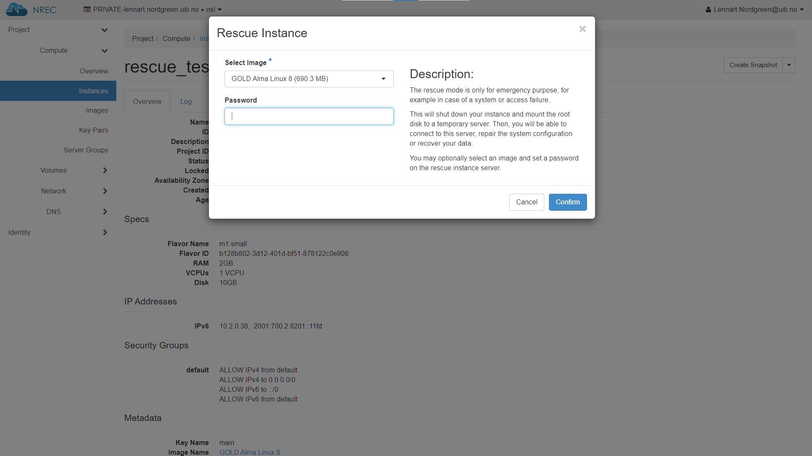
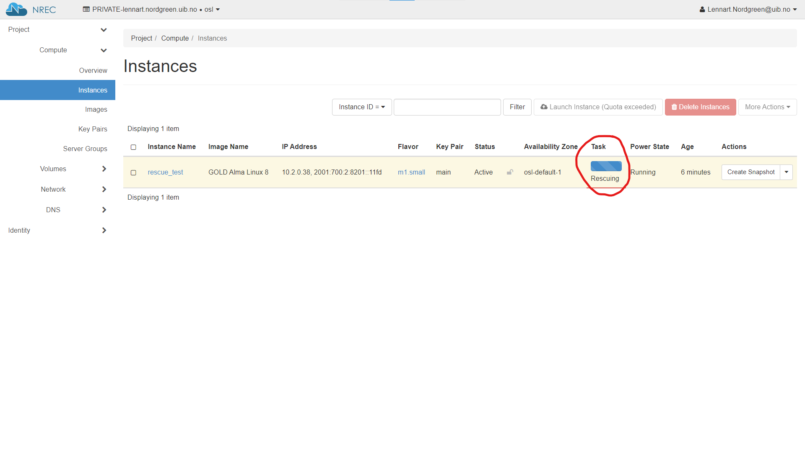
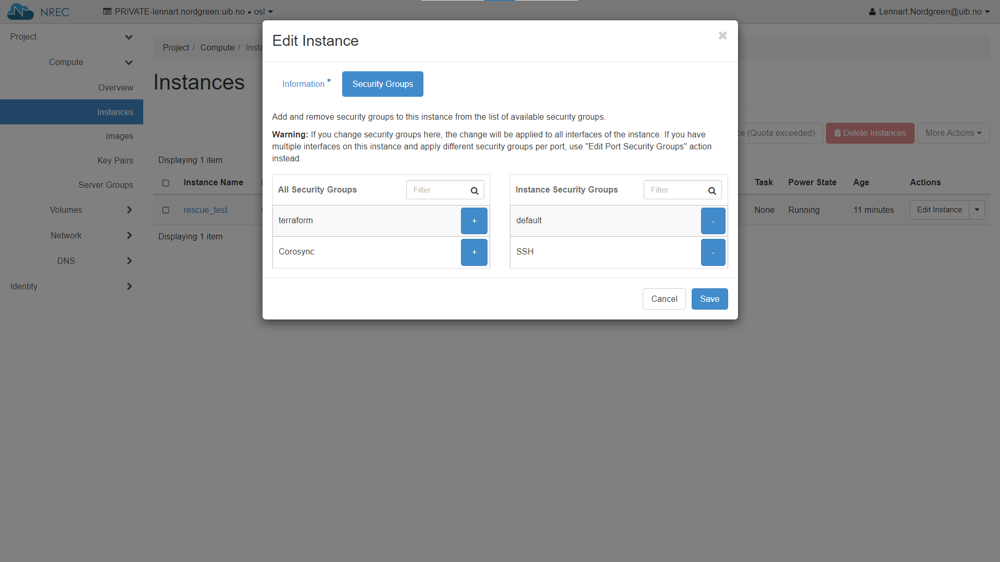
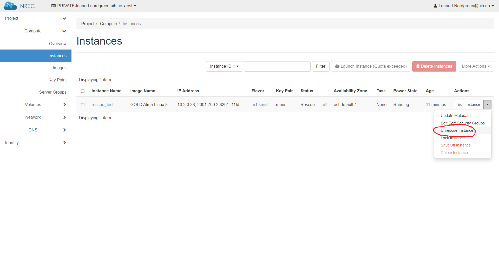

.. |date| date::

Troubleshoot
============

Last changed: |date|

.. contents::

Lost access to instance
-----------------------
.. _lostaccess:

There can be multiple reasons for losing access to an instance.

- Lost SSH key
- Disk trouble e.g. wrong mount path (`Rescue instance`_)
- Problems with NIC/network (`Rescue instance`_)

Don't fret, there is maybe a way (workaround) to fix this by accsessing the console/terminal.
But you need to do some "hacks" to do so if you didn't set/change a users password.

Possible solution (workaround [#f1]_)
~~~~~~~~~~~~~~~~~~~~~~~~~~~~~~~~~~~~~

Got to console, press the "Send ctrlAltDel" button then activate the console window and interrupt the boot by pressing an arrow key for example. Choose a boot entry and press :kbd:`e` for edit.
Depending on which OS is in use you can edit the boot loader in the console and boot to single user by adding single to the end of the line that start with linux on ubuntu, on centos you have to remove all ``console=ttys`` besides the ``tty0`` and add ``rd.break enforcing=0`` at the end of the line starting with linux16.
There a several exampels and documentation on how to start your Linux server/instance in singel mode (root access) which you can find by searching the web. On centos you have to be fast to interrupt the normal boot.
Depending on if you are using Ubuntu or Centos you should now have a console and logged in as root. The keyboard layout is probably en_US.UTF8 which means you have to figure out what keys on your keyboard represent :kbd:`=`, :kbd:`/`, :kbd:`-` and :kbd:`:` etc.

On my keyboard (norwegian):

:kbd:`=` is :kbd:`\\` left key from backspace

:kbd:`/` is :kbd:`-` left key from right shift

:kbd:`-` is :kbd:`?` second left key from backspace

:kbd:`:` is :kbd:`shift` + :kbd:`ø`

Now you can issue a password change for e.g. the root account by running `passwd` or `passwd username`.
If you are using Centos you have to do some additional steps as follows.
You need to mount :file:`/sysroot` by running `mount -o remount,rw /sysroot` and then change root by running `chroot /sysroot`.
Now you can run e.g `passwd`
After you've don that, reboot and log in to console again on normal boot.
Now you can fix the authorized_keys. I fetched my public ssh keys from github.

E.g
``wget https://github.com/username.keys``
or
``curl -o pub.keys https://github.com/username.keys``

Then add or replace the keys in authorized_keys

E.g
``cat username.keys >> authorized_keys``

The authorized_keys file is located in :file:`/home/username/.ssh/authorized_keys`
Now you should be able to login using ssh with the new key(s).

.. NOTE::
   If you are experiencing problem with booting up and you have attached
   volumes(s), try dettach them first then run rescue agian.

----------

Rescue instance
---------------
.. _rescue mode: https://docs.openstack.org/nova/latest/user/rescue.html

Here is a quick runddown on how it is done using the dashboard.

For more information, take a look at the Openstack documentation on `rescue mode`_

.. NOTE::
   Setting a password when activating rescue mode dose not work.
   If you lost access to the SSH key take a look at lostaccess_

Using the dashboard
~~~~~~~~~~~~~~~~~~~
.. _security groups: https://docs.nrec.no/security-groups.html#id3

If you need to edit `security groups`_ then edit instance and then select "Security Groups".

.. NOTE::
   THIS IS RELATED to LINUX!

   If you do not select a specific image (or specify the same as the instance
   originally used, which in effect is the same), the two (pseudo)disks may end
   up with the same UUID. For some distributions this may cause the instance to
   mount its root filesystem from the damaged disk. The upshot is that any SSH
   connections will seemingly connect to the broken instance, and the rescue
   attempt is thus moot.

   The workaround is to explicitly specify an image for the rescue attempt, and
   select any other image than the one used for setting up the instance in the
   first place.

Not able to SSH to Debian instance created from uploaded snapshot image
-----------------------------------------------------------------------
.. _debianimagenetwork:

Description
~~~~~~~~~~~

I created an instance based on a Debian image that I downloaded before. The image was created from a snapshot of a Debian instance. I am not able to SSH to the new instance.

Possible solution
~~~~~~~~~~~~~~~~~

When an image snapshot is downloaded from a project;

.. code-block:: console

  openstack image save --file <image name>.img <image ID>

it does not save its properties from OpenStack. 

These image properties can be seen using the OpenStack API. They are
only set for pre-existing images and snapshots in a project:

.. code-block:: console

  openstack image show <image ID> -c properties -f yaml

Unfortunately, when a new instance is created based on the .img file,
these properties are not set. For Debian instances, lack of these
properties imposes hardware change that leads to a different naming of
the network interface card (NIC). Since the old NIC name is specified
in existing network configuration files, the newly created instance
will not receive a network connection.

The solution is to set the correct properties of the uploaded
image. The properties that need to be set in order for the image to
perform optimally can be found in our image repository [#f2]_. Look
for the gold image that best matches your image, and set each property
with the following command:

.. code-block:: console

  openstack image set --property <name>=<value> <image ID>

Example:

.. code-block:: console

  openstack image set --property hw_machine_type=q35 <image ID>

Specifically, for a Debian 12 instance, the properties that
needs to be set are specified in our image repository [#f2]_ under
'debian12'::'properties' and is a subset of the properties seen with
the ``openstack image show`` command above.

.. code-block:: console

  $ while read line; do k=$(echo $line | cut -d ' ' -f 1); v=$(echo $line | cut -d ' ' -f 2); cmd="openstack image set --property $k=$v <image ID>"; eval $cmd; done <<< 'hw_disk_bus scsi
       hw_scsi_model virtio-scsi
       hw_rng_model virtio
       hw_qemu_guest_agent yes
       hw_machine_type q35
       hw_firmware_type uefi
       hw_vif_multiqueue_enabled yes
       os_require_quiesce yes
       os_type linux'

----------------------------------------------------------------------

.. rubric:: Footnotes

.. [#f1] Since setting a password when rescuing an instance do not work.

.. [#f2] https://github.com/norcams/himlarcli/blob/master/config/images/default.yaml
