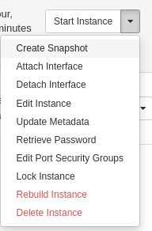
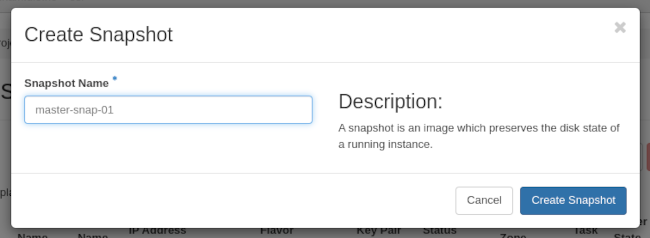

Usecase: CS Course with individual student instances (Linux)
============================================================

Last changed: 2024-10-18

.. contents::

.. _Terraform: https://www.terraform.io/
.. _Ansible: https://www.ansible.com/
.. _Terraform and NREC\: Part I - Basics: terraform-part1.html
.. _Terraform and NREC\: Part II - Additional resources: terraform-part2.html
.. _Terraform and NREC\: Part III - Dynamics: terraform-part3.html
.. _Terraform and NREC\: Part IV - Pairing with Ansible: terraform-part4.html
.. _OpenStack CLI tools: api.html

This document describes and tries to offer a solution on how to spin
up an arbitrary number of Linux Server instances. The idea is that
each student is given their own pre-configured instance with a set of
credentials.

Overview
--------

In this usecase study, we will demonstrate with examples and code the
entire process:

#. Install a master Linux instance, which we will later use as a
   template for new instances

#. Do whatever configuration changes, install software etc. that is
   required. All changes that should be identical on the students'
   instances should be done in this step

#. Make a snapshot of the master instance. This is the template
   template that will be used in the next step

#. Use Terraform_ to spin up a number of instances for students based
   on the template created in the previous step

#. Use Ansible_ to make individual configuration on each of the
   student instances. I our case we add an individual user with an
   autogenerated password for each instance

Prerequisites
-------------

This guide assumes that you have installed and know how to use
Terraform_ and Ansible_. For more information, see

* `Terraform and NREC\: Part I - Basics`_
* `Terraform and NREC\: Part II - Additional resources`_
* `Terraform and NREC\: Part III - Dynamics`_
* `Terraform and NREC\: Part IV - Pairing with Ansible`_

You also need to have the `OpenStack CLI tools`_ installed.

Preparing the master Linux instance
-----------------------------------

.. _Create a Linux virtual machine: create-linux-machine.html

For this step, consult the documentation available here:

* `Create a Linux virtual machine`_

Step by step example
~~~~~~~~~~~~~~~~~~~~

#. If you haven't already, create an SSH key

   .. code-block:: console

     $ ssh-keygen -t ed25519 -a 100 -f ~/.ssh/id_ed25519_in8888

#. Import the public key ``~/.ssh/id_ed25519_in8888.pub`` into
   openstack

#. Create a Linux instance. In this demo, we have chosen:

   - Name: ``in8888-master``
   - Image: ``GOLD Alma Linux 9``
   - Flavor: ``m1.small``
   - Network: ``IPv6``
   - Security Groups: ``default`` and others
   - Key Pair: ``id_ed25519_in8888`` (created above)

   You should add security groups that allow SSH from your current IP
   address.

#. Wait for the instance to be ready. With Linux it only takes a few
   seconds:

   .. image:: images/usecase02-master.png
     :align: center
     :alt: Master instance

   When the instance responds to SSH logins, you can proceed:

   .. code-block:: console

     $ ssh 2001:700:2:8201::10ac -l almalinux -i ~/.ssh/id_ed25519_in8888
     Last login: Mon Sep 30 01:33:18 2024 from 158.39.75.247
     [almalinux@in8888-master ~]$

#. Install software and make any changes as required. For the purposes
   of this demonstration, we install Visual Studio Code

   .. code-block:: console

     [almalinux@in8888-master ~]$ sudo rpm --import https://packages.microsoft.com/keys/microsoft.asc
     [almalinux@in8888-master ~]$ echo -e "[code]\nname=Visual Studio Code\nbaseurl=https://packages.microsoft.com/yumrepos/vscode\nenabled=1\ngpgcheck=1\ngpgkey=https://packages.microsoft.com/keys/microsoft.asc" | sudo tee /etc/yum.repos.d/vscode.repo > /dev/null
     [almalinux@in8888-master ~]$ sudo dnf install code
     AlmaLinux 9 - AppStream                      17 MB/s |  14 MB     00:00    
     AlmaLinux 9 - BaseOS                        6.6 MB/s |  15 MB     00:02    
     AlmaLinux 9 - Extras                         37 kB/s |  20 kB     00:00    
     Visual Studio Code                           16 MB/s | 5.2 MB     00:00    
     Dependencies resolved.
     (...output omitted...)

Take a snapshot
---------------

.. NOTE::
   When cloning an instance like we do here, each clone will have the
   same machine ID as the parent. Some applications rely on the
   machine ID to uniquely identify hosts. If this applies to any
   applications that you plan to run, remove the machine ID before
   taking a snapshot::

     rm /etc/machine-id
     rm /var/lib/dbus/machine-id

   A new machine ID will be generated automatically during first boot.

Shut down the master instance:

.. code-block:: console

  [almalinux@in8888-master ~]$ sudo poweroff 

Proceed when the instance is properly shut down:

.. code-block:: console

  $ openstack server show in8888-master -c status -f value
  SHUTOFF

Make a snapshot of the instance while it is shut off

We name the snapshot «master-snap-01»:

We are now ready to proceed with creating student instances.

Create student instances
------------------------

This next step uses Terraform_ to create a number of instances for
students. First, create an empty directory and cd into it, e.g.:

.. code-block:: console

  $ mkdir ~/in8888-h2024
  $ cd ~/in8888-h2024

Copy the following files info this directory:

* :download:`main.tf <downloads/usecase02/main.tf>`
* :download:`secgroup.tf <downloads/usecase02/secgroup.tf>`
* :download:`variables.tf <downloads/usecase02/variables.tf>`
* :download:`terraform.tfvars <downloads/usecase02/terraform.tfvars>`

These files are from `Terraform and NREC\: Part IV - Pairing with
Ansible`_, but with adjustments for this usecase. Edit these files to
suit your needs. You should most likely want a lot of changes in
``variables.tf`` and ``terraform.tfvars``.

Run **terraform init**:

.. code-block:: console

  $ terraform init
  (...output omitted...)
  Terraform has been successfully initialized!

Run **terraform plan**:

.. code-block:: console

  $ terraform plan
  (...output omitted...)
  Plan: 29 to add, 0 to change, 0 to destroy.

Fix any errors from the plan command, then run **terraform apply**:

.. code-block:: console

  $ terraform apply
  (...output omitted...)
  Apply complete! Resources: 29 added, 0 changed, 0 destroyed.

The instances are now created, we are ready to make the final
configuration with Ansible_. The end result is:

.. code-block:: console

  $ openstack server list --name in8888 --sort-column Name -c Name -c Status -c Image
  +--------------------+---------+-------------------+
  | Name               | Status  | Image             |
  +--------------------+---------+-------------------+
  | in8888-h2024-lab-0 | ACTIVE  | master-snap-01    |
  | in8888-h2024-lab-1 | ACTIVE  | master-snap-01    |
  | in8888-h2024-lab-2 | ACTIVE  | master-snap-01    |
  | in8888-h2024-lab-3 | ACTIVE  | master-snap-01    |
  | in8888-h2024-lab-4 | ACTIVE  | master-snap-01    |
  | in8888-master      | SHUTOFF | GOLD Alma Linux 9 |
  +--------------------+---------+-------------------+

Configure student instances
---------------------------

Download the following files into the same directory as the Terraform
files:

* :download:`terraform.yaml <downloads/usecase02/terraform.yaml>`
* :download:`add-labuser.yaml <downloads/usecase02/add-labuser.yaml>`

Edit these files as necessary. At minimum you need to edit the
``terraform.yaml`` file.

Test that ansible works:

.. code-block:: console

  $ ansible -i terraform.yaml all -m ping
  [WARNING]: Collection cloud.terraform does not support Ansible version 2.14.14
  [WARNING]: Invalid characters were found in group names but not replaced, use -vvvv to see details
  in8888-h2024-lab-3 | SUCCESS => {
      "ansible_facts": {
          "discovered_interpreter_python": "/usr/bin/python3"
      },
      "changed": false,
      "ping": "pong"
  }
  in8888-h2024-lab-2 | SUCCESS => {
      "ansible_facts": {
          "discovered_interpreter_python": "/usr/bin/python3"
      },
      "changed": false,
      "ping": "pong"
  }
  in8888-h2024-lab-0 | SUCCESS => {
      "ansible_facts": {
          "discovered_interpreter_python": "/usr/bin/python3"
      },
      "changed": false,
      "ping": "pong"
  }
  in8888-h2024-lab-1 | SUCCESS => {
      "ansible_facts": {
          "discovered_interpreter_python": "/usr/bin/python3"
      },
      "changed": false,
      "ping": "pong"
  }
  in8888-h2024-lab-4 | SUCCESS => {
      "ansible_facts": {
          "discovered_interpreter_python": "/usr/bin/python3"
      },
      "changed": false,
      "ping": "pong"
  }

Run the ``add-labuser.yaml`` playbook:

.. code-block:: console

  $ ansible-playbook -i terraform.yaml add-labuser.yaml
  (...output omitted...)

The SSH pass phrases are saved in a file called ``labusers.csv``,
which is located in the same directory as the playbook. Example
contents:

.. code-block::

  HOST,IPADDR,USERNAME,SSH_PASSPHRASE
  in8888-h2024-lab-0,2001:700:2:8201::100e,labuser,Msho!nLKCCo)yIAvB$UC
  in8888-h2024-lab-1,2001:700:2:8201::1270,labuser,cXhm_q%xvwvBmLM6rPF6
  in8888-h2024-lab-2,2001:700:2:8201::1485,labuser,sGecTMBp0u11x0.OpEGn

The SSH keys are collected from the instances and placed in this
directory:

.. code-block::

  labuser_ssh_keys

The keys are named:

* Private key: ``id_ed25519_<instance_name>``

* Public key: ``id_ed25519_<instance_name>.pub``

Example:

.. code-block:: console

  $ ls -l labuser_ssh_keys/
  -rw-------. 1 user group 509 Oct 10 15:06 id_ed25519_in8888-h2024-lab-0
  -rw-r--r--. 1 user group 131 Oct 10 15:06 id_ed25519_in8888-h2024-lab-0.pub
  -rw-------. 1 user group 509 Oct 10 15:06 id_ed25519_in8888-h2024-lab-1
  -rw-r--r--. 1 user group 131 Oct 10 15:06 id_ed25519_in8888-h2024-lab-1.pub
  -rw-------. 1 user group 509 Oct 10 15:06 id_ed25519_in8888-h2024-lab-2
  -rw-r--r--. 1 user group 131 Oct 10 15:06 id_ed25519_in8888-h2024-lab-2.pub
  -rw-------. 1 user group 509 Oct 10 15:06 id_ed25519_in8888-h2024-lab-3
  -rw-r--r--. 1 user group 131 Oct 10 15:06 id_ed25519_in8888-h2024-lab-3.pub

The SSH private/public key pair can be distributed to the individual
students along with the pass phrase which is stored in
``labusers.csv``.

The students will access their lab clone using the SSH key (example):

.. code-block:: console

  $ ssh 2001:700:2:8201::138b -l labuser -i path/to/id_ed25519_in8888-h2024-lab-0
  Enter passphrase for key 'path/to/id_ed25519_in8888-h2024-lab-0': 
  [labuser@in8888-h2024-lab-0 ~]$ 

Adding or removing instances
----------------------------

In order to to increase or decrease the number of instances, change
the number in ``variables.tf``:

.. literalinclude:: downloads/usecase02/variables.tf
   :language: terraform
   :caption: variables.tf
   :linenos:
   :lines: 54-60
   :emphasize-lines: 5

Then run::

  terraform plan
  terraform apply

Create users and SSH keys as before with::
  
  ansible-playbook -i terraform.yaml add-labuser.yaml

The credentials file ``labusers.csv`` will be updated to reflect the
changes, and the directory ``labuser_ssh_keys`` will contain any new
SSH key pairs. Note that the pass phrases are randomly generated but
idempotent, thus changing the number of instances will not change pass
phrases for existing instances.

-------------------------------------------------------------------------

File listing
------------

A complete listing of the example files used in this document is
provided below.

.. literalinclude:: downloads/usecase02/terraform.yaml
   :language: yaml
   :caption: terraform.yaml
   :name: usecase02-ansible-inventory
   :linenos:

.. literalinclude:: downloads/usecase02/main.tf
   :language: terraform
   :caption: main.tf
   :name: usecase02-main-tf
   :linenos:

.. literalinclude:: downloads/usecase02/secgroup.tf
   :language: terraform
   :caption: secgroup.tf
   :name: usecase02-secgroup-tf
   :linenos:

.. literalinclude:: downloads/usecase02/variables.tf
   :language: terraform
   :caption: variables.tf
   :name: usecase02-variables-tf
   :linenos:

.. literalinclude:: downloads/usecase02/terraform.tfvars
   :caption: terraform.tfvars
   :name: usecase02-terraform-tfvars
   :linenos:

.. literalinclude:: downloads/usecase02/add-labuser.yaml
   :language: yaml
   :caption: add-labuser.yaml
   :name: usecase02-add-labuser.yaml
   :linenos:
